# Low Level Design
## post_apply_assistant Integration

| Field | Detail |
|---|---|
| **Document Version** | 1.0 |
| **Status** | In-progress |
| **Last Updated** | 2026-03-02 |
| **Component** | careers-ai-service (existing, Add new Primary Assistant 2 with post_apply_assistant) · candidate-mcp (new) |
| **Parent System** | Careers AI Platform |
| **Depends On** | cx-applications · talent-profile-service · job-sync-service · careers-data-schema |

---

## Table of Contents

1. [Purpose & Scope](#1-purpose--scope)
2. [Glossary](#2-glossary)
3. [System Context](#3-system-context)
4. [Architecture Overview](#4-architecture-overview)
5. [Component Design](#5-component-design)
    5.1 [v2 API Route — careers-ai-service](#51-v2-api-route--careers-ai-service)
    5.2 [post_apply_assistant — Sub-assistant](#52-post_apply_assistant--sub-assistant)
    5.3 [candidate-mcp — Architecture](#53-candidate-mcp--architecture)
    5.4 [Three-Layer Data Transformation Pipeline](#54-three-layer-data-transformation-pipeline)
    5.5 [Agent Guardrails & Anti-Hallucination](#55-agent-guardrails--anti-hallucination)
        5.5.1 [Recursion & Iteration Limits](#551-recursion--iteration-limits)
        5.5.2 [ID Validation Strategy](#552-id-validation-strategy)
        5.5.3 [Convergence Patterns](#553-convergence-patterns)
        5.5.4 [System Prompt Enhancements](#554-system-prompt-enhancements)
        5.5.5 [Tool Schema Improvements](#555-tool-schema-improvements)
    5.6 [Schema Bridge](#56-schema-bridge)
        5.6.1 [The Problem](#561-the-problem)
        5.6.2 [The Solution — candidate-mcp Exposes Schemas as MCP Resources](#562-the-solution--candidate-mcp-exposes-schemas-as-mcp-resources)
        5.6.3 [Schema Resources Exposed by candidate-mcp](#563-schema-resources-exposed-by-candidate-mcp)
6. [Key Data Flows](#6-key-data-flows)
7. [Integration Design](#7-integration-design)
8. [Security Design](#8-security-design)
9. [Resilience Design](#9-resilience-design)
10. [Observability Design](#10-observability-design)
11. [Caching Design](#11-caching-design)
    11.1 [LangGraph Thread State — Conversation Checkpointer](#111-langgraph-thread-state--conversation-checkpointer)
    11.2 [Cache Hierarchy Summary](#112-cache-hierarchy-summary)
12. [Error Handling](#12-error-handling)
13. [Testing Strategy](#13-testing-strategy)
14. [Deployment](#14-deployment)
15. [Design Decisions](#15-design-decisions)
16. [Open Issues & Risks](#16-open-issues--risks)

---

## 1. Purpose & Scope

### 1.1 Purpose

This document describes the design for implementing a **primary assistant 2** and a
`post_apply_assistant` sub-assistant as a new feature within the existing `careers-ai-service`.
This service provides the agentic workflows for the candidate-facing AI assistant that will be
integrated into the `cx-web` UI. The new sub-assistant handles queries about a candidate's profile,
applications, assessments, and preferences by calling tools exposed by `candidate-mcp`.

The v1 primary assistant (with its existing job search assistant and job-search-service
direct HTTP calls) is **completely untouched**. The new capability is exposed under a
separate `/api/v2/agent/` route backed by a dedicated v2 LangGraph. In a future
phase, a single primary assistant with all sub-assistants will consolidate both v1
and v2 routes into one.

### 1.2 In Scope

- A new `/api/v2/agent/invoke` and `/api/v2/agent/stream` route in `careers-ai-service`
- A new v2 LangGraph graph containing only `post_apply_assistant` as a sub-node
- A `primary_assistant_2` orchestrator node that routes to `post_apply_assistant` for all post apply domain queries
- Connecting the v2 graph to `candidate-mcp` via the MCP client
- **App2App signature authentication** between `careers-ai-service` and `candidate-mcp`: signature generated per request, 5-minute default TTL, configurable per client in the `candidate-mcp` service registry
- **TLS connection pool configuration** for the httpx transport: shared persistent pool with HTTP/2 and TLS session resumption to eliminate per-tool-call handshake overhead
- Implementation of downstream REST client integration in `candidate-mcp`
- Schema sharing strategy: `candidate-mcp` exposes `careers-data-schema` models as MCP static resources — available as a contract reference.
- Resilience, observability, and caching
- Testing strategy covering unit, integration, and contract tests
- **Agent guardrails**: recursion limits (10 iterations), request timeouts (30 seconds), tool call limits (10 per request)
- **ID validation and anti-hallucination measures**: regex validation for all entity IDs, two-layer validation (schema + implementation)
- **Convergence patterns and stop conditions**: tool calling sequence rules, explicit stop conditions, prohibition of speculative calls

### 1.3 Out of Scope

- **existing primary assistant (considered as v1)** — no changes to existing graph, nodes, tools, routing logic, or the `/api/v1/agent/` routes
- **Existing job search assistant** — untouched
- **Direct HTTP calls to job-search-service** — untouched
- **Consolidation of v1 and v2 into a single primary assistant** — future phase

### 1.4 Assumptions

- `careers-ai-service` is a Python Uvicorn + LangGraph application. The v2 graph runs in the same process as v1; v2 will use the MCP tool registry loaded at startup.
- The primary assistant makes direct HTTP calls to `job-search-service` for job data — this pattern is not used for the new sub-assistant; `candidate-mcp` is used instead.
- `careers-data-schema` is a shared Maven library containing canonical Java domain models used across all backend services.
- All service-to-service authentication uses App2App HMAC-SHA256 signature — both `careers-ai-service` → `candidate-mcp` and `candidate-mcp` → downstream services.
- `candidate-mcp` is a stateless MCP server that calls real downstream services using App2App signature authentication.

---

## 2. Glossary

| Term | Definition |
|---|---|
| **MCP** | Model Context Protocol — a standard for exposing tools and resources to LLM agents over HTTP |
| **LangGraph** | Python framework for building stateful multi-agent LLM workflows as directed graphs |
| **StateGraph** | LangGraph construct representing the agent workflow as nodes (agents) and edges (routing) |
| **Handoff Tool** | A LangGraph `@tool` that, when called by the primary assistant, routes execution to a named sub-assistant |
| **candidate-mcp** | The Java MCP server that exposes candidate domain tools and schema resources. Calls downstream services from its tools. |
| **careers-data-schema** | Shared Java Maven library containing canonical domain models used across all Careers platform services |
| **MCP Resource** | A static or templated data object served by the MCP server — exposed by `candidate-mcp` as a schema contract for domain models; not currently loaded by the Python agent |
| **MCP Tool** | A callable function the LLM agent invokes at runtime to retrieve live data |
| **Circuit Breaker** | Resilience pattern that stops calls to a failing downstream service and returns a structured fallback |
| **Virtual Threads** | Java 21 lightweight threads that make blocking I/O safe within synchronous MCP tool handlers |
| **post_apply_assistant** | New LangGraph sub-assistant handling candidate profile, application, assessment, and preferences queries |
| **primary_assistant_2** | New orchestrator node introduced under the v2 API route; contains only `post_apply_assistant` as a sub-node for now |
| **App2App Auth** | HMAC-SHA256 request signature scheme used between `careers-ai-service` (caller) and `candidate-mcp` (receiver). No user identity or OAuth2 token involved — machine-to-machine trust only. |
| **Signature TTL** | The validity window of an App2App request signature. Default 5 minutes; configurable per registered client in the `candidate-mcp` service registry. |

---

## 3. System Context

The diagram below shows the existing platform and the new
components added under the v2 route.


---

## 4. Architecture Overview

### 4.1 LangGraph Graphs

Two separate compiled `StateGraph` instances exist in the same Python process. The
v1 graph is unchanged. The v2 graph is new.

#### v1 Graph — Existing (no changes)


#### v2 Graph — New

A minimal graph containing only the `primary_assistant_2` and `post_apply_assistant`
nodes. In a future consolidation phase this graph will absorb the job search assistant
and replace v1 entirely.


### 4.2 MCP Component Architecture

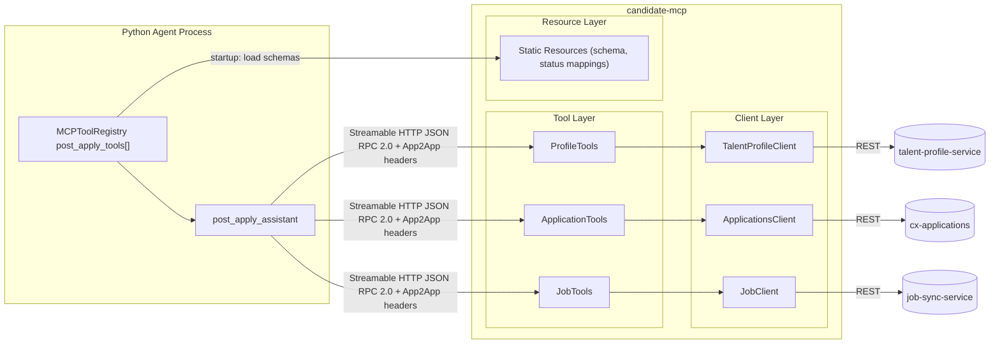

---

## 5. Component Design

### 5.1 v2 API Route — careers-ai-service

A new pair of FastAPI routes is registered under the `/api/v2/agent/` prefix in
the existing `careers-ai-service` service. They are wired to the v2 compiled graph.
The v1 routes and v1 graph remain completely independent.

| Route | v1 (existing) | v2 (new) |
|---|---|---|
| Sync invoke | `POST /api/v1/agent/invoke` | `POST /api/v2/agent/invoke` |
| SSE stream | `POST /api/v1/agent/stream` | `POST /api/v2/agent/stream` |
| Backing graph | v1 graph (primary + job search) | v2 graph (primary v2 + post apply) |
| MCP tools used | None (direct HTTP to job-search-service) | tools from `candidate-mcp` |
| Auth to MCP | N/A | App2App signature |

#### Migration Path

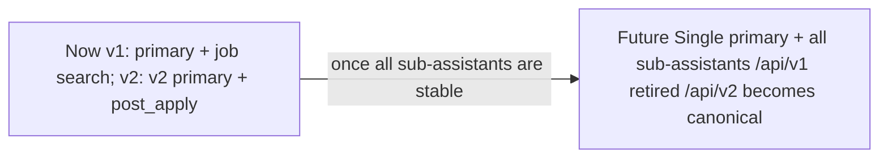

---

### 5.2 post_apply_assistant — Sub-assistant

#### Responsibilities

- Respond to queries about a candidate's profile, applications status, assessment results, and stated preferences.
- Call `candidate-mcp` tools to retrieve live data (Layer 1 projected context).
- Apply a query-specific context filter before passing tool results to the LLM (Layer 2).
- Produce clear, empathetic, candidate-facing responses using its persona system prompt and named response templates (Layer 3).
- **This assistant faces the actual candidate directly** — Tone, language, and content are designed accordingly.

See **Section 5.4** for the full three-layer transformation pipeline.

#### State Schema — v2 State

The v2 graph uses its own `AgentState`. It does not share or modify the v1 state schema.

| Field | Type | Default | Description |
|---|---|---|---|
| `messages` | `list[BaseMessage]` | `[]` | Conversation history (LangGraph managed) |
| `talent_profile_id` | `str` | `""` | Candidate context for tool calls — **mandatory at the sub assistant boundary** |
| `ats_requisition_id` | `str` | `""` | Optional. When set, the assistant focuses on this specific application. When absent, the assistant retrieves all applications for the candidate. |
| `thread_id` | `str` | auto | Coversation thread ID |
| `correlation_id` | `str` | auto | Request trace ID |

#### State Injection into LLM Context — Callable Prompt Pattern

LangGraph state fields such as `talent_profile_id` and `ats_requisition_id` are **not
automatically visible to the LLM**. The LLM operates only on the `messages` list.
Without explicit injection the LLM will prompt the user to provide IDs it already has.

Both `primary_assistant_2` and `post_apply_assistant` use **callable prompt
functions** rather than static strings. At each inference step the callable reads
the current state and appends an `Active Request Context` block to the system
prompt before passing it to the LLM.

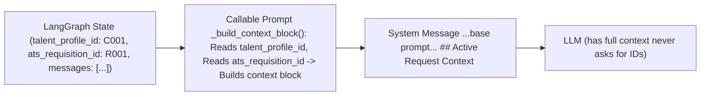

The injected instruction differs based on whether `ats_requisition_id` is present:

| Scenario | `ats_requisition_id` in state | Instruction injected |
|---|---|---|
| v2 primary (with app) | set | "Route immediately — talentProfileId and atsRequisitionId are already known." |
| v2 primary (no app) | empty | "Route immediately — talentProfileId is known. No specific application — the specialist will retrieve all priority applications." |
| post_apply (with app) | set | "A specific application is in scope. Use both IDs directly in tool calls." |
| post_apply (no app) | empty | "No specific application was provided. Call `getActionableApplications(talentProfileId)` " |

This pattern ensures:
- When `ats_requisition_id` is absent, `post_apply_assistant` automatically broadens its scope to the full applications list rather than asking for clarification.
- The base prompt strings are built once at startup; the context block is appended cheaply per inference step with no additional LLM calls.

#### Handoff Trigger Conditions

The primary assistant calls `transfer_to_post_apply_assistant` when the user's query
concerns any of the following:

- A candidate's profile and job applications
- Status, history, or timeline of a specific application
- What happens next in the application process
- Assessment results, scores, or completion status
- Candidate preferences (location, job, renewal)

#### Tool Set

All tools are served by `candidate-mcp`. The sub-assistant has access to various **8 tools** across
three domains. The **Job** tool is used to enrich
application context: every application carries a `jobId`, so the assistant fetches job details
(title, status, location, required assessment code, shift) to give the candidate meaningful context
alongside their application status.

| Domain | Tool | How it is used by post_apply_assistant |
|---|---|---|
| **Profile** (3 tools) | `getTalentProfile` | Candidate's entire profile (PII striped) |
| | `getPreferences` | Candidate's job, location preferences |
| | `getAssessmentResults` | Candidate's assessment results |
| **Application** (4 tools) | `getActionableApplications` | Sorted and grouped actionable applications list with SLA, status mapping |
| | `getApplicationDetails` | Current stage, days in stage, workflow history, metadata |
| | `getAtsApplications` | All the raw post-apply applications list (PII striped) |
| | `getApplicationGroups` | All the raw pre-apply applications list (PII striped) |
| **Job** (1 tool) | `getJobDetails` | Enriches application context: resolves `jobId` → job title, status, location, required assessment code, job type, shift |

**Total**: 8 tools

**Typical job enrichment pattern:**

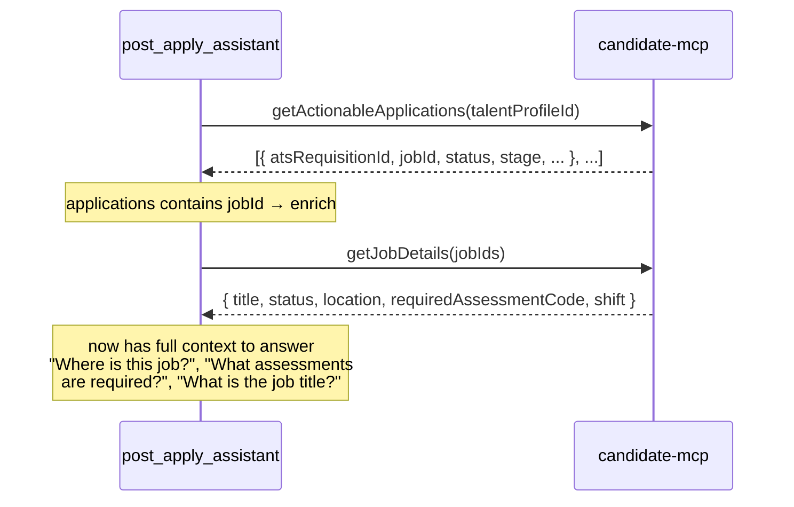

---

### 5.3 candidate-mcp — Architecture

`candidate-mcp` is a stateless MCP server built from java MCP starter kit. Every tool handler calls the
appropriate downstream service, passes the response through `ContextTransformer`
to strip PII and project agent-safe fields, and returns the result as JSON.
`candidate-mcp` is the single point where raw backend data is sanitised — no PII or
internal metadata ever reaches the agents or the LLM.

#### Downstream Service Responsibilities

| Service | Tools it backs | Data it provides |
|---|---|---|
| `talent-profile-service` | `getTalentProfile`, `getPreferences`, `getAssessmentResults` | Candidate profiles, questionnaire responses, assessment results and preferences |
| `cx-applications` | `getActionableApplications`, `getApplicationDetails`, `getAtsApplications`, `getApplicationGroups` | Application documents, stage history, statuses |
| `job-sync-service` | `getJobDetails` | Job requisition details — title, status, location, assessment codes, job type, shift details |

#### Package Structure

```
candidate-mcp/
├── config/
│   ├── McpConfiguration          Tool & resource registration
│   ├── WebClientConfiguration    One WebClient bean per downstream service
│   ├── ResilienceConfiguration   Circuit breaker & retry registries
│   └── SecurityConfiguration     App2App SignatureProvider (outbound) - inbound is handled by MCP's sidecar
├── tool/
│   ├── ProfileTools              Delegates to TalentProfileClient → transformer
│   ├── ApplicationTools          Delegates to CxApplicationsClient → transformer
│   ├── JobTools                  Delegates to JobSyncClient → transformer
│   └── AssessmentTools           Delegates to TalentProfileClient → transformer
├── transformer/
│   └── ContextTransformer   PII strip + field projection for each domain
├── resource/
│   └── StaticResources           Status mappings, Serialises careers-data-schema → JSON Schema MCP resources
├── client/
│   ├── TalentProfileClient       WebClient wrapper for talent-profile-service
│   ├── CxApplicationsClient      WebClient wrapper for cx-applications
│   └── JobSyncClient             WebClient wrapper for job-sync-service
└── dto/
    ├── profile/                  AgentContext DTOs for profile domain
    ├── application/              AgentContext DTOs for application domain
    ├── job/                      AgentContext DTOs for job domain
    └── assessment/               AgentContext DTOs for assessment domain
```

#### Technology Stack

| Concern | Technology |
|---|---|
| Framework | Spring Boot · Java 21 |
| MCP SDK | Spring AI (stateless streamable HTTP) |
| HTTP client | WebClient (Project Reactor) + virtual threads for safe blocking in MCP handlers |
| Domain models | `careers-data-schema` (Maven compile dependency) |
| Auth (inbound from agent) | App2App HMAC-SHA256 signature validation |
| Auth (outbound to downstream) | App2App HMAC-SHA256 signature — one shared secret for all downstream services |
| Resilience | Resilience4j — circuit breaker + retry, one instance per downstream service |
| Observability | Micrometer + OpenTelemetry |

---

### 5.4 Three-Layer Data Transformation Pipeline

Data passes through three distinct transformation stages before reaching the candidate.
Each layer has a single, well-bounded responsibility.


#### **Layer 1 — MCP Transformer**

`candidate-mcp` is **agent-neutral**: it does not know which assistant or which user
type is calling it. Every tool handler maps the raw downstream response to a projected
`AgentContext` DTO before returning. This projection is the same for every caller.

**PII fields always stripped (never appear in any tool response):**

| Category | Fields Excluded |
|---|---|
| Direct identifiers | National ID / NI number, passport number, exact date of birth |
| Contact details | Personal phone number, home address lines, personal email |
| Internal ATS | Database row IDs, audit `created_by` / `modified_by`, internal routing codes, lock/version fields |
| Downstream artefacts | Cosmos `_etag`, `_ts`, partition keys, internal service correlation IDs |

**Fields included in agent context:**

| Domain | Included Fields |
|---|---|
| Profile | Candidate ID, display name, Assessment results with status details |
| Application | Application ID, job ID, status enums, current stage name, days in current stage, SLA, stage history, ats source |
| Job | Job ID, title, status, job type, location, shift details |

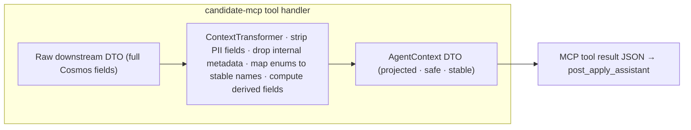

---

#### **Layer 2 — Post Apply Assistant Context Filter**

The `post_apply_assistant` receives the agent-neutral context from Layer 1 — which is
already PII-safe but may still contain fields irrelevant to the current query. A
second filter prevents the LLM from reasoning over unrelated fields and keeps token
usage predictable.

This filter operates in two complementary ways:

**System prompt instructions**
The `post_apply_assistant` system prompt includes explicit field-focus directives.
The LLM is told which fields to prioritise for each query type and to disregard the
rest.

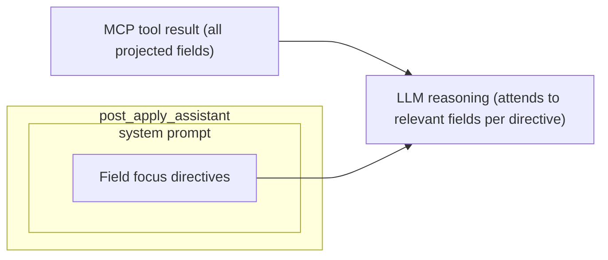

**Programmatic filter (for large payloads)**
Where a tool response may contain many items (e.g. `getActionableApplications`
returning a list with many context fields), an agent `ContextFilter`
trims the payload before it enters the LLM message. This is a safety net for
token-budget control, not the primary filtering mechanism.

---

#### **Layer 3 — post_apply_assistant Response Formatter**

The `post_apply_assistant` faces the actual candidate. Its system prompt and response templates are designed for that audience:
clear, empathetic, jargon-free, and actionable.

**System prompt — candidate persona directives:**

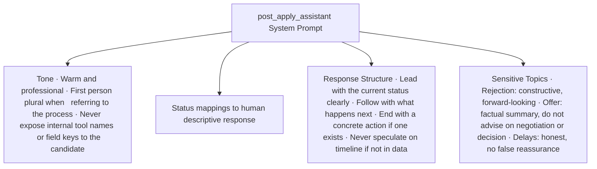

**Named Response Templates**

For recurring query patterns, response templates provide consistent structure. The
LLM fills in the candidate-specific data; the template enforces the shape.

| Template | Trigger Pattern | Structure |
|---|---|---|
| `status-update` | "What's the status of my application?" | Current stage → time in stage (relative) → what happens next |
| `next-steps-guide` | "What should I do now?" / "What do I need to prepare?" | Stage-specific actions → preparation tips → expected timeline |
| `assessment-summary` | "How did I do in the assessment?" | Score context → pass/fail → next stage if passed |
| `rejection-debrief` | Application status is `REJECTED` | Acknowledgement → details if reason available |
| `workflow-overview` | "Can you walk me through all the statuses of my application?" | Chronological list → statuses in history data → any requiring action |

---

### 5.5 Agent Guardrails & Anti-Hallucination

This section describes critical production guardrails implemented to prevent infinite loops, ID hallucination, and other agent failure modes.

#### 5.5.1 Recursion & Iteration Limits

**Problem**: Without hard limits, the agent can enter infinite tool-calling loops, consuming resources and providing poor user experience.

**Solution — Three-Layer Limit Strategy**:

| Layer | Limit | Configuration | Purpose |
|---|---|---|---|
| **StateGraph recursion_limit** | 25 iterations | `StateGraph(AgentState, recursion_limit=25)` | Hard stop on LangGraph execution — prevents infinite graph loops |
| **Request timeout** | 30 seconds | `asyncio.wait_for(agent_executor.ainvoke(), timeout=30.0)` | Hard stop at API layer — protects backend resources |
| **Tool call limit per request** | 10 tool calls | Tracked in `AgentState.tool_call_count` | Soft limit — agent returns helpful message when exceeded |

**Implementation**:

```python
graph = StateGraph(
    AgentState,
    recursion_limit=25  # Max 25 iterations before hard stop
)
```

**Rationale**:
- Prevents infinite loops and runaway requests
- 25 iterations = approximately 5-6 tool calls with reasonable reasoning steps
- Industry standard for production LLM agents
- Provides multiple layers of protection (graph-level, API-level, application-level)

**Request-Level Timeout Implementation**:

```python
@router.post("/api/v2/agent/invoke")
async def invoke_agent(request: AgentRequest):
    try:
        # Add 30-second timeout for entire request
        result = await asyncio.wait_for(
            agent_executor.ainvoke(request),
            timeout=30.0  # 30 seconds max
        )
        return result
    except asyncio.TimeoutError:
        raise HTTPException(
            status_code=504,
            detail="Agent execution timeout. Please try a simpler query or contact support."
        )
```

**Tool Call Tracking in State**:

```python
    # Increment tool call counter
    tool_call_count = state.get("tool_call_count", 0)

    # GUARDRAIL: Stop if too many tool calls
    if tool_call_count >= 10:
        return {
            "messages": [AIMessage(content=
                "I've made multiple tool calls but need more information. "
                "Could you please rephrase your question or be more specific?"
            )],
            "tool_call_count": tool_call_count
        }

    response = llm.invoke(state["messages"])

    # Update counter if tools were called
    new_count = tool_call_count + (1 if response.tool_calls else 0)
    tools_called = state.get("tools_called", [])
    if response.tool_calls:
        tools_called.extend([tc["name"] for tc in response.tool_calls])

    return {
        "messages": [response],
        "tool_call_count": new_count,
        "tools_called": tools_called
    }
```

---

#### 5.5.2 ID Validation Strategy

**Problem**: Agent hallucinates entity IDs by inferring them from names/titles.

**Solution — Two-Layer Validation**:

All tool parameters representing entity IDs MUST be validated against these patterns before downstream calls:

| Entity Type | Format Pattern | Valid Examples | Invalid Examples |
|---|---|---|---|
| **Job ID** | WD `R-XXX`, CP `CP-XXXX-XXXX` or `XXXXXXXX` | R-123456, CP-1234-5678, 12345678 | Cashier, R123, Engineer |
| **Profile ID** | `UUID` | valid UUIDs | name, email |
| **Application document ID** | `UUID` | valid UUIDs | ats application id, job IDs |

**Validation occurs in two layers**:

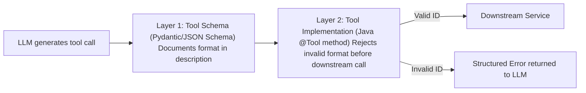

---

#### 5.5.3 Convergence Patterns

**Problem**: Agent calls tools repeatedly without making progress toward answering the user's question.

**Solution — Explicit Tool Calling Sequence Rules**:

The agent follows these convergence patterns to ensure it stops when sufficient data is collected:

**1. Tool Call Sequencing**: Call foundational tools first before detail tools

| Query Type | Correct Sequence |
|---|---|
| "Show all my applications with it's location details" | `getActionableApplications(talentProfileId)` → Extract job IDs → Calling `getJobDetails()` for all the actionable applications |
| "What's the application status history of the application?" | `getActionableApplications(talentProfileId)` → Extract `applicationDocumentId`  → `getApplicationDetails(applicationDocumentId)` |

**2. Stop Conditions**: Agent stops when:

| Condition | Example |
|---|---|
| Sufficient data collected to answer query | User asks "What's my application status?" → `getApplicationDetails()` returns complete status → STOP (don't call `getAssessmentResults()` unless asked) |
| Last tool call returned complete information | `getActionableApplications()` returns full list → STOP (don't call `getJobDetails()` for each unless user asks for job details) |
| Tool call count reaches limit (10) | Agent has called 10 tools → return helpful message asking user to rephrase |
| Recursion limit reached (25 iterations) | Graph hits 25 iterations → hard stop with timeout error |

**3. No Speculative Calls**: Agent does NOT call tools "just in case" or "for completeness"

| Anti-Pattern | Why It's Wrong | Correct Behavior |
|---|---|---|
| "Let me also check your assessments in case they're relevant" | Adds unnecessary latency and cost | Only call `getAssessmentResults()` if user asks about assessments |
| Calling `getJobDetails()` for all 5 applications when user asks "How many applications do I have?" | User didn't ask for job details | Answer "You have 5 applications" directly from `getActionableApplications()` |
| Calling same tool multiple times with same parameters | Redundant, wastes resources | Use exact result from first call (or rely on session cache) |

---

#### 5.5.4 System Prompt Enhancements

**Problem**: LLM lacks explicit rules on ID usage, tool calling convergence, and anti-patterns.

**Solution — Strict ID Usage Rules in System Prompt**:

```python

POST_APPLY_ASSISTANT_PROMPT = """
You are post_apply_assistant, helping candidates track their job applications.

## CRITICAL RULES

1. **NEVER guess or infer IDs from names/titles**
     WRONG: User mentions "Senior SRE job" → You call getJobDetails("JSeniorSRE")
     CORRECT: Call getActionableApplications() first → Extract job_id from response → Use exact ID

2. **Tool Calling Sequence**:
   - To show all applications: getActionableApplications(talent_profile_id) → Extract job IDs → DONE
   - To get job details: getActionableApplications() FIRST → Then getJobDetails(exact_job_id)

3. **When to STOP calling tools**:
   - You have enough information to answer the user's question
   - Last tool call returned complete data
   - More tool calls won't add value to the answer
   - Don't call tools "just to check" or "for completeness"

4. **Answer Directly When Possible**:
   - If user asks "show my applications" and you already called getActionableApplications() → ANSWER immediately
   - Don't call getJobDetails() for every application unless user specifically asks for job details

## Response Format

Always structure your response:
1. **Direct Answer First** (1-2 sentences)
2. **Supporting Details** (bullet points or table)
3. **Next Steps** (optional, only if relevant)

Example:
"You have 3 active applications. Here's your current status:

• **Senior SRE (R-12345)**: Technical Interview stage - 2 interviews scheduled next week
• **Frontend Engineer (R-12346)**: Offer Extended - Expires in 4 days
• **Data Engineer (R-12347)**: Rejected - Received feedback on yyyy-mm-dd

Your most urgent action: Respond to the Frontend Engineer offer by [date]."
"""
```

**Anti-Patterns Explicitly Prohibited**:

| Anti-Pattern | Example | Why It's Prohibited |
|---|---|---|
| **ID Inference** | "Senior SRE" → "seniorSre" | Causes `Job not found` errors, breaks tool calls |
| **Redundant Calls** | Calling `getApplicationDetails(uuid)` twice in same conversation | Wastes resources, session cache should handle this |
| **Unbounded Loops** | Looping through all 5 applications calling `getJobDetails()` for each | Hits tool call limit, poor UX |
| **Speculative Completeness** | "Let me also check your assessments just in case" | Adds unnecessary latency |

---

#### 5.5.5 Tool Schema Improvements

Tools that take entity IDs as parameters include explicit format instructions in their schema descriptions. This guides the LLM to provide correctly formatted IDs and reduces hallucination.

```java
@Tool(
    description = """
    Get current details of a specific application.

    REQUIRED: applicationDocumentId (format: uuid).
    DO NOT guess. ONLY use IDs from getActionableApplications() results if you have them.

    Valid: any UUIDs
    INVALID: app-doc-1, JOB_AP_12345
    """
)
public ApplicationDetails getApplicationDetails(
    @ToolParam(
        description = "Exact application ID in format UUID (e.g., 123e4567-e89b-12d3-a456-426614174000).",
        required = true
    )
    String applicationDocumentId
) {
    // Validate format before downstream call
    if (!applicationDocumentId_PATTERN.matcher(applicationDocumentId).matches()) {
        throw new IllegalArgumentException(
            "Invalid applicationDocumentId format: '" + applicationDocumentId + "'. " +
            "Expected format: UUID (e.g., 123e4567-e89b-12d3-a456-426614174000). "
        );
    }
}
```

---
### 5.6 Schema Bridge

This section describes how canonical Java domain models defined in `careers-data-schema` are available as a shared contract without requiring Python-side model definitions or code generation.

#### 5.6.1 The Problem

The Careers platform is a Java-first ecosystem. All domain models are defined once in the shared
`careers-data-schema` Maven library and used by every backend service, including
`cx-applications` and `talent-profile-service`.

The Python LangGraph agent sits outside this ecosystem. Without a bridge:

- Teams would be forced to maintain parallel model definitions in Python alongside the authoritative Java ones.
- Schema changes in `careers-data-schema` could silently diverge from whatever the Python side assumes.

#### 5.6.2 The Solution — candidate-mcp Exposes Schemas as MCP Resources

`candidate-mcp` takes `careers-data-schema` as a compile-time Maven dependency. At startup, it
serialises the **projected** `AgentContext` DTO shapes — not raw Cosmos document shapes —
to JSON Schema and exposes them as MCP static resources.

The Python agent does **not** load these resources at startup. They serve as the authoritative
contract between `candidate-mcp` and any consumer (Python agent, integration tests, developer
tooling). The tool response shape returned at runtime is always consistent with the published schema.

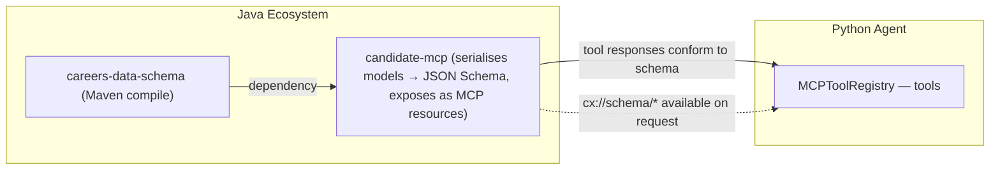

#### 5.6.3 Schema Resources Exposed by candidate-mcp

Each schema resource describes the **projected agent-context shape** — the fields that
survive PII stripping and the Layer 1 transformer.

| MCP Resource URI | Projected Source | Content (agent-safe fields only) |
|---|---|---|
| `cx://schema/profile` | `TalentProfileV2` | Assessment results, experience summary, questionnaire responses — no raw contact details |
| `cx://schema/application` | `AtsApplication` | Stage, status enum, history, metadata — no internal fields |
| `cx://schema/job` | `JobRequisition` | Title, status, location, job type, shift details — no internal fields |
| `cx://schema/application-stages` | `ApplicationStage` | Enum of all possible application stages with descriptions — no internal fields |

> **Note:** The Python agent does not call `get_resources()` at startup. These URIs are available if a future use case — such as integration-test contract assertions or an on-demand drift-detection check — requires fetching them.

---

## 6. Key Data Flows

### 6.1 Agent Startup — Tool Loading

The Python application loads MCP tools once during startup before serving any request.

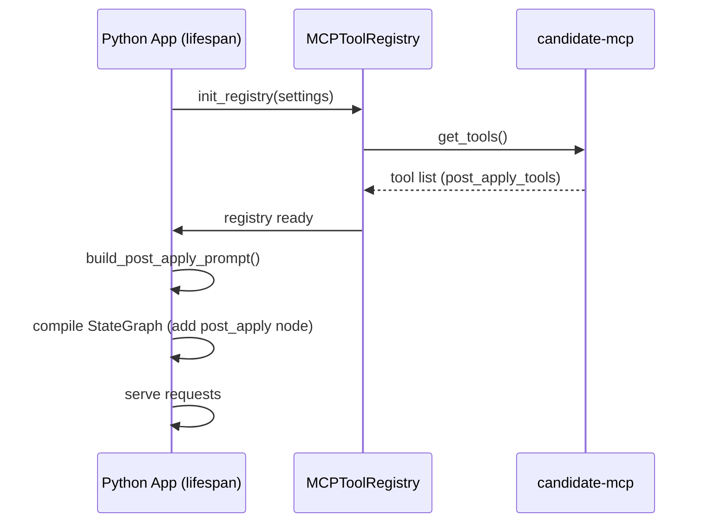

### 6.2 Happy Path — Post-Apply Query

End-to-end flow for a candidate querying their application status and next steps.

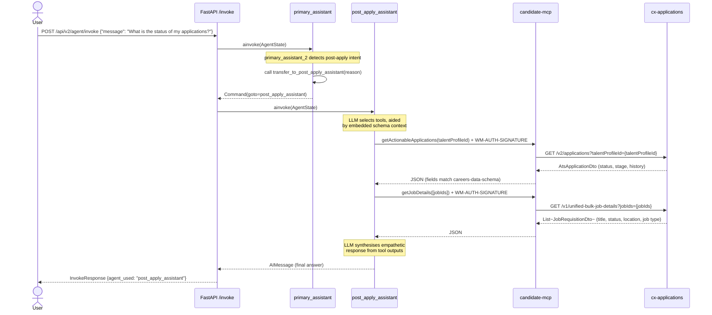

### 6.3 Profile Query Flow

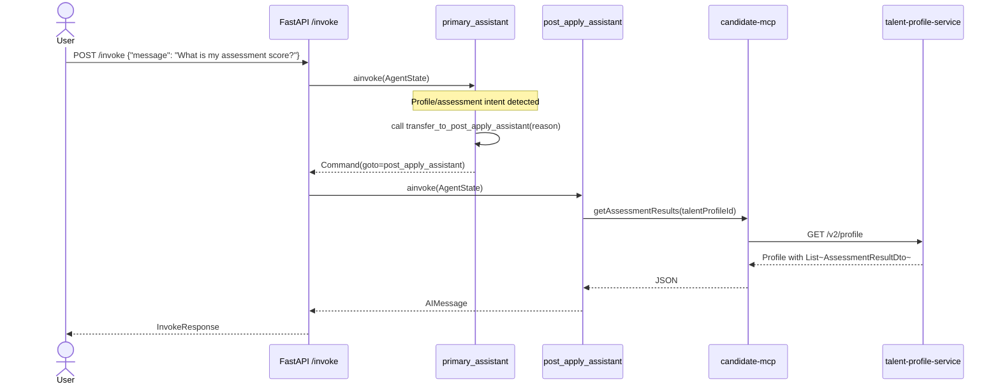

### 6.4 SSE Streaming Path

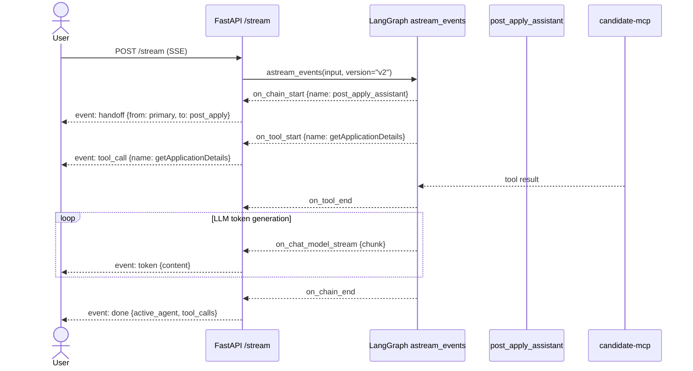

### 6.5 Downstream Call with Resilience

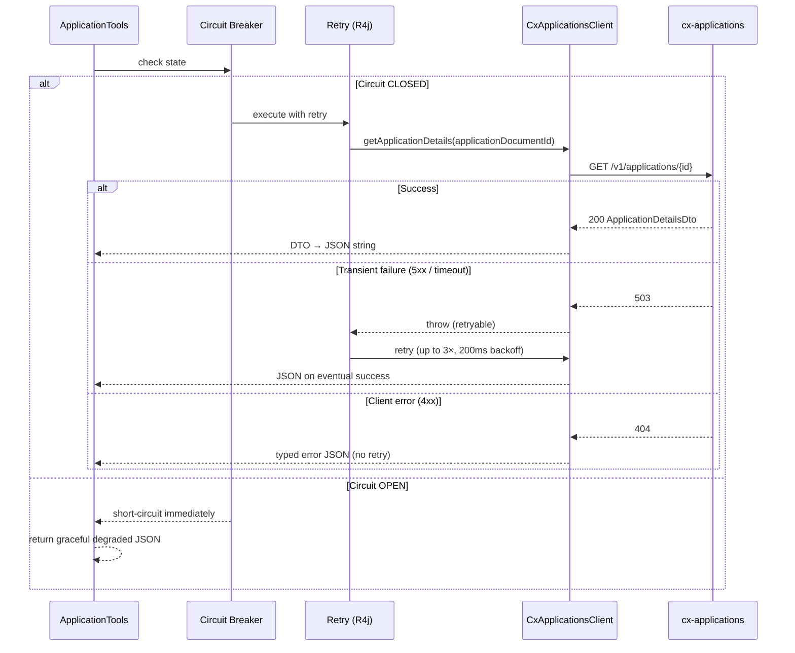

---

## 7. Integration Design

### 7.1 MCP Integration Steps — careers-ai-service to candidate-mcp

This section defines the **onboarding flow** to connect `careers-ai-service`
to `candidate-mcp`, based on the working implementation from the prototype implementation.

#### 7.1.1 Initialize MCP registry during FastAPI lifespan startup

Load tools/resources once during startup, then attach them to app state so routes and
dependencies reuse the same registry.

```python
@asynccontextmanager
async def lifespan(app: FastAPI):
    registry = await init_registry(settings)
    graph = build_graph(registry, settings)
    v2_graph = build_v2_graph(registry, settings)

    app.state.mcp_registry = registry
    app.state.graph = graph
    app.state.v2_graph = v2_graph
    app.state.settings = settings
    yield
```

#### 7.1.2 Load candidate-mcp tools at startup

At startup, create the MCP client (`streamable_http`), then fetch dynamic callable tools
for runtime tool invocation.

```python
client = MultiServerMCPClient(
    {
        "candidate_mcp": {
            "url": settings.mcp_server_url,
            "transport": "streamable_http",
            "headers": {"Accept": "application/json, text/event-stream"},
        }
    }
)

all_tools = await client.get_tools()
post_apply_tools = [t for t in all_tools if t.name in POST_APPLY_TOOL_NAMES]
```

### 7.2 MCP Protocol and TLS Handshake Optimisation

`candidate-mcp` uses **stateless streamable HTTP**. This means `langchain-mcp-adapters`
creates a new HTTP session (including a full TLS handshake) for every individual tool
call. A typical `post_apply_assistant` workflow makes 3–5 tool calls in a single
user request (e.g. `getActionableApplications` → `getJobDetails` → `getApplicationDetails` →
`getAssessmentResults` → `getPreferences`), resulting in 3–5 consecutive TLS handshakes.

Without mitigation, this adds ~50–150ms of unnecessary overhead per tool call and
saturates the TCP connection pool.

#### Problem — Per-Call TLS Overhead


#### Solution — httpx Connection Pool with TLS Session Resumption

`langchain-mcp-adapters` uses `httpx` under the hood. Configuring a shared
**persistent httpx connection pool** with TLS session resumption eliminates redundant
handshakes across tool calls within the same agent invocation.


**Implementation approach:**

A shared `httpx.AsyncClient` instance (not created per-call) is configured in the
`MCPToolRegistry` at startup and passed to the `MultiServerMCPClient` transport.

| Configuration | Value | Reason |
|---|---|---|
| `http2=True` | Enabled | HTTP/2 multiplexes tool calls over a single connection; eliminates TCP overhead entirely for concurrent calls |
| `limits.keepalive_expiry` | 30s | Prevents stale connections; matches Kubernetes service mesh idle timeout |
| `verify` | CA bundle path | Validates `candidate-mcp` TLS certificate against internal CA |
| TLS session tickets | Enabled by default in httpx | `candidate-mcp` returns a `Session-Ticket` on first handshake; subsequent reconnects reuse it, skipping full certificate exchange |

**candidate-mcp — keep-alive configuration:**

On the Spring MCP side, keep-alive settings are tuned to allow connection reuse while preventing stale connections:

| Property | Value | Reason |
|---|---|---|
| `server.connection-timeout` | `20s` | How long server waits for a new request on a kept-alive connection |
| `server.keep-alive-timeout` | `15s` | Slightly below the agent's 30s expiry to avoid race conditions |
| `server.max-keep-alive-requests` | `100` | Maximum requests on one connection before forcing a new one |

**Result:** a `post_apply_assistant` workflow making 4 tool calls to the same
`candidate-mcp` pod performs **one TLS handshake** (on the first call) and
**three keep-alive reuses** for the remainder.

```mermaid
flowchart LR
    subgraph "Python Process"
        MC["httpx.AsyncClient (shared · HTTP/2) Persistent connection pool"]
    end
    subgraph "candidate-mcp Pod A"
        EP_A["/mcp (keep-alive enabled)"]
    end
    subgraph "candidate-mcp Pod B"
        EP_B["/mcp (keep-alive enabled)"]
    end

    MC -->|"HTTP/2 stream 1 — tool call 1 TLS handshake once per pod connection"| EP_A
    MC -->|"HTTP/2 stream 2 — tool call 2 reuses connection (no new handshake)"| EP_A
    MC -->|"HTTP/2 stream 3 — tool call 3 reuses connection"| EP_A
    MC -->|"different pod — one handshake then reused"| EP_B
```

Any pod handles any call — no sticky sessions required. Connection pool distributes
across all healthy pods; a new handshake occurs only when a connection to a previously
unseen pod is first established.

### 7.3 Downstream Service Contracts

`candidate-mcp` consumes three downstream services in production:

**talent-profile-service** — profile, assessments, preferences

| Tool | Endpoint |
|---|---|
| `getTalentProfile` | `GET /v2/profile?talentProfileId={talentProfileId}` |
| `getAssessmentResults` | `GET /v2/profile?talentProfileId={talentProfileId}` |
| `getPreferences` | `GET /v2/profile?talentProfileId={talentProfileId}` |

**cx-applications** — application status and workflow history

| Tool | Endpoint |
|---|---|
| `getApplicationDetails` | `GET /v2/applications/{applicationDocumentId}` |
| `getActionableApplications` | `GET /v2/applications?talentProfileId={talentProfileId}` |


**job-sync-service** — job requisition details

| Tool | Endpoint |
|---|---|
| `getJobDetails` | `GET /v1/bulkUnifiedJobDetails?jobIds={jobIds}` — returns title, location, job type, required assessment codes, and requisition status |

---

## 8. Security Design

All service-to-service authentication uses **App2App HMAC-SHA256 signature auth**.
The same mechanism applies to both hops:
`careers-ai-service` → `candidate-mcp` and `candidate-mcp` → downstream services.
Each hop uses independently registered app IDs and secrets.

### 8.1 App2App Signature Auth — careers-ai-service to candidate-mcp

Trust is established via an HMAC-SHA256 request signature computed by the caller
and validated by the receiver.

#### Signature Header Contract

Each MCP request from `careers-ai-service` carries additional HTTP headers:

| Header | Content |
|---|---|
| `WM_CONSUMER_ID` | Registered caller identifier |
| `WM_SVC_ENV` | Registered caller environment |
| `WM_AUTH_SIGNATURE` | HMAC-SHA256 signature of the request |
| `WM_TIMESTAMP` | UTC Unix epoch seconds at signing time |

#### Service Registry — Signature TTL Configuration

`candidate-mcp` maintains the service registry that maps each registered caller to
its shared secret and optional TTL override. The default TTL is 5 minutes if App2App authentication is enabled.

#### Python — SignatureProvider

`careers-ai-service` wraps the `MultiServerMCPClient` with a `SignatureProvider` that
injects the three signature headers into every outgoing MCP HTTP request.

```mermaid
flowchart LR
    PAA["post_apply_assistant tool call"]
    SP["SignatureProvider ──────────────────── computes HMAC-SHA256 injects WM_* headers"]
    MC["MultiServerMCPClient (httpx transport)"]
    CMCP["candidate-mcp /mcp"]

    PAA --> SP
    SP --> MC
    MC -->|"POST /mcp + signature headers"| CMCP
```

---

### 8.2 App2App Signature Auth — candidate-mcp to Downstream Services

`candidate-mcp` uses the same HMAC-SHA256 signature scheme when calling downstream
services. Each downstream service registers `candidate-mcp` as a trusted `consumer_id`
in its own Service Registry. A `SignatureProvider` in `candidate-mcp` computes and
injects `WM_*` headers on every outbound REST call.

```mermaid
flowchart LR
    subgraph "candidate-mcp"
        SP["SignatureProvider computes HMAC-SHA256 injects WM_* headers"]
        PT["ProfileTools"]
        AT["ApplicationTools"]
        JT["JobTools"]
        PT & AT & JT --> SP
    end

    TPS["talent-profile-service (validates WM_* headers)"]
    CXA["cx-applications (validates WM_* headers)"]
    JSS["job-sync-service (validates WM_* headers)"]

    SP -->|"REST + App2App Signature"| TPS
    SP -->|"REST + App2App Signature"| CXA
    SP -->|"REST + App2App Signature"| JSS
```

---

### 8.3 Security Principles

| Principle | Implementation |
|---|---|
| **App2App — no shared user context** | The agent-to-MCP hop is machine-to-machine. No user bearer token is forwarded through the agent. |
| **Replay attack prevention** | Signature TTL (default 5 min) prevents reuse of a captured signature. Clock skew tolerance is not added — clocks must be synchronised (NTP). |
| **Least privilege (downstream)** | Each downstream service registers `candidate-mcp` with its own consumer_id and independent shared secret. Secrets are never shared across services. |
| **No secrets in code** | Key secret (`CONSUMER_PRIVATE_KEY`) injected via Akeyless `Secret` → env variable. MCP service registry secrets stored in Akeyless Vault, never in `application.yml`. |
| **MCP endpoint hardened** | `/mcp/**` requires a valid App2App signature. `/health/**` is public for probe access only. |

---

## 9. Resilience Design

### 9.1 Circuit Breaker — State Machine

One circuit breaker per downstream service, independently tripped. An unavailability in
`cx-applications` does not affect `talent-profile-service` or `job-sync-service`
calls. Three circuit breakers in total: one per service.

```mermaid
stateDiagram-v2
    [*] --> Closed
    Closed --> Open : failure rate ≥ 50% across 20-call sliding window
    Open --> HalfOpen : after 30 seconds
    HalfOpen --> Closed : 5 probe calls succeed
    HalfOpen --> Open : any probe call fails
```

### 9.2 Retry Configuration

| Parameter | Value | Applies To |
|---|---|---|
| Max attempts | 3 total attempts (1 initial + 2 retries) | All downstream services |
| Wait between retries | 200ms | All downstream services |
| Retry on | 5xx, connection timeout | Network / server errors |
| Do not retry | 4xx | Client errors (not found, access denied) |

### 9.3 Timeout Hierarchy

| Layer | Timeout | Purpose |
|---|---|---|
| MCP tool handler total | 30s | LLM tool call budget |
| WebClient response | 5s | Per downstream HTTP call |
| WebClient connect | 2s | TCP connection establishment |

### 9.4 Graceful Degradation

When a circuit is open or all retries are exhausted, every tool handler returns a
structured error JSON rather than throwing an exception. The LLM reads this and
generates a helpful message about the temporary unavailability rather than
hallucinating data or producing an error trace.

---

## 10. Observability Design

Production observability uses a **three-layer stack**:

- **Langfuse**: LLM tracing, cost tracking, prompt management, user feedback
- **MMS (Prometheus, Grafana)**: Service metrics, SLOs, alerting
- **MLS (OpenObserve)**: Application logs, structured logging, dashboards, alerts

This section describes the comprehensive observability strategy: what is tracked at each layer, how they integrate, and how they enable proactive monitoring and debugging of the agent in production.

---

### 10.1 Three-Layer Observability Stack

```mermaid
flowchart TD
    subgraph "Layer 1: LLM Observability"
        LF["Langfuse • Trace every LLM call • Track token usage & cost • Session tracking • User feedback collection • Prompt versioning"]
    end

    subgraph "Layer 2: Service Metrics"
        PROM["MMS • Golden signals (error rates, latency, throughput) • Tool call metrics • Circuit breaker state • SLO tracking"]
    end

    subgraph "Layer 3: Application Logs"
        OO["MLS • Structured logs • Strategic log events • Alert rules • Production dashboards"]
    end

    subgraph "Services"
        PA["careers-ai-service (Python)"]
        MC["candidate-mcp (Java)"]
    end

    PA -->|"LangfuseCallbackHandler"| LF
    PA -->|"/metrics endpoint"| PROM
    MC -->|"Micrometer metrics"| PROM
    PA -->|"structlog JSON"| OO
    MC -->|"logback JSON"| OO
```

---

### 10.2 Langfuse: LLM Tracing & Cost Management

#### A. Enhanced Trace Configuration

**Langfuse callback handler** integrated with v2 API routes provides:

- **Session tracking** via `thread_id` (multi-turn conversation grouping)
- **User segmentation** via `talent_profile_id` (per-candidate metrics)
- **Rich metadata**: agent version, environment, ats_requisition_id context
- **Tags**: `production`, `post_apply_assistant`, `application_specific`

**Implementation**:
```python
from langfuse.langchain import CallbackHandler

langfuse_handler = CallbackHandler(
    session_id=thread_id,       # Multi-turn conversation tracking
    user_id=talent_profile_id,        # Per-candidate cost and performance metrics
    tags=["production", "post_apply_assistant"],
    metadata={
        "agent_version": "v2.0",
        "environment": "production",
        "talent_profile_id": talent_profile_id,
        "ats_requisition_id": ats_requisition_id,
    }
)

config = {"configurable": {"thread_id": thread_id}, "callbacks": [langfuse_handler]}
final_state = await graph.ainvoke(input_state, config=config)
```

#### B. Cost Tracking Features

Langfuse automatically tracks:
- **Per-request cost** (prompt + completion tokens × model pricing)
- **Session-level cost** (multi-turn conversation total)
- **Per-candidate cost** (grouped by `talent_profile_id`)
- **Model usage breakdown** (cost by model type)

This enables monitoring of LLM costs at a granular level, identifying expensive queries, and optimizing prompts or tool usage to reduce costs.

#### C. User Feedback Integration

Not part of the initial implementation, but might be added in the future: a feedback endpoint that the frontend can call to send thumbs up/down feedback on the agent's response quality.

#### D. Prompt Management

Not implemented in the initial version, but the system is designed to support

**Centralized prompt versioning** in Langfuse UI:
- Store system prompts in Langfuse (version-controlled)
- Fetch at runtime: `prompt = client.get_prompt("post_apply_assistant_system_prompt", version=3)`
- A/B test prompt variations
- Rollback to previous versions on quality regression

#### E. Key Metrics Tracked by Langfuse

| Metric | Description | Alert Threshold |
|---|---|---|
| **P95 latency** | 95th percentile request duration | > 10s for 5 min |
| **Cost per trace** | LLM cost for one user request | > $0.50 (expensive query) |
| **Tool call patterns** | Most frequently used tools | - |
| **Error rate** | Percentage of failed requests | > 5% for 10 min |
| **Session duration** | Multi-turn conversation length | - |
| **Token usage trend** | Prompt + completion tokens over time | - |

---

### 10.3 MMS (Managed Metrics Service): Service Metrics & SLOs

#### A. Python Agent Metrics (careers-ai-service)

| Metric | Type | Labels | Description |
|---|---|---|---|
| `agent_requests_total` | Counter | `agent_version`, `agent_used`, `status` | Total agent requests (success/error) |
| `agent_request_duration_seconds` | Histogram | `agent_version`, `agent_used` | Request latency distribution |
| `mcp_tool_calls_total` | Counter | `tool_name`, `status` | MCP tool invocations |
| `mcp_tool_duration_seconds` | Histogram | `tool_name` | Tool call latency |
| `agent_handoff_total` | Counter | `from_agent`, `to_agent` | Agent handoff events |
| `mcp_connection_status` | Gauge | - | MCP connection health (1=up, 0=down) |
| `mcp_tools_loaded` | Gauge | `agent_type` | Number of tools loaded |
| `pa2_llm_tokens_total` | Counter | `token_type`, `model` | LLM tokens used (prompt/completion) |

#### B. Java MCP Server Metrics (candidate-mcp)

| Metric | Type | Labels | Description |
|---|---|---|---|
| `mcp.tool.calls.total` | Counter | `tool`, `status` | Tool invocations |
| `mcp.tool.duration.seconds` | Timer | `tool` | Tool execution time |
| `mcp.transformations.total` | Counter | `transformer`, `status` | PII transformation calls |
| `mcp.transformation.duration.seconds` | Timer | `transformer` | Transformation time |
| `mcp.downstream.calls.total` | Counter | `service`, `endpoint`, `status` | Downstream REST calls |
| `mcp.downstream.duration.seconds` | Timer | `service`, `endpoint` | Downstream latency |
| `mcp.circuit_breaker.open.total` | Counter | `service` | Circuit breaker opens |
| `resilience4j.circuitbreaker.state` | Gauge | `name` | Circuit state (0=closed, 1=open) |

---

### 10.4 MLS (Managed Log Search): Application Logs & Alerting

#### A. Strategic Logging Points — Python Agent

| Event | Level | Fields | Alert Trigger |
|---|---|---|---|
| `agent_invoke_start` | INFO | `thread_id`, `correlation_id`, `talent_profile_id`, `message` | - |
| `handoff_to_post_apply_assistant` | INFO | `reason`, `talent_profile_id`, `ats_requisition_id` | - |
| `mcp_tool_call_start` | DEBUG | `tool_name`, `args`, `correlation_id` | - |
| `mcp_tool_call_complete` | INFO | `tool_name`, `duration_ms`, `status` | If `duration_ms > 5000` |
| `mcp_tool_call_error` | ERROR | `tool_name`, `error`, `correlation_id` | Immediate |
| `agent_invoke_complete` | INFO | `agent_used`, `tool_calls`, `duration_ms` | If `duration_ms > 30000` |
| `agent_invoke_error` | ERROR | `error`, `error_type`, `stack_trace` | Immediate |
| `mcp_connection_failed` | CRITICAL | `error`, `mcp_url`, `retry_attempt` | Immediate |
| `pa2_llm_call_complete` | INFO | `model`, `prompt_tokens`, `cost_usd`, `duration_ms` | If `cost_usd > 1.0` |
| `circuit_breaker_opened` | CRITICAL | `service`, `failure_rate` | Immediate |

#### B. Strategic Logging Points — Java MCP Server

| Event | Level | Fields | Alert Trigger |
|---|---|---|---|
| `tool_called` | INFO | `tool`, `talent_profile_id`, `trace_id` | - |
| `tool_completed` | INFO | `tool`, `duration_ms`, `result_size_bytes` | If `duration_ms > 5000` |
| `tool_error` | ERROR | `tool`, `error`, `trace_id` | Immediate |
| `transformation_complete` | INFO | `transformer`, `duration_ms`, `fields_stripped` | - |
| `downstream_call_complete` | INFO | `service`, `endpoint`, `status_code`, `duration_ms` | If `status_code >= 500` |
| `downstream_call_error` | ERROR | `service`, `endpoint`, `error`, `retry_attempt` | If 3+ failures in 5 min |
| `circuit_breaker_opened` | CRITICAL | `service`, `failure_rate`, `call_count` | Immediate |
| `sla_breach_detected` | WARN | `ats_requisition_id`, `stage`, `days_in_stage`, `threshold` | If count > 10 in 1 hour |
| `mcp_request_received` | INFO | `x_correlation_id`, `x_talent_profile_id`, `method` | - |
| `mcp_response_sent` | INFO | `x_correlation_id`, `status`, `duration_ms` | If `duration_ms > 10000` |

#### C. Production Dashboards

**Dashboard 1: Agent Performance Overview**

Panels:
1. **Request Rate** — Requests per minute by agent type
2. **P50/P95/P99 Latency** — Latency distribution over time
3. **Error Rate** — Percentage of failed requests (gauge)
4. **Top Tools Used** — Bar chart of most frequently called tools
5. **PA2 LLM Cost** — Cumulative cost over time
6. **Tool Call Heatmap** — Usage patterns by hour of day

**Dashboard 2: MCP Server Health**

Panels:
1. **Tool Success Rate** — Success percentage per tool (gauge grid)
2. **Downstream Service Latency** — Average latency by service
3. **Circuit Breaker Status** — Open/closed status per service
4. **Transformation Performance** — Average duration by transformer

**Dashboard 3: User Experience & SLOs**

Panels:
1. **SLO Compliance** — % of requests < 10s (target: 95%)
2. **SLA Breaches** — Count of applications exceeding stage thresholds
3. **Session Duration** — Distribution of multi-turn conversation lengths
4. **Multi-Turn Conversations** — % of sessions with > 1 turn

---

### 10.5 Distributed Trace Propagation

```mermaid
flowchart LR
    CL["Client (trace ID generated)"]
    PY["Python Agent (FastAPI + OTel)"]
    MC["MCP HTTP call (httpx instrumented)"]
    JV["candidate-mcp (Micrometer + OTel)"]
    DS["Downstream Service"]
    COLL[("OTLP Collector → TraceStore")]

    CL -->|"traceparent"| PY
    PY -->|"traceparent injected by httpx"| MC
    MC --> JV
    JV -->|"traceparent injected by WebClient"| DS
    PY -.->|"spans"| COLL
    JV -.->|"spans"| COLL
```

A `correlation_id` is generated at the API layer, carried in `AgentState`, and
included in every structured log record throughout the Python process.
The `traceparent` header carries the trace across service boundaries into the Java layer.

---

## 11. Caching Design

The production `careers-ai-service` service already operates a Redis cluster shared
across all worker processes and pods. The v2 primary assistant flow uses this same
Redis instance for distributed state management of the LangGraph conversation checkpointer.

```mermaid
flowchart LR
    subgraph "careers-ai-service instances"
        W1["Worker 1 (MCP resource cache)"]
        W2["Worker 2 (MCP resource cache)"]
        WN["Worker N (MCP resource cache)"]
    end

    subgraph "Shared Redis Cluster"
        NS2["langgraph:checkpoint:* Thread conversation state"]
    end

    subgraph "candidate-mcp"
        SR["Static Resources (source of truth)"]
    end

    W1 & W2 & WN <-->|"read / write"| NS2
```

---


### 11.1 LangGraph Thread State — Conversation Checkpointer

**Current State:** v1 already uses a Redis-backed LangGraph
checkpointer. The same shared Redis infrastructure and existing checkpointer
tables are reused for v2.

**Solution — Reuse existing production checkpointer for v2:**

v2 uses the same Redis deployment used by v1 and stores the full
LangGraph checkpoint (conversation message history + agent state) keyed by
`thread_id`. All workers and all pods read and write the same shared checkpoint
store.

```mermaid
sequenceDiagram
    participant C as Client (thread_id: T1)
    participant W1 as Worker 1 (Pod A)
    participant W3 as Worker 3 (Pod B)
    participant Redis as Redis

    C->>W1: Turn 1 — "What's my application status?"
    W1->>Redis: SAVE checkpoint {T1, messages: [turn1]}
    W1-->>C: response

    C->>W3: Turn 2 — "What do I need to prepare?"
    W3->>Redis: LOAD checkpoint {T1}
    Redis-->>W3: {messages: [turn1]}
    note over W3: full context available<br/>even though different worker + pod
    W3->>Redis: SAVE checkpoint {T1, messages: [turn1, turn2]}
    W3-->>C: response (contextually aware of turn 1)
```

| Parameter | Value | Reason |
|---|---|---|
| Infrastructure | Existing production Redis + existing checkpointer tables | No new infrastructure required for v2 |
| Key namespace | `langgraph:v2:checkpoint:{thread_id}` | Separate from v1 while reusing the same underlying store/tables |
| TTL | 2 hours from last write | Matches expected candidate session length; prevents stale checkpoints accumulating |
| Serialisation | JSON (LangGraph native) | Human-readable, inspectable in Redis CLI for debugging |
| v1 graph checkpointer | Already in production on the same infra/tables | v2 rollout reuses proven production path |

---

### 11.2 Cache Hierarchy Summary

| Cache | Owner | Storage | Namespace / Scope | What it prevents |
|---|---|---|---|---|
| Thread state (checkpointer) | careers-ai-service | Redis | `langgraph:v2:checkpoint:*` | Lost conversation context across workers and pods |
---

## 12. Error Handling

### 12.1 Error Envelope Contract

Every MCP tool returns a JSON string. On failure, a typed error envelope is returned
so the LLM can interpret it and generate a helpful user-facing message.

| Field | Description |
|---|---|
| `error` | Machine-readable error code |
| `message` | Human-readable description safe to surface |
| `retriable` | Whether the caller should suggest trying again |

### 12.2 Error Classification

| Scenario | Error Code | HTTP Status | Retriable | Example Response |
|---|---|---|---|---|
| Resource not found (404) | `{resource}_not_found` | 404 | No | `{"error": "job_not_found", "message": "Job R-12345 not found"}` |
| Access denied (403) | `access_denied` | 403 | No | `{"error": "access_denied", "message": "Unauthorized access"}` |
| Service timeout | `service_timeout` | 504 | Yes | `{"error": "service_timeout", "message": "Request timed out"}` |
| Circuit breaker open | `service_unavailable` | 503 | Yes | `{"error": "service_unavailable", "message": "Service temporarily unavailable"}` |
| Unexpected error | `internal_error` | 500 | No | `{"error": "internal_error", "message": "An unexpected error occurred"}` |
| **Recursion limit exceeded** | `recursion_limit_exceeded` | 504 | No | `{"error": "recursion_limit_exceeded", "message": "Request exceeded maximum iteration limit (25). Please simplify your query."}` |
| **Request timeout** | `request_timeout` | 504 | No | `{"error": "request_timeout", "message": "Agent execution timeout. Please try a simpler query or contact support."}` |

**Guardrail Error Response Examples**:

```python
# Recursion limit exceeded (504 Gateway Timeout)
{
    "error": "recursion_limit_exceeded",
    "message": "Request exceeded maximum iteration limit (25). Please simplify your query.",
    "retriable": false,
    "details": {
        "iterations": 25,
        "limit": 25,
        "tool_calls": 12
    }
}
# Request timeout (504 Gateway Timeout)
{
    "error": "request_timeout",
    "message": "Agent execution timeout after 30 seconds. Please try a simpler query or contact support.",
    "retriable": false,
    "details": {
        "timeout_seconds": 30,
        "elapsed_seconds": 30.2
    }
}
```

Stack traces, internal metadata, and raw downstream response bodies are never included
in the error envelope.

---

## 13. Testing Strategy

### 13.1 Test Layers

```mermaid
flowchart TB
    E2E["End-to-End Tests ────────────────────── Python pytest · Full conversation scenarios"]
    INT_PY["Python Integration Tests ────────────────────── ASGI client + candidate-mcp Lifespan-managed fixture"]
    INT_JAVA["Java Integration Tests ────────────────────── JUnit5 + Downstream services stubbed"]
    UNIT["Unit Tests ────────────────────── Tool handlers: JSON shape Error paths: 4xx · 5xx · circuit open Token provider: refresh boundary"]

    E2E --> INT_PY
    INT_PY --> INT_JAVA
    INT_JAVA --> UNIT
```

### 13.2 Key Scenarios by Layer

**Unit (Java — candidate-mcp tool handlers)**
- Nominal: correct JSON shape matching `careers-data-schema` DTO fields.
- 404 from downstream: typed `not_found` envelope returned, no exception propagated.
- Circuit open: graceful degraded envelope returned without touching the downstream client.
- Retry: client retries on 503, succeeds on the third attempt.

**Integration (Java — JUnit5)**
- Full tool call through WebClient to a WireMocked downstream service.
- Circuit breaker trips after 20 consecutive failures.
- App2App signature headers are computed and injected into the downstream request header.
- Schema resources are served at startup and contain the expected JSON Schema fields.

**Integration (Python — pytest)**
- Handoff from primary to `post_apply_assistant` fires for recognised intent patterns.
- `post_apply_assistant` reaches END with a non-empty response.
- Schema resources are loaded and embedded in the system prompt during lifespan startup.

**Guardrail-Specific Tests**

- `test_recursion_limit_prevents_infinite_loop`: verifies requests stop at recursion limit (25) and return success/timeout safely.
- `test_invalid_job_id_format_rejected`: verifies invalid/hallucinated job IDs are rejected and valid IDs pass.
- `test_request_timeout_enforced`: verifies request-level timeout is enforced at 30 seconds (with grace window).
- `test_tool_call_limit_enforced`: verifies per-request tool call limit is enforced at 10 calls.
- `test_id_validation_error_message_helpful`: verifies ID validation errors contain actionable guidance and valid format examples.

**Test Coverage Requirements**:

| Guardrail | Test Scenarios | Acceptance Criteria |
|---|---|---|
| **Recursion limit** | Infinite loop query, nested tool calls | Stops at 25 iterations, returns 504 or helpful message |
| **Request timeout** | Long-running query, slow downstream | Stops at 30 seconds, returns 504 with user-friendly message |
| **Tool call limit** | Overly broad query | Stops at 10 tool calls, agent asks user to rephrase |
| **ID validation** | Hallucinated IDs (JSeniorSRE, job-001, A1) | Rejects with 400, error message teaches correct format |
| **Convergence patterns** | Sequential tool calls | Agent stops after sufficient data collected |

**End-to-End**
- Candidate asks for application status → `agent_used: post_apply_assistant`, response references atsRequisitionId.
- Candidate asks for skills gap against a role → `getTalentProfile` and `getSkillsGap` both called.
- `cx-applications` unavailable → user receives a degraded but helpful response.

---

## 14. Deployment

### 14.1 Service Topology

```mermaid
flowchart TD
    subgraph "Kubernetes Cluster"
        subgraph "Agent Namespace"
            AGT["careers-agent Python replicas: 36"]
        end

        subgraph "MCP Namespace"
            CMCP["candidate-mcp Java replicas: 9"]
        end

        subgraph "Infrastructure"
            REDIS[("Redis")]
        end

        INGRESS["Ingress Controller"]
    end

    subgraph "Downstream"
        CXA["cx-applications"]
        TPS["talent-profile-service"]
        JSS["job-sync-service"]
    end

    INGRESS --> AGT
    AGT -->|"MCP"| CMCP
    AGT --> REDIS
    CMCP -->|"REST"| CXA
    CMCP -->|"REST"| TPS
    CMCP -->|"REST"| JSS

```

### 14.2 Health Checks

| Service | Liveness Probe | Readiness Probe |
|---|---|---|
| careers-agent (Python) | `GET /health` → 200 | `GET /health` → `mcp_connected: true` |
| candidate-mcp (Java) | `GET /actuator/health/liveness` | `GET /actuator/health/readiness` |

The readiness probe on `candidate-mcp` returns unhealthy if any circuit breaker is in
the `OPEN` state, removing the pod from the load balancer until the downstream service
recovers.

### 14.3 Configuration Injection

| Config Type | Mechanism |
|---|---|
| Service URLs | CCM `ConfigMap` → environment variables |
| App2App private key | Akeyless Vault `PrivateKey` → environment variables |
| candidate-mcp URL (Python) | CCM `ConfigMap` → `.env` |

---

## 15. Design Decisions

### DD-01: Three-Layer Transformation — Separation of PII Safety, Context Relevance, and Presentation

**Decision:** Data is transformed in three discrete, independently owned layers:
Layer 1 (candidate-mcp — PII stripping and agent-neutral projection), Layer 2
(post_apply_assistant — query-specific context filtering for the LLM), Layer 3
(post_apply_assistant — candidate-facing response formatting).

**Alternatives considered:**
- Single transformation in candidate-mcp, fully assistant-specific → rejected:
  `candidate-mcp` would need to know about each assistant's specific output
  requirements. Adding a new assistant would require changes to the MCP server.
- Single transformation in the Python agent → rejected: PII would flow from downstream
  services through the MCP transport into the Python process. Any logging or tracing
  in the agent would risk capturing PII.
- No explicit formatting — rely entirely on LLM → rejected: LLM tone and structure
  are non-deterministic. Candidate-facing communication requires consistent, predictable
  language around sensitive events like rejection and offer.

**Consequence:** Each layer has a clear owner and change boundary. A change to PII
policy requires only a `candidate-mcp` change. A change to how the LLM is prompted
for context filtering requires only a Python system prompt change. A change to
candidate-facing language requires only the response template. None of these cross
the layer boundary.

---

### DD-02: v2 Route as Isolation Strategy

**Decision:** A new `/api/v2/agent/` route backed by a new LangGraph graph is
introduced in the same `careers-ai-service` process. The existing v1 graph and
`/api/v1/agent/` routes are untouched.

**Alternatives considered:**
- Inject `post_apply_assistant` into the existing v1 graph → rejected: risks
  destabilising the live job search assistant; changes the routing logic of a
  production graph that is currently working.

**Consequence:** v1 and v2 graphs coexist in the same process. With MCP registry attached to v2, v2 can be iterated independently. Future
consolidation replaces v1 with v2 once all sub-assistants are stable.

---

### DD-03: App2App HMAC-SHA256 Signature for All Service-to-Service Calls

**Decision:** All internal service-to-service authentication uses HMAC-SHA256
signature — both `careers-ai-service` → `candidate-mcp` and `candidate-mcp` →
downstream services. No OAuth2 server is involved at any hop.

**Alternatives considered:**
- IAM token → rejected: adds an external dependency, more complex token management, less transparent security model.

**Consequence:** Authentication is entirely self-contained. No external auth server
dependency at any hop. All secrets managed via Akeyless Vault.

---

### DD-04: MCP Static Resources as Schema Carrier for careers-data-schema

**Decision:** `candidate-mcp` takes `careers-data-schema` as a compile-time dependency,
serialises the Java models to JSON Schema, and exposes them as MCP static resources.
They are the authoritative
contract for the shape of data returned by MCP tools, consumed by integration tests and
developer tooling.

**Alternatives considered:**
- Maintain parallel Python Pydantic models → rejected: dual maintenance, silent drift risk.
- OpenAPI spec → Python code generation → rejected: extra pipeline, still a separate artefact to synchronise.
- Embed schemas in system prompts → rejected: inflates system-prompt token count with no current benefit.
- Load schemas at Python startup → rejected: adds a startup network call and an 8N startup burst for no current consumer.

**Consequence:** A `careers-data-schema` breaking change requires rebuilding and
redeploying `candidate-mcp`. This is an intentional and auditable deployment gate.

---

### DD-05: Stateless MCP over Stateful Sessions

**Decision:** `candidate-mcp` uses `STATELESS` protocol mode. Each tool call is an
independent HTTP request.

**Alternatives considered:**
- Stateful SSE sessions → requires session affinity in Kubernetes; no benefit for
  this use case since all domain calls are stateless by nature.

**Consequence:** Horizontal scaling is trivial. Each tool call has a small
session-init overhead but latency is dominated by the downstream service call itself.

---

### DD-06: Shared httpx Connection Pool with HTTP/2 to Eliminate Per-Tool TLS Overhead

**Decision:** A single `httpx.AsyncClient` instance with `http2=True` and a
configured keep-alive pool is shared across all MCP tool calls within a process
lifetime. TLS session resumption reuses session tickets across reconnects to the
same pod.

**Problem observed:** Without a shared pool, every tool call in a multi-step workflow
triggers a full TCP + TLS handshake. A 4-tool workflow = 4 handshakes = ~200–600ms
of avoidable overhead on top of actual tool execution.

**Alternatives considered:**
- Accept per-call handshakes → rejected: latency is visible to candidates on slower
  queries; a 4-tool workflow that takes 2s of LLM + tool time adding 400ms of TLS
  overhead is a 20% regression for no benefit.
- HTTP/1.1 keep-alive only (no HTTP/2) → acceptable fallback, but HTTP/2 multiplexing
  allows concurrent tool calls to the same pod over a single connection — strictly
  better if `candidate-mcp` supports it.
- Connection per request (current default in langchain-mcp-adapters) → baseline,
  rejected for production.

**Consequence:** The `SignatureProvider` transport patch must also configure
the shared `httpx.AsyncClient`. These two concerns are implemented together in the
same transport wrapper.

---

### DD-08: Circuit Breaker per Downstream Service

**Decision:** Three independent Resilience4j circuit breakers — one each for
`talent-profile-service`, `cx-applications`, and `job-sync-service`.

**Alternatives considered:**
- Single shared circuit breaker → rejected: a failure in `cx-applications` would
  block profile lookups from `talent-profile-service`; incorrect blast radius.

**Consequence:** A full outage of one service degrades only the tools that depend on
it. Profile and assessment tools remain functional if `cx-applications` is down.
`getJobDetails` enrichment degrades gracefully if `job-sync-service` is unavailable — the
assistant can still answer application status queries without job details.

---

## 16. Open Issues & Risks

| ID | Issue / Risk | Severity | Owner | Status |
|---|---|---|---|---|
| R-01 | `langchain-mcp-adapters` does not natively support custom per-request header injection. The `SignatureProvider` must wrap or patch the httpx transport layer. Verify compatibility with `langchain-mcp-adapters 0.1.x`. Same httpx transport patch also enables shared connection pool for TLS reuse. | High | Dev team | Open — spike required |
| R-02 | v1 and v2 graphs share no state. A user switching between `/api/v1` and `/api/v2` endpoints within the same session will lose conversation context. Cross-version thread continuity is not supported and must be communicated to consumers. | Low | Dev team | Accepted for now |

---

**Document Author**: Venkat Raman K S