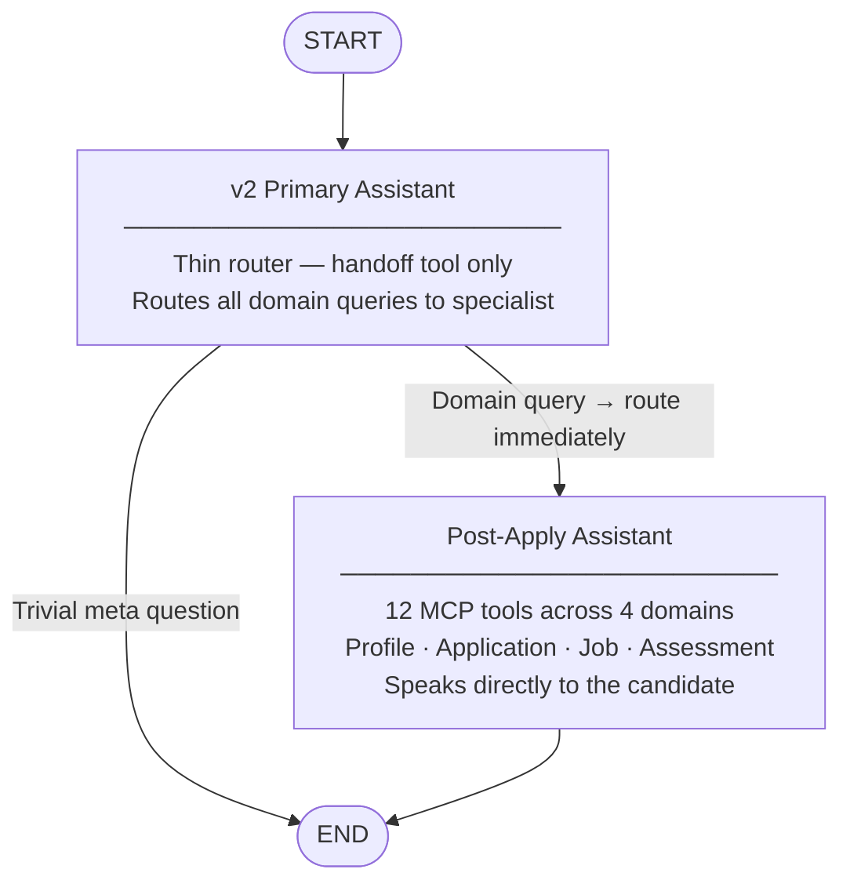
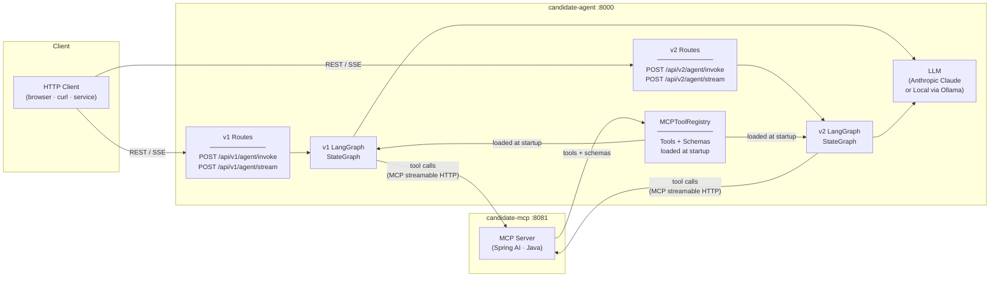
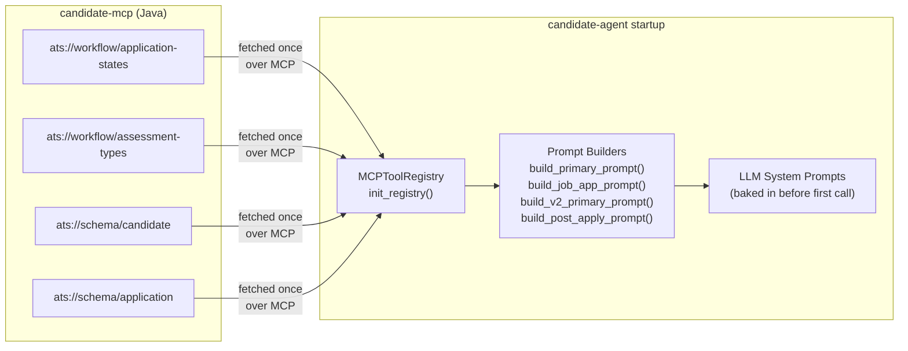

# candidate-agent

A **production-grade LLM agent** for the ATS candidate domain, built with Python, FastAPI, and LangGraph. It connects to [`candidate-mcp`](../candidate-mcp) via the Model Context Protocol and exposes two independent multi-agent workflows through REST and Server-Sent Events (SSE) endpoints.

The service runs **two parallel graphs** in a single process:

| Version | Route prefix | Agents | Use case |
|---|---|---|---|
| **v1** | `/api/v1/agent/` | Candidate Primary + Job Application Agent | Internal ATS domain queries, developer assistants, HR ops |
| **v2** | `/api/v2/agent/` | v2 Primary Router + Post-Apply Assistant | Candidate-facing: profile, applications, assessments |

---

## Architecture

### v1 Graph — Candidate Primary + Job Application Agent


### v2 Graph — v2 Primary Router + Post-Apply Assistant



### System Components



---

## How Schema Resources Power the Agents

At startup, `candidate-agent` fetches static JSON Schema resources from `candidate-mcp`
and embeds them directly into the LLM system prompts before any conversation begins.



The LLM knows the exact shape, field names, enums, and valid state transitions of
every ATS entity **before** its first tool call — improving accuracy and eliminating
hallucinated field names at zero runtime cost.

---

## API Endpoints

### v1 — Internal / Developer

#### `POST /api/v1/agent/invoke`

Runs the v1 graph synchronously.

**Request**

| Field | Type | Required | Description |
|---|---|---|---|
| `message` | string | Yes | User message |
| `candidate_id` | string | No | Candidate context for the session |
| `thread_id` | string | No | Conversation thread ID (auto-generated if omitted) |
| `correlation_id` | string | No | Trace ID for observability (auto-generated if omitted) |

**Response**

| Field | Description |
|---|---|
| `response` | Final agent answer |
| `agent_used` | `"candidate_primary"` or `"job_application_agent"` |
| `tool_calls` | Names of MCP tools called during the run |
| `thread_id` | Thread ID for subsequent turns |
| `correlation_id` | Trace ID for log correlation |

#### `POST /api/v1/agent/stream`

Same as v1 `/invoke` but streams as **Server-Sent Events**.

---

### v2 — Candidate-Facing

#### `POST /api/v2/agent/invoke`

Runs the v2 graph synchronously. Routes through `v2_primary_assistant` →
`post_apply_assistant`.

**Request**

| Field | Type | Required | Description |
|---|---|---|---|
| `message` | string | Yes | Candidate's message |
| `candidate_id` | string | **Yes** | Candidate identity — injected into LLM context |
| `application_id` | string | No | Scope the query to a specific application. When omitted, the assistant retrieves all applications for the candidate. |
| `thread_id` | string | No | Conversation thread ID (auto-generated if omitted) |
| `correlation_id` | string | No | Trace ID (auto-generated if omitted) |

**Response**

| Field | Description |
|---|---|
| `response` | Candidate-facing answer in plain language |
| `agent_used` | `"v2_primary_assistant"` or `"post_apply_assistant"` |
| `tool_calls` | Names of MCP tools called |
| `thread_id` | Thread ID for subsequent turns |
| `correlation_id` | Trace ID |

**Example — profile query (no application_id)**

```bash
curl -s -X POST http://localhost:8000/api/v2/agent/invoke \
  -H "Content-Type: application/json" \
  -d '{
    "message": "Show me my candidate profile.",
    "candidate_id": "C002",
    "thread_id": "session-001"
  }'
```

**Example — specific application query**

```bash
curl -s -X POST http://localhost:8000/api/v2/agent/invoke \
  -H "Content-Type: application/json" \
  -d '{
    "message": "Where does my application stand?",
    "candidate_id": "C001",
    "application_id": "A001",
    "thread_id": "session-002"
  }'
```

#### `POST /api/v2/agent/stream`

Same as v2 `/invoke` but streams as Server-Sent Events. Emits a `handoff` event
when `post_apply_assistant` takes over.

**SSE Event Types**

| Event | Payload | Description |
|---|---|---|
| `token` | `{content: str}` | LLM output token |
| `tool_call` | `{name: str}` | MCP tool invocation started |
| `handoff` | `{from: str, to: str}` | Routing from v2 primary → post_apply |
| `done` | `{active_agent: str, tool_calls: [str]}` | Stream complete |
| `error` | `{detail: str}` | Unhandled error |

---

### Health

#### `GET /health`

Liveness and MCP connectivity check.

```json
{
  "status": "healthy",
  "mcp_connected": true,
  "llm_model": "claude-sonnet-4-6",
  "version": "1.0.0"
}
```

---

## Prerequisites

| Requirement | Version | Notes |
|---|---|---|
| Python | 3.12+ | |
| [uv](https://docs.astral.sh/uv/) | latest | Package manager |
| candidate-mcp | running on `:8081` | Start it first |
| Anthropic API key | — | Not required when `LOCAL_LLM=true` |

---

## Quick Start

```bash
# 1. Clone and install dependencies
git clone <repo-url>
cd candidate-agent
uv sync

# 2. Configure environment
cp .env.example .env
# Edit .env — set ANTHROPIC_API_KEY (or set LOCAL_LLM=true for Ollama)

# 3. Make sure candidate-mcp is running on :8081

# 4. Start the agent
uv run uvicorn candidate_agent.main:app --host 0.0.0.0 --port 8000 --reload
```

---

## Configuration

All settings are read from a `.env` file (copy from `.env.example`).

### MCP

| Variable | Default | Description |
|---|---|---|
| `MCP_SERVER_URL` | `http://localhost:8081/mcp` | candidate-mcp endpoint |
| `MCP_CONNECT_TIMEOUT` | `30` | Connection timeout in seconds |

### LLM — Anthropic (default)

| Variable | Default | Description |
|---|---|---|
| `ANTHROPIC_API_KEY` | — | **Required** when `LOCAL_LLM=false` |
| `LLM_MODEL` | `claude-sonnet-4-6` | Anthropic model ID |
| `LLM_TEMPERATURE` | `0.0` | Sampling temperature |

### LLM — Local (Ollama / LM Studio / vLLM)

Set `LOCAL_LLM=true` to use any OpenAI-compatible local server instead of Anthropic.
`ANTHROPIC_API_KEY` is not required in this mode.

| Variable | Default | Description |
|---|---|---|
| `LOCAL_LLM` | `false` | Switch to local LLM backend |
| `LOCAL_LLM_BASE_URL` | `http://localhost:11434/v1` | OpenAI-compatible server URL |
| `LOCAL_LLM_MODEL` | `llama3.2` | Model name to request |
| `LOCAL_LLM_API_KEY` | `ollama` | API key (Ollama ignores this; set for vLLM auth) |

**Ollama quick setup:**
```bash
ollama pull llama3.2
# Set LOCAL_LLM=true in .env
```

### Server

| Variable | Default | Description |
|---|---|---|
| `APP_HOST` | `0.0.0.0` | Bind address |
| `APP_PORT` | `8000` | HTTP port |
| `LOG_LEVEL` | `INFO` | Logging level (`DEBUG` / `INFO` / `WARNING`) |

---

## Multi-Turn Conversations

Pass the same `thread_id` across multiple requests to maintain conversation context.
The agent remembers previous messages within the thread.

```bash
# Turn 1
curl -s -X POST http://localhost:8000/api/v2/agent/invoke \
  -H "Content-Type: application/json" \
  -d '{"message": "What is my application status?", "candidate_id": "C001", "application_id": "A001", "thread_id": "my-session"}'

# Turn 2 — agent has context from turn 1
curl -s -X POST http://localhost:8000/api/v2/agent/invoke \
  -H "Content-Type: application/json" \
  -d '{"message": "What should I prepare for next?", "candidate_id": "C001", "thread_id": "my-session"}'
```

---

## Running Tests

### Integration Tests (pytest)

Require both `candidate-mcp` (`:8081`) and a valid `ANTHROPIC_API_KEY`.

```bash
uv run pytest tests/ -v
```

### v2 Scenario Tests

A standalone script that exercises all 14 v2 use cases against a live server and
reports pass/fail with response previews.

```bash
# Run all 14 scenarios
.venv/bin/python tests/test_v2_scenarios.py

# Run a single scenario
.venv/bin/python tests/test_v2_scenarios.py --scenario 3

# Against a non-default host
.venv/bin/python tests/test_v2_scenarios.py --base-url http://staging:8000
```

Scenarios covered:

| # | Group | Candidate | Scenario |
|---|---|---|---|
| 1 | Profile | C002 | View candidate profile |
| 2 | Profile | C001 | Skills gap vs unapplied role (J002) |
| 3 | Application Status | C001 / A001 | FINAL_INTERVIEW status |
| 4 | Application Status | C004 / A004 | OFFER_EXTENDED — offer details |
| 5 | Application Status | C001 / A006 | REJECTED — constructive tone |
| 6 | All Applications | C001 | Full history (A001 + A006), no application_id |
| 7 | All Applications | C006 | Journey narrative, no application_id |
| 8 | Assessments | C004 / A004 | All 3 assessments (top scorer) |
| 9 | Assessments | C002 / A002 | Percentile comparison (94th) |
| 10 | Next Steps | C002 / A002 | PHONE_INTERVIEW prep guidance |
| 11 | Next Steps | C006 / A007 | SLA / stage duration check |
| 12 | Streaming | C003 / A003 | SSE stream — status + next steps |
| 13 | Edge Cases | C005 / A005 | HIRED candidate — journey summary |
| 14 | Edge Cases | C001 / A001 | Interview feedback (3 rounds) |

---

## Project Structure

```
src/candidate_agent/
├── main.py                   FastAPI app and lifespan (MCP init, both graphs compiled)
├── config.py                 Pydantic Settings — reads from .env
├── logging_setup.py          structlog JSON configuration
├── agents/
│   ├── graph.py              v1 build_graph() + v2 build_v2_graph() + context injection
│   ├── state.py              CandidateAgentState (v1) · PostApplyAgentState (v2)
│   ├── prompts.py            System prompt factory functions for all four agents
│   └── llm.py               LLM factory (Anthropic ↔ local)
├── mcp/
│   └── client.py            MCPToolRegistry — tool loading, schema fetching,
│                            app_tools (6) · post_apply_tools (12)
└── api/
    ├── schemas.py            InvokeRequest/Response · V2InvokeRequest · V2StreamRequest
    ├── dependencies.py       get_graph() · get_v2_graph() · get_registry() · get_settings()
    └── routes/
        ├── agent.py          v1 /invoke and /stream
        ├── agent_v2.py       v2 /invoke and /stream
        └── health.py         /health
tests/
├── test_agent_invoke.py      pytest integration suite (v1 + health)
└── test_v2_scenarios.py      14-scenario v2 end-to-end test runner
docs/
└── post-apply-assistant-lld.md  Low Level Design — v2 primary assistant + post_apply_assistant
```

---

## Related

- **[candidate-mcp](../candidate-mcp)** — Java MCP server that this agent consumes.
- **[docs/post-apply-assistant-lld.md](docs/post-apply-assistant-lld.md)** — LLD for the v2 primary assistant and post_apply_assistant.
