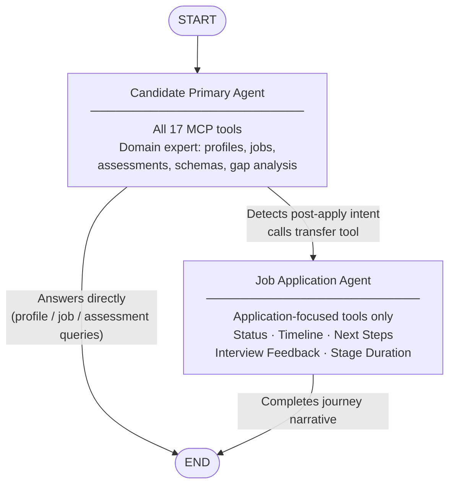
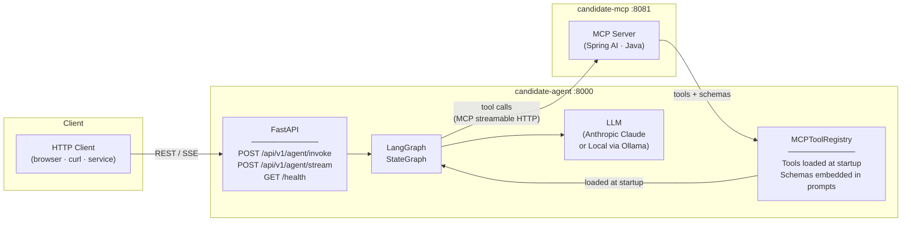
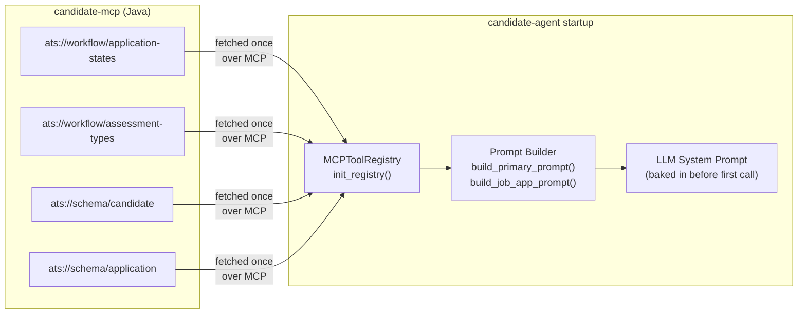

# candidate-agent

A **production-grade LLM agent** for the ATS candidate domain, built with Python, FastAPI, and LangGraph. It connects to [`candidate-mcp`](../candidate-mcp) via the Model Context Protocol and exposes a multi-agent workflow through REST and Server-Sent Events (SSE) endpoints.

The agent is designed around two specialists that collaborate: a **Candidate Primary Agent** that handles the broad domain (profiles, jobs, assessments, schemas) and a **Job Application Agent** that specialises in the post-application journey (status, timelines, next steps, interview feedback). The primary agent routes to the specialist automatically when the query calls for it.

---

## Architecture

### Multi-Agent Graph



### System Components



---

## How Schema Resources Power the Agent

At startup, `candidate-agent` fetches static JSON Schema resources from `candidate-mcp`
and embeds them directly into the LLM system prompts before any conversation begins.



This means the LLM knows the exact shape, field names, enums, and valid state
transitions of every ATS entity **before** its first tool call — improving accuracy
and eliminating hallucinated field names with no runtime overhead.

---

## API Endpoints

### `POST /api/v1/agent/invoke`

Runs the full agent workflow synchronously and returns the final response as JSON.

**Request**

| Field | Type | Required | Description |
|---|---|---|---|
| `message` | string | Yes | User message |
| `candidate_id` | string | No | Candidate context for the session |
| `thread_id` | string | No | Conversation thread ID (auto-generated if omitted) |
| `correlation_id` | string | No | Trace ID for observability (auto-generated if omitted) |

**Response**

| Field | Description |
|---|---|
| `response` | Final agent answer |
| `agent_used` | `"candidate_primary"` or `"job_application_agent"` |
| `tool_calls` | Names of MCP tools called during the run |
| `thread_id` | Thread ID (use in subsequent turns to maintain context) |
| `correlation_id` | Trace ID for log correlation |

---

### `POST /api/v1/agent/stream`

Same as `/invoke` but streams the response as **Server-Sent Events**. Suitable for
real-time UIs.

**SSE Event Types**

| Event | Payload | Description |
|---|---|---|
| `token` | `{content: str}` | LLM output token |
| `tool_call` | `{name: str}` | MCP tool invocation started |
| `handoff` | `{from: str, to: str}` | Agent routing decision |
| `done` | `{active_agent: str, tool_calls: [str]}` | Stream complete |
| `error` | `{detail: str}` | Unhandled error |

---

### `GET /health`

Liveness and MCP connectivity check.

```json
{
  "status": "healthy",
  "mcp_connected": true,
  "llm_model": "claude-sonnet-4-6",
  "version": "1.0.0"
}
```

---

## Prerequisites

| Requirement | Version | Notes |
|---|---|---|
| Python | 3.12+ | |
| [uv](https://docs.astral.sh/uv/) | latest | Package manager |
| candidate-mcp | running on `:8081` | Start it first |
| Anthropic API key | — | Not required when `LOCAL_LLM=true` |

---

## Quick Start

```bash
# 1. Clone and install dependencies
git clone <repo-url>
cd candidate-agent
uv sync

# 2. Configure environment
cp .env.example .env
# Edit .env — set ANTHROPIC_API_KEY (or set LOCAL_LLM=true for Ollama)

# 3. Make sure candidate-mcp is running on :8081

# 4. Start the agent
uv run uvicorn candidate_agent.main:app --host 0.0.0.0 --port 8000 --reload
```

---

## Configuration

All settings are read from a `.env` file (copy from `.env.example`).

### MCP

| Variable | Default | Description |
|---|---|---|
| `MCP_SERVER_URL` | `http://localhost:8081/mcp` | candidate-mcp endpoint |
| `MCP_CONNECT_TIMEOUT` | `30` | Connection timeout in seconds |

### LLM — Anthropic (default)

| Variable | Default | Description |
|---|---|---|
| `ANTHROPIC_API_KEY` | — | **Required** when `LOCAL_LLM=false` |
| `LLM_MODEL` | `claude-sonnet-4-6` | Anthropic model ID |
| `LLM_TEMPERATURE` | `0.0` | Sampling temperature |

### LLM — Local (Ollama / LM Studio / vLLM)

Set `LOCAL_LLM=true` to use any OpenAI-compatible local server instead of Anthropic.
`ANTHROPIC_API_KEY` is not required in this mode.

| Variable | Default | Description |
|---|---|---|
| `LOCAL_LLM` | `false` | Switch to local LLM backend |
| `LOCAL_LLM_BASE_URL` | `http://localhost:11434/v1` | OpenAI-compatible server URL |
| `LOCAL_LLM_MODEL` | `llama3.2` | Model name to request |
| `LOCAL_LLM_API_KEY` | `ollama` | API key (Ollama ignores this; set for vLLM auth) |

**Ollama quick setup:**
```bash
ollama pull llama3.2
# Set LOCAL_LLM=true in .env
```

### Server

| Variable | Default | Description |
|---|---|---|
| `APP_HOST` | `0.0.0.0` | Bind address |
| `APP_PORT` | `8000` | HTTP port |
| `LOG_LEVEL` | `INFO` | Logging level (`DEBUG` / `INFO` / `WARNING`) |

---

## Multi-Turn Conversations

Pass the same `thread_id` across multiple requests to maintain conversation context.
The agent remembers previous messages within the thread.

```bash
# Turn 1
curl -s -X POST http://localhost:8000/api/v1/agent/invoke \
  -H "Content-Type: application/json" \
  -d '{"message": "Tell me about candidate C001.", "thread_id": "my-session"}'

# Turn 2 — agent has context from turn 1
curl -s -X POST http://localhost:8000/api/v1/agent/invoke \
  -H "Content-Type: application/json" \
  -d '{"message": "What jobs match their skills?", "thread_id": "my-session"}'
```

---

## Running Tests

Tests are integration tests — they require both `candidate-mcp` (`:8081`) and a valid
`ANTHROPIC_API_KEY` (or `LOCAL_LLM=true`) to be configured.

```bash
uv run pytest tests/ -v
```

---

## Project Structure

```
src/candidate_agent/
├── main.py                   FastAPI app and lifespan (MCP init, graph compile)
├── config.py                 Pydantic Settings — reads from .env
├── logging_setup.py          structlog JSON configuration
├── agents/
│   ├── graph.py              LangGraph StateGraph wiring
│   ├── state.py              CandidateAgentState schema
│   ├── prompts.py            System prompt factory functions
│   └── llm.py                LLM factory (Anthropic ↔ local)
├── mcp/
│   └── client.py             MCPToolRegistry — tool loading and schema fetching
└── api/
    ├── schemas.py             Pydantic request/response models
    ├── dependencies.py        FastAPI dependency injection
    └── routes/
        ├── agent.py           /invoke and /stream endpoints
        └── health.py          /health endpoint
tests/
└── test_agent_invoke.py       Integration test suite
docs/
└── post-apply-assistant-lld.md  Low Level Design for the next production feature
```

---

## Related

- **[candidate-mcp](../candidate-mcp)** — Java MCP server that this agent consumes.
- **[docs/post-apply-assistant-lld.md](docs/post-apply-assistant-lld.md)** — LLD for the upcoming `post_apply_assistant` feature.
