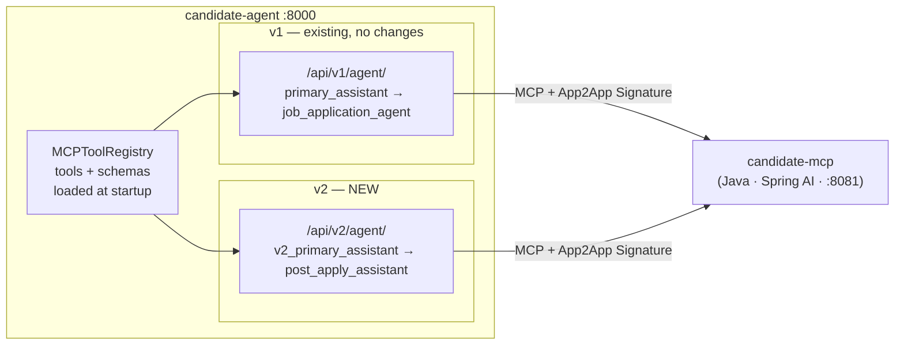
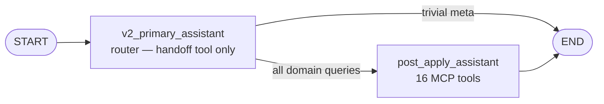
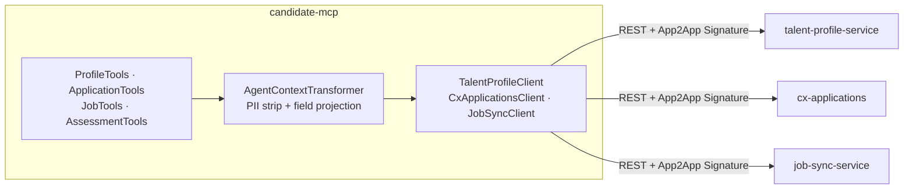
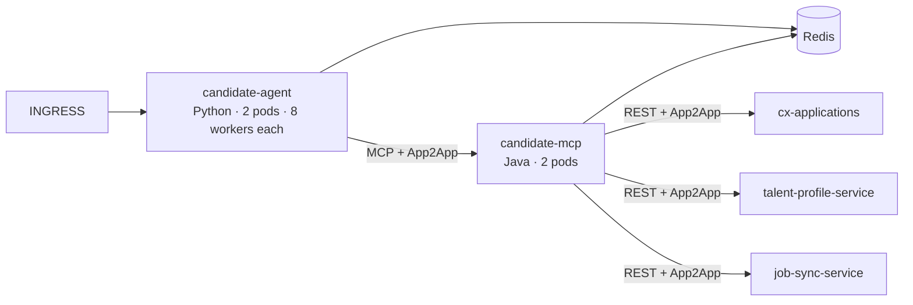

# LLD — post_apply_assistant Integration

| Field | Detail |
|---|---|
| **Version** | 2.0 |
| **Status** | Ready for Enterprise Submission |
| **Last Updated** | 2026-03-01 |
| **Component** | candidate-agent (Python) · candidate-mcp (Java) |
| **Depends On** | cx-applications · talent-profile-service · job-sync-service |

---

## 1. Purpose & Scope

Introduce a **v2 API route** (`/api/v2/agent/`) and a `post_apply_assistant` sub-assistant to `candidate-agent`. The assistant faces the actual candidate — answering queries about profile, applications, assessments, and next steps using tools from `candidate-mcp`.

**In scope:**
- New `/api/v2/agent/invoke` and `/api/v2/agent/stream` routes
- `v2_primary_assistant` (router) + `post_apply_assistant` (specialist) LangGraph nodes
- `candidate-mcp` evolution: real downstream service clients + PII-stripping transformer
- App2App HMAC-SHA256 auth for all service-to-service hops (agent → MCP, MCP → downstream)
- TLS connection pool, Redis caching, conversation checkpointer

**Out of scope:** v1 routes/graph (untouched), frontend integration, infra provisioning.

---

## 2. Architecture

### Two Independent Graphs — Same Process

### v2 Graph

### candidate-mcp Architecture

---

## 3. Component Design

### post_apply_assistant State (`PostApplyAgentState`)

| Field | Required | Description |
|---|---|---|
| `messages` | Yes | LangGraph message history |
| `candidate_id` | **Mandatory** | Injected from API request into every LLM prompt |
| `application_id` | Optional | When set → focus on this application. When absent → `getApplicationsByCandidate` retrieves all. |
| `correlation_id` | Yes | Request trace ID |

### Callable Prompt — State Injection

The LLM only sees `messages`, not state fields. Both agents use callable prompt functions that append an `## Active Request Context` block from state at inference time, so the LLM never asks for IDs already in the request.

| `application_id` | Agent | Injected instruction |
|---|---|---|
| Set | v2 primary | "Route immediately — candidateId and applicationId are already known." |
| Absent | v2 primary | "Route — candidateId known. Specialist will retrieve all applications." |
| Set | post_apply | "Specific application in scope. Use both IDs in tool calls." |
| Absent | post_apply | "Call `getApplicationsByCandidate(candidateId)` — do not ask the candidate for an application ID." |

### post_apply_assistant Tool Set (16 tools — validated in prototype)

| Domain | Tools |
|---|---|
| **Profile** (3) | `getCandidateProfile`, `getSkillsGap`, `getCandidatePreferences` (location, job type, shift preferences) |
| **Application** (9) | `getApplicationStatus`, `getApplicationsByCandidate`, `getCandidateJourney`, `getNextSteps`, `getStageDuration`, `getInterviewFeedback`, `getApplicationGroup` (draft multi-job applications), `getApplicationGroupsByCandidate`, `getScheduledEvents` (interview schedule with names, IDs stripped) |
| **Job** (1) | `getJob` — resolves `jobId` from application → title, location, assessment codes |
| **Assessment** (3) | `getAssessmentResults`, `getAssessmentByType`, `compareToPercentile` |

**New Enterprise Tools (4)**:
- `getCandidatePreferences` — Location, job type, work mode, shift preferences (compensation expectations stripped as PII)
- `getApplicationGroup` — Draft multi-job applications (3-5 jobs in one session)
- `getApplicationGroupsByCandidate` — All draft applications for a candidate
- `getScheduledEvents` — Interview schedule with dates, times, interviewer names (IDs stripped as PII)

### Three-Layer Data Transformation

| Layer | Owner | Responsibility |
|---|---|---|
| **1 — PII Strip & Project** | `candidate-mcp` `AgentContextTransformer` | Strips PII (NI, DOB, address, bank details, audit fields). Projects raw Cosmos document → `AgentContext` DTO. Computes derived fields (`daysInCurrentStage`, `slaBreached`). Agent-neutral — same output for every caller. |
| **2 — Context Filter** | `post_apply_assistant` system prompt | Field-focus directives: for status queries use stage/SLA fields, ignore skills. For assessment queries ignore application history. Programmatic trim for list responses (`getApplicationsByCandidate`, `getCandidateJourney`). |
| **3 — Response Format** | `post_apply_assistant` system prompt | Candidate-facing persona. ATS codes → plain language (`TECHNICAL_SCREEN` → "technical interview stage"). Lead with status → next steps → action. Constructive on rejection, factual on offer. |

### Data Model Extensions (validated in prototype)

Four enterprise data model extensions must be added to `careers-data-schema` v1.6.0:

1. **ApplicationGroups** — Multi-job applications (3-5 jobs in one draft session, 3 statuses: DRAFT/SUBMITTED/ABANDONED)
2. **Shift Details** — First-class job attribute (ShiftType: DAY, NIGHT, ROTATING, FLEXIBLE, ON_CALL) for operations/SRE roles
3. **Assessment Code Mapping** — Standardized codes (JAVA_01, SYS_DESIGN_02, KUBERNETES_03) for skills gap matching
4. **Interview Schedule** — PII nuance: interviewer **names are safe** (transparency), **IDs are PII** (stripped in Layer 1)
5. **SLA Tracking** — Derived field pattern: `daysInCurrentStage` and `slaBreached` computed on-the-fly by `SlaCalculator`, NOT stored in Cosmos

### Schema Resources — Startup Embedding

`candidate-mcp` serialises `careers-data-schema` Java models to JSON Schema at startup and exposes them as MCP static resources. `candidate-agent` fetches them once in `init_registry()` and embeds them into all four agent system prompts — the LLM knows exact field names and enums before its first tool call.

| MCP Resource URI | Content |
|---|---|
| `ats://schema/candidate` | CandidateProfile projected fields |
| `ats://schema/application` | Application stage, status, SLA fields |
| `ats://workflow/application-states` | Stage names, SLA thresholds, transitions |
| `ats://workflow/assessment-types` | Assessment type enum + descriptions |

---

## 4. Security

All service-to-service calls use **App2App HMAC-SHA256 signature auth**. There is no OAuth2 server in the platform. The same header contract applies to both hops.

### Signature Header Contract

| Header | Value |
|---|---|
| `X-App-Id` | Registered caller ID (e.g. `candidate-agent-prod`, `candidate-mcp-prod`) |
| `X-Timestamp` | UTC Unix epoch seconds |
| `X-Signature` | `HMAC-SHA256(secret, app_id + ":" + timestamp + ":" + path)` hex |

The receiver looks up `app_id` in its Service Registry (secret + `ttl_seconds`, default 300s), verifies the HMAC and timestamp window. Returns `401 SIGNATURE_EXPIRED` or `401 SIGNATURE_INVALID` on failure.

### candidate-agent → candidate-mcp

`candidate-agent` implements a `SignatureProvider` transport wrapper that injects the three signature headers into every outgoing MCP request. `APP_ID` and `APP_SECRET` are injected via K8s Secret → environment variable.

### candidate-mcp → Downstream Services

`candidate-mcp` acts as the caller for all three downstream services. Each downstream service registers `candidate-mcp` as a trusted `app_id` in its own Service Registry. A `SignatureProvider` in `candidate-mcp` injects the headers on every outbound REST call — identical mechanism, independent secret per service.

---

## 5. Integration — TLS Connection Pool

`langchain-mcp-adapters` creates a new HTTP session per tool call by default — a 4-tool workflow causes 4 full TLS handshakes (~50–150ms each). Fix: shared `httpx.AsyncClient` across all MCP calls.

| Config | Value | Reason |
|---|---|---|
| `http2=True` | Enabled | Multiplexes concurrent tool calls over one connection |
| `max_keepalive_connections` | 5 | One per `candidate-mcp` replica |
| `keepalive_expiry` | 30s | Below Kubernetes idle timeout |
| TLS session tickets | httpx default | Skips full cert exchange on reconnect |

Result: one TLS handshake on first call to each pod, subsequent calls reuse the connection.

---

## 6. Caching

All four caches use the existing production Redis cluster.

| Cache | Namespace | TTL | What it prevents |
|---|---|---|---|
| MCP static schemas | `mcp:schema:{uri}` | 24h | 8×N redundant schema fetches per deployment. Distributed NX lock ensures only one worker fetches; others wait and read from cache. |
| LangGraph checkpoints | `langgraph:v2:checkpoint:{thread_id}` | 2h | `MemorySaver` is per-process — cross-worker / cross-pod turns lose context. `AsyncRedisSaver` shares state across all workers and pods. |
| Session tool responses | `agent:tool:{tool}:{cid}:{args_hash}` | 5–10 min | Repeat MCP calls within one conversation (e.g. `getCandidateProfile` called on multiple turns). Live tools (`getApplicationStatus`, `getNextSteps`, etc.) are not cached. |
| MCP-side tool responses | `cmcp:tool:*` | 5–15 min | Repeat downstream REST calls across all callers. Separate from agent-side cache. |

---

## 7. Resilience

One Resilience4j circuit breaker per downstream service (3 total — independent).

| Parameter | Value |
|---|---|
| Trip threshold | 50% failure rate over 20-call window |
| Open → Half-Open | 30s cooldown |
| Retry attempts | 3 × with 200ms backoff, 5xx/timeout only |
| Downstream timeout | 5s response, 2s connect |
| MCP handler budget | 10s total |
| Degraded response | Structured error JSON returned to LLM — never a stack trace |

---

## 8. Observability — Three-Layer Stack

Production observability uses **Langfuse** (LLM tracing), **Prometheus** (service metrics), and **OpenObserve** (application logs):

### Langfuse: LLM Tracing & Cost Management
- Session tracking via `thread_id`, user segmentation via `candidate_id`
- Automatic cost tracking (per-request, per-session, per-candidate)
- User feedback integration (`/api/v2/agent/feedback` endpoint)
- Prompt management (version control, A/B testing, rollback)
- Key alerts: P95 latency > 10s, cost per trace > $0.50, user feedback < 0.6

### Prometheus: Service Metrics & SLOs
**Python agent** (`/metrics`): `agent_requests_total`, `agent_request_duration_seconds`, `mcp_tool_calls_total`, `llm_tokens_total`, `llm_cost_usd_total`

**Java MCP server** (`/actuator/prometheus`): `mcp.tool.calls.total`, `mcp.tool.duration.seconds`, `mcp.downstream.calls.total`, `resilience4j.circuitbreaker.state`

**Alert rules**: High error rate (>5%), slow responses (P95 >10s), MCP connection down, high LLM cost (>$100/hour), circuit breaker open

### OpenObserve: Application Logs & Dashboards
**Strategic log events** (29 total): `agent_invoke_start`, `handoff_to_post_apply_assistant`, `mcp_tool_call_complete`, `llm_call_complete`, `pii_violation_detected`, `circuit_breaker_opened`, `sla_breach_detected`

**Production dashboards** (3): Agent Performance Overview, MCP Server Health, User Experience & SLOs

**Critical alerts**: Agent error rate >10%, PII violation detected (CRITICAL), circuit breaker open, excessive SLA breaches (>50/hour)

**Distributed tracing**: `correlation_id` propagated through all Python logs. W3C `traceparent` carries trace into Java layer via httpx → WebClient.

---

## 9. Error Handling

Every MCP tool returns a JSON string. On failure, a typed envelope is returned so the LLM can give a helpful response instead of surfacing an error.

| Scenario | Error Code | Retriable |
|---|---|---|
| 404 from downstream | `{resource}_not_found` | No |
| Circuit open | `service_unavailable` | Yes |
| Timeout | `service_timeout` | Yes |
| 403 | `access_denied` | No |

Stack traces, internal URLs, and raw downstream bodies never appear in tool responses.

---

## 10. Testing

| Layer | Tool | Key Scenarios |
|---|---|---|
| Unit (Java) | JUnit 5 | Tool handlers return correct JSON shape; 404 returns typed envelope; circuit open returns degraded response |
| Integration (Java) | Spring Boot Test + WireMock | Full tool call with real WebClient to stubbed downstream; App2App signature injected; circuit breaker trips |
| Contract | Pact | `candidate-mcp` publishes consumer contracts for `cx-applications` and `talent-profile-service` |
| Integration (Python) | pytest + ASGI client | Handoff fires; `post_apply_assistant` reaches END with non-empty response; schemas embedded at startup |
| Scenario (Python) | `test_v2_scenarios.py` | 14 end-to-end scenarios covering profile, application status, assessments, next steps, SSE streaming, edge cases (HIRED, REJECTED, OFFER) |

---

## 11. Deployment

| Service | Liveness | Readiness |
|---|---|---|
| candidate-agent | `GET /health` → 200 | `GET /health` → `mcp_connected: true` |
| candidate-mcp | `GET /actuator/health/liveness` | `GET /actuator/health/readiness` (unhealthy if any circuit OPEN) |

---

## 12. Design Decisions

| DD | Decision | Consequence |
|---|---|---|
| **DD-01** Three-layer transformation | PII strip in `candidate-mcp` (Layer 1), LLM context filter in system prompt (Layer 2), candidate-facing formatting in system prompt (Layer 3). | Each layer has one owner. PII policy changes touch only `candidate-mcp`. Tone changes touch only the Python prompt. No cross-layer coupling. |
| **DD-02** v2 route isolation | New `/api/v2/` route + separate compiled graph in same process. v1 untouched. | v1 production stability preserved. v2 iterated independently. Future consolidation: v2 absorbs v1 once all sub-assistants are stable. Rejected: injecting into v1 graph risked destabilising live job search assistant. |
| **DD-03** App2App HMAC-SHA256 for all hops | Per-request HMAC-SHA256 signature used for ALL internal service-to-service calls: `candidate-agent` → `candidate-mcp` and `candidate-mcp` → downstream services. | Independent secret per service pair. Rotation requires coordinated redeployment or live Vault reload across the affected pair. Rejected: mTLS (cert lifecycle complexity), OAuth2 (network hop on hot path). |
| **DD-04** Reuse candidate-mcp | `post_apply_assistant` connects to existing `candidate-mcp`, evolved to call real services. No new MCP server. | All candidate domain tooling in one place. Schema resources centralised. |
| **DD-05** MCP static resources as schema carrier | `candidate-mcp` takes `careers-data-schema` as compile dep, serialises to JSON Schema, exposes as MCP static resources. Python agent embeds at startup. | No parallel Python models to maintain. LLM grounded in exact field names. Schema drift detected at `candidate-mcp` build time. |
| **DD-06** Stateless MCP | `STATELESS` protocol mode — each tool call is an independent HTTP request. | Trivial horizontal scaling. Session-init overhead per call is dominated by downstream latency. |
| **DD-07** Shared httpx pool + HTTP/2 | Single `httpx.AsyncClient` with `http2=True` shared across all tool calls. TLS session resumption reuses tickets across reconnects. | One TLS handshake per pod connection. 4-tool workflow = 1 handshake + 3 keep-alive reuses. Without this: ~200–600ms avoidable overhead per multi-tool request. |
| **DD-08** Redis checkpointer | `AsyncRedisSaver` replaces `MemorySaver` for both v1 and v2 graphs. | Multi-turn context survives across workers and pods. `MemorySaver` is per-process — cross-worker turns silently lose conversation history. Redis write cost is negligible vs LLM latency. |
| **DD-09** Distributed lock for schema cache | First worker acquires Redis NX lock, fetches schemas, caches for 24h. Others wait and read from cache. | At most one schema fetch per deployment regardless of worker count (8×N pods → 1 fetch). Fallback: if Redis unavailable, each worker fetches directly. |
| **DD-10** Per-service circuit breakers | Three independent Resilience4j circuit breakers. | `cx-applications` outage does not block profile/assessment calls. `job-sync-service` failure degrades job enrichment only — application status still works. |

---

## 13. Open Issues & Risks

| ID | Risk | Severity | Status |
|---|---|---|---|
| R-01 | `langchain-mcp-adapters` has no native custom header injection. `SignatureProvider` must wrap/patch httpx transport. Same patch enables shared connection pool. Verify with `0.2.x`. | High | Open — spike required |
| R-02 | App2App secret rotation requires coordinated redeployment of the affected service pair (or live Vault reload). Applies to all three hops. Rotation procedure not yet defined. | High | Open |
| R-03 | Clock drift between agent host and `candidate-mcp` pods may cause valid signatures to be rejected if drift > TTL. NTP sync required. | Medium | Open |
| R-04 | `careers-data-schema` does not currently produce JSON Schema. Serialisation logic must be added to `candidate-mcp`. | Medium | Open |
| R-05 | Downstream API contracts with `cx-applications` and `talent-profile-service` not yet formalised as Pact contracts. Schema drift undetected until runtime. | Medium | Open — Pact planned Q3 |
| R-06 | Redis down at startup → workers fall back to direct MCP fetch (8N fetches). Acceptable but must be tested. | Low | Accepted |
| R-07 | Redis down during request → LangGraph checkpointer fails → conversation context lost for that turn. Circuit breaker around Redis ops recommended. | Medium | Open |
| R-08 | Schema resources embedded in system prompt consume context window tokens. Impact to be measured in staging. | Low | Open |
| R-09 | v1 and v2 graphs share no state. A user switching between `/api/v1` and `/api/v2` endpoints within the same session will lose conversation context. Cross-version thread continuity not supported. | Low | Accepted |

---

## 14. Prototype Validation & References

This LLD has been **validated through a working end-to-end prototype** that implemented all 16 tools, three-layer transformation, PII protection, and MCP integration.

### Supplemental Documents

For comprehensive implementation details, refer to:

1. **post-apply-assistant-lld-v1.md** (2,627 lines) — Full LLD with detailed architecture, data flows, and implementation patterns
2. **LLD_PROTOTYPE_VALIDATION_APPENDIX.md** — Prototype validation results, production readiness assessment
3. **OBSERVABILITY_ENHANCEMENT_GUIDE.md** (52 pages) — Langfuse + Prometheus + OpenObserve production strategy
4. **MOCK_DATA_AND_TEST_PROMPTS.md** — 50+ test prompts for validation

### Readiness

- ✅ **Core infrastructure**: All transformers, tools, and MCP integration production-ready
- ✅ **Validated patterns**: Three-layer transformation, PII stripping, SLA tracking, data model extensions
- ⏳ **Remaining work**: Real WebClient implementations, circuit breakers, Redis checkpointer, careers-data-schema v1.6.0

---

**Version**: 2.0 | **Status**: Ready for Enterprise Submission | **Validation**: All architecture validated through working prototype
