# Low Level Design
## post_apply_assistant Integration

| Field | Detail |
|---|---|
| **Document Version** | 1.5 |
| **Status** | Ready for Review |
| **Component** | v2 Primary Assistant · post_apply_assistant (Python) · candidate-mcp (Java — production evolution) |
| **Parent System** | Careers AI Platform |
| **Depends On** | cx-applications · talent-profile-service · careers-data-schema |

---

## Table of Contents

1. [Purpose & Scope](#1-purpose--scope)
2. [Glossary](#2-glossary)
3. [System Context](#3-system-context)
4. [Architecture Overview](#4-architecture-overview)
5. [Schema Bridge — careers-data-schema to Python Agent](#5-schema-bridge--careers-data-schema-to-python-agent)
6. [Component Design](#6-component-design) — 6.1 v2 API Route · 6.2 post_apply_assistant · 6.3 candidate-mcp · 6.4 Three-Layer Data Transformation Pipeline
7. [Key Data Flows](#7-key-data-flows)
8. [Integration Design](#8-integration-design)
9. [Security Design](#9-security-design)
10. [Resilience Design](#10-resilience-design)
11. [Observability Design](#11-observability-design)
12. [Caching Design](#12-caching-design) — 12.1 Schema Cache · 12.2 Thread Checkpointer · 12.3 Session Tool Cache · 12.4 MCP-side Tool Cache · 12.5 Summary
13. [Error Handling](#13-error-handling)
14. [Testing Strategy](#14-testing-strategy)
15. [Deployment](#15-deployment)
16. [Design Decisions](#16-design-decisions)
17. [Open Issues & Risks](#17-open-issues--risks)

---

## 1. Purpose & Scope

### 1.1 Purpose

This document describes the design for introducing a **v2 primary assistant** and a
`post_apply_assistant` sub-assistant within the existing `candidate-agent` service.
The new sub-assistant handles queries about a candidate's profile, applications,
assessments, and preferences by calling tools exposed by `candidate-mcp`.

The v1 primary assistant (with its existing job search assistant and job-sync-service
direct HTTP calls) is **completely untouched**. The new capability is exposed under a
separate `/api/v2/agent/` route backed by a dedicated v2 LangGraph. In a future
phase, a single primary assistant with all sub-assistants will consolidate both v1
and v2 routes into one.

### 1.2 In Scope

- A new `/api/v2/agent/invoke` and `/api/v2/agent/stream` route in `candidate-agent`
- A new v2 LangGraph graph containing only `post_apply_assistant` as a sub-node
- A `v2_primary_assistant` orchestrator node that routes to `post_apply_assistant` for all candidate domain queries
- Connecting the v2 graph to `candidate-mcp` via the MCP client
- **App2App signature authentication** between `candidate-agent` and `candidate-mcp`: signature generated per request, 5-minute default TTL, configurable per client in the `candidate-mcp` service registry
- **TLS connection pool configuration** for the httpx transport: shared persistent pool with HTTP/2 and TLS session resumption to eliminate per-tool-call handshake overhead
- Production evolution of `candidate-mcp`: replacing in-memory data with real downstream REST clients
- Schema sharing strategy: how `careers-data-schema` models flow through `candidate-mcp` into the LLM prompt
- Resilience, observability, and caching within `candidate-mcp`
- Testing strategy covering unit, integration, and contract tests

### 1.3 Out of Scope

- **v1 primary assistant** — no changes to existing graph, nodes, tools, routing logic, or the `/api/v1/agent/` routes
- **Existing job search assistant** — untouched
- **Direct HTTP calls to job-sync-service** — untouched
- **Consolidation of v1 and v2 into a single primary assistant** — future phase
- **Changes to downstream services** (`cx-applications`, `talent-profile-service`)
- **Frontend / conversation channel integration**
- **Infrastructure provisioning** (covered in separate ops runbook)

### 1.4 Assumptions

- `candidate-agent` is a Python Uvicorn + LangGraph application. The v2 graph runs in the same process as v1; both share the MCP tool registry loaded at startup.
- The primary assistant makes direct HTTP calls to `job-sync-service` for job data — this pattern is not used for the new sub-assistant; `candidate-mcp` is used instead.
- `careers-data-schema` is a shared Maven library containing canonical Java domain models used across all backend services.
- All service-to-service authentication uses App2App HMAC-SHA256 signature — both `candidate-agent` → `candidate-mcp` and `candidate-mcp` → downstream services.
- `candidate-mcp` is already implemented as a stateless MCP server with in-memory data. The production work evolves it to call real downstream services using the same App2App signature scheme.

---

## 2. Glossary

| Term | Definition |
|---|---|
| **MCP** | Model Context Protocol — a standard for exposing tools and resources to LLM agents over HTTP |
| **LangGraph** | Python framework for building stateful multi-agent LLM workflows as directed graphs |
| **StateGraph** | LangGraph construct representing the agent workflow as nodes (agents) and edges (routing) |
| **Handoff Tool** | A LangGraph `@tool` that, when called by the primary assistant, routes execution to a named sub-assistant |
| **candidate-mcp** | The Java Spring AI MCP server that exposes candidate domain tools and schema resources. Starts as a prototype with in-memory data; evolves to call real downstream services in production. |
| **careers-data-schema** | Shared Java Maven library containing canonical domain models (`Application`, `CandidateProfile`, `AssessmentResult`, etc.) used across all Careers platform services |
| **MCP Resource** | A static or templated data object served by the MCP server — fetched once at agent startup and embedded into LLM system prompts |
| **MCP Tool** | A callable function the LLM agent invokes at runtime to retrieve live data |
| **Circuit Breaker** | Resilience pattern that stops calls to a failing downstream service and returns a structured fallback |
| **Virtual Threads** | Java 21 lightweight threads that make blocking I/O safe within synchronous MCP tool handlers |
| **post_apply_assistant** | New LangGraph sub-assistant handling candidate profile, application, assessment, and preferences queries |
| **v2_primary_assistant** | New orchestrator node introduced under the v2 API route; contains only `post_apply_assistant` as a sub-node for now |
| **App2App Auth** | HMAC-SHA256 request signature scheme used between `candidate-agent` (caller) and `candidate-mcp` (receiver). No user identity or OAuth2 token involved — machine-to-machine trust only. |
| **Signature TTL** | The validity window of an App2App request signature. Default 5 minutes; configurable per registered client in the `candidate-mcp` service registry. |
| **Service Registry** | Configuration store within `candidate-mcp` that holds registered caller identities (app IDs), their shared secrets, and their per-client signature TTL overrides. |

---

## 3. System Context

The diagram below shows the existing platform (greyed, no changes) and the new
components added under the v2 route (highlighted).

```mermaid
graph TB
    User(["👤 Candidate / HR User"])

    subgraph "candidate-agent — Python · Uvicorn (same process)"
        subgraph "v1 — existing, no changes"
            V1API["POST /api/v1/agent/invoke\nPOST /api/v1/agent/stream"]
            PA["v1 primary_assistant"]
            JSA["job_search_assistant"]
            V1API --> PA
            PA -->|"existing handoff"| JSA
        end

        subgraph "v2 — NEW"
            V2API["POST /api/v2/agent/invoke\nPOST /api/v2/agent/stream  ⬅ NEW"]
            V2PA["v2_primary_assistant  ⬅ NEW"]
            PAA["post_apply_assistant  ⬅ NEW"]
            V2API --> V2PA
            V2PA -->|"new handoff"| PAA
        end
    end

    subgraph "MCP Layer — NEW real-service clients"
        CMCP["candidate-mcp\n(Java · Spring AI)"]
    end

    subgraph "Downstream Services"
        JSS["job-sync-service\n(v1 direct HTTP — existing, unchanged)"]
        CXA["cx-applications\n(new — via candidate-mcp)"]
        TPS["talent-profile-service\n(new — via candidate-mcp)"]
        JSS2["job-sync-service\n(new — via candidate-mcp JobSyncClient\nfor getJob enrichment)"]
    end

    subgraph "Shared Libraries"
        CDS["careers-data-schema\n(Maven package)"]
    end

    User -->|"v1 REST / SSE"| V1API
    User -->|"v2 REST / SSE"| V2API
    PA -->|"existing direct HTTP\n(no changes)"| JSS
    PAA -->|"MCP + App2App Signature"| CMCP
    CMCP -->|"REST + App2App Signature"| CXA
    CMCP -->|"REST + App2App Signature"| TPS
    CMCP -->|"REST + App2App Signature\n(getJob enrichment)"| JSS2
    CDS -.->|"domain models"| CMCP
    CDS -.->|"domain models"| CXA
    CDS -.->|"domain models"| TPS
```

---

## 4. Architecture Overview

### 4.1 LangGraph Graphs

Two separate compiled `StateGraph` instances exist in the same Python process. The
v1 graph is unchanged. The v2 graph is new.

#### v1 Graph — Existing (no changes)

```mermaid
flowchart TD
    S1(["START"])
    PA["primary_assistant\nexisting tools + job-sync-service HTTP"]
    JSA["job_search_assistant\nexisting — no changes"]
    E1(["END"])

    S1 --> PA
    PA -->|"job search query"| JSA
    PA -->|"direct answer"| E1
    JSA --> E1
```

#### v2 Graph — New

A minimal graph containing only the `v2_primary_assistant` and `post_apply_assistant`
nodes. In a future consolidation phase this graph will absorb the job search assistant
and replace v1 entirely.

```mermaid
flowchart TD
    S2(["START"])

    V2PA["v2_primary_assistant  ⬅ NEW\n─────────────────────────────\nOrchestrates post-apply queries\ncalls transfer_to_post_apply_assistant()"]

    PAA["post_apply_assistant  ⬅ NEW\n─────────────────────────────\nProfile  · getCandidateProfile · getSkillsGap\nApplication · getApplicationStatus\n             getApplicationsByCandidate\n             getCandidateJourney\n             getNextSteps · getStageDuration\n             getInterviewFeedback\nAssessment · getAssessmentResults\n             getAssessmentByType\n             compareToPercentile"]

    E2(["END"])

    S2 --> V2PA
    V2PA -->|"profile / application /\nassessment / preferences query"| PAA
    V2PA -->|"direct answer"| E2
    PAA --> E2
```

### 4.2 MCP Component Architecture

```mermaid
flowchart LR
    subgraph "Python Agent Process"
        REG["MCPToolRegistry\n────────────────────\npost_apply_tools []\nschemas embedded\nin LLM prompts"]
        PAA["post_apply_assistant"]
        REG --> PAA
    end

    subgraph "candidate-mcp  ·  Java · Spring AI"
        subgraph "Tool Layer"
            PT["ProfileTools\ngetCandidateProfile\ngetSkillsGap"]
            AT["ApplicationTools\ngetApplicationStatus\ngetApplicationsByCandidate\ngetCandidateJourney\ngetNextSteps\ngetStageDuration\ngetInterviewFeedback"]
            JT["JobTools\ngetJob"]
            AST["AssessmentTools\ngetAssessmentResults\ngetAssessmentByType\ncompareToPercentile"]
        end
        subgraph "Client Layer  (production)"
            TC["TalentProfileClient"]
            CC["CxApplicationsClient"]
            JSC["JobSyncClient"]
        end
        subgraph "Resource Layer"
            SR["Static Resources\n────────────────────\nats://schema/candidate\nats://schema/application\nats://schema/job\nats://schema/assessment\nats://workflow/application-stages"]
        end
        PT --> TC
        AT --> CC
        JT --> JSC
        AST --> TC
    end

    PAA -->|"MCP / streamable HTTP\n+ App2App Signature headers"| PT
    PAA -->|"MCP / streamable HTTP\n+ App2App Signature headers"| AT
    PAA -->|"MCP / streamable HTTP\n+ App2App Signature headers"| JT
    PAA -->|"MCP / streamable HTTP\n+ App2App Signature headers"| AST
    REG -->|"startup: load schemas"| SR

    TC -->|"REST"| TPS[("talent-profile-service")]
    CC -->|"REST"| CXA[("cx-applications")]
```

---

## 5. Schema Bridge — careers-data-schema to Python Agent

This section describes one of the most important architectural decisions in this design:
**how canonical Java domain models defined in `careers-data-schema` are made available
to the Python LLM agent without any Python-side model definitions or code generation.**

### 5.1 The Problem

The Careers platform is a Java-first ecosystem. All domain models — `Application`,
`CandidateProfile`, `AssessmentResult` — are defined once in the shared
`careers-data-schema` Maven library and used by every backend service, including
`cx-applications` and `talent-profile-service`.

The Python LangGraph agent sits outside this ecosystem. Without a bridge, three
problems arise:

- The LLM does not know the shape of data returned from tool calls, leading to
  hallucinated field names and incorrect reasoning.
- Schema changes in `careers-data-schema` silently break agent behaviour.
- Teams are forced to maintain parallel model definitions in Python alongside the
  authoritative Java ones.

### 5.2 The Solution — MCP Static Resources as Schema Carrier

`candidate-mcp` takes `careers-data-schema` as a compile-time Maven dependency. At
startup, it serialises the **projected** `AgentContext` DTO shapes — not the raw
Cosmos document shapes — to JSON Schema and exposes them as MCP static resources.
The Python agent fetches these once at startup and embeds them into the LLM system
prompt before any conversation begins.

> **Important:** The schemas exposed as MCP resources describe what `candidate-mcp`
> returns after PII stripping and field projection (Layer 1 output), not the full
> Cosmos document stored in the downstream services. The LLM is deliberately grounded
> in the projected shape only — it never sees, reasons about, or hallucinates fields
> from the raw document.

```mermaid
flowchart LR
    subgraph "Java Ecosystem"
        CDS["careers-data-schema\n(Maven compile dep)\n────────────────────\nCandidateProfile.java\nApplication.java\nAssessmentResult.java\nWorkflowStage.java"]

        CMCP["candidate-mcp\n(Spring AI)\n────────────────────\nDepends on CDS\nSerialises models\nto JSON Schema\nExposes as MCP\nstatic resources"]

        CDS -->|"compile dependency"| CMCP
    end

    subgraph "Python Agent — Startup"
        REG["MCPToolRegistry\ninit_registry()"]
        PB["Prompt Builder\nbuild_post_apply_prompt()"]
        LLM["LLM System Prompt\n────────────────────\nKnows exact field names,\ntypes, enums, valid stage\ntransitions — before\nfirst tool call"]

        REG -->|"fetch once over MCP"| PB
        PB --> LLM
    end

    CMCP -->|"ats://schema/candidate\nats://schema/application\nats://schema/assessment\nats://workflow/application-stages"| REG
```

### 5.3 Benefits

| Benefit | Detail |
|---|---|
| **Single source of truth** | Schema is authored once in `careers-data-schema`. No Python model to maintain alongside it. |
| **Zero schema drift** | A field rename or new enum value in Java propagates to the agent automatically when `candidate-mcp` is rebuilt and redeployed. |
| **No code generation pipeline** | No OpenAPI → Python dataclass step. The MCP resource is the contract. |
| **LLM grounding** | The LLM receives precise field names, types, required fields, and enum values in its system prompt. This directly improves tool call accuracy and eliminates hallucinated field names. |
| **Cross-team alignment** | Java engineers own the schema in a familiar Maven package. Python engineers consume it with no Java knowledge required. |
| **Deployment audit trail** | The schemas embedded in the prompt are version-locked to the `candidate-mcp` release. Every deployment produces a traceable snapshot of the schema the agent was operating with. |

### 5.4 Schema Resources Exposed by candidate-mcp

Each schema resource describes the **projected agent-context shape** — the fields that
survive PII stripping and the Layer 1 transformer. Raw Cosmos document fields that are
stripped (PII, internal metadata, database artefacts) are not present.

| MCP Resource URI | Projected Source | Content (agent-safe fields only) |
|---|---|---|
| `ats://schema/candidate` | `CandidateProfileAgentContext` | Skills, experience summary, education, status enum — no raw contact details |
| `ats://schema/application` | `ApplicationAgentContext` | Stage, status enum, timeline, SLA indicator, source enum — no internal audit fields |
| `ats://schema/assessment` | `AssessmentAgentContext` | Assessment type enum, score, percentile, completion date — no raw scorer notes |
| `ats://workflow/application-stages` | `WorkflowStage` + config | Stage names, SLA day thresholds, valid transitions — no internal routing metadata |

---

## 6. Component Design

### 6.1 v2 API Route — candidate-agent

A new pair of FastAPI routes is registered under the `/api/v2/agent/` prefix in
the existing `candidate-agent` service. They are wired to the v2 compiled graph.
The v1 routes and v1 graph remain completely independent.

| Route | v1 (existing) | v2 (new) |
|---|---|---|
| Sync invoke | `POST /api/v1/agent/invoke` | `POST /api/v2/agent/invoke` |
| SSE stream | `POST /api/v1/agent/stream` | `POST /api/v2/agent/stream` |
| Backing graph | v1 graph (primary + job search) | v2 graph (v2 primary + post apply) |
| MCP tools used | None (direct HTTP to job-sync-service) | 12 tools from `candidate-mcp` (incl. `getJob`) |
| Auth to MCP | N/A | App2App signature |

#### Migration Path

```mermaid
flowchart LR
    NOW["Now\n────────────────\nv1: primary + job search\nv2: v2 primary + post_apply"]
    FUTURE["Future\n────────────────\nSingle primary + all sub-assistants\n/api/v1 retired\n/api/v2 becomes canonical"]

    NOW -->|"once all sub-assistants\nare stable"| FUTURE
```

---

### 6.2 post_apply_assistant — Python Sub-assistant

#### Responsibilities

- Respond to queries about a candidate's profile, active applications, assessment results, and stated preferences.
- Call `candidate-mcp` tools to retrieve live data (Layer 1 projected context).
- Apply a query-specific context filter before passing tool results to the LLM (Layer 2).
- Produce clear, empathetic, candidate-facing responses using its persona system prompt and named response templates (Layer 3).
- **This assistant faces the actual candidate directly** — it is not an internal HR or developer tool. Tone, language, and content are designed accordingly.

See **Section 6.4** for the full three-layer transformation pipeline.

#### State Schema — v2 State

The v2 graph uses its own `AgentState`. It does not share or modify the v1 state schema.

| Field | Type | Default | Description |
|---|---|---|---|
| `messages` | `list[BaseMessage]` | `[]` | Conversation history (LangGraph managed) |
| `candidate_id` | `str` | `""` | Candidate context for tool calls — **mandatory at the API boundary** |
| `application_id` | `str` | `""` | Optional. When set, the assistant focuses on this specific application. When absent, the assistant retrieves all applications for the candidate via `getApplicationsByCandidate`. |
| `correlation_id` | `str` | auto | Request trace ID |

#### State Injection into LLM Context — Callable Prompt Pattern

LangGraph state fields such as `candidate_id` and `application_id` are **not
automatically visible to the LLM**. The LLM operates only on the `messages` list.
Without explicit injection the LLM will prompt the user to provide IDs it already has.

Both `v2_primary_assistant` and `post_apply_assistant` use **callable prompt
functions** rather than static strings. At each inference step the callable reads
the current state and appends an `## Active Request Context` block to the system
prompt before passing it to the LLM.

```mermaid
flowchart LR
    STATE["LangGraph State\n────────────────────\ncandidate_id: C002\napplication_id: A001\nmessages: [...]"]
    CALLABLE["Callable Prompt\n_build_context_block()\n────────────────────\nReads candidate_id\nReads application_id\nBuilds context block"]
    SYSMSG["System Message\n────────────────────\n...base prompt...\n\n## Active Request Context\ncandidateId: C002\napplicationId: A001\n<instruction>"]
    LLM["LLM\n(has full context\nnever asks user\nfor IDs)"]

    STATE --> CALLABLE
    CALLABLE --> SYSMSG
    SYSMSG --> LLM
```

The injected instruction differs based on whether `application_id` is present:

| Scenario | `application_id` in state | Instruction injected |
|---|---|---|
| v2 primary (with app) | set | "Route immediately — candidateId and applicationId are already known." |
| v2 primary (no app) | empty | "Route immediately — candidateId is known. No specific application — the specialist will retrieve all applications." |
| post_apply (with app) | set | "A specific application is in scope. Use both IDs directly in tool calls." |
| post_apply (no app) | empty | "No specific application was provided. Call `getApplicationsByCandidate(candidateId)` — do not ask the candidate for an application ID." |

This pattern ensures:
- The LLM never asks the candidate to supply IDs already present in the request.
- When `application_id` is absent, `post_apply_assistant` automatically broadens its scope to the full application history rather than asking for clarification.
- The base prompt strings are built once at startup; the context block is appended cheaply per inference step with no additional LLM calls.

#### Handoff Trigger Conditions

The primary assistant calls `transfer_to_post_apply_assistant` when the user's query
concerns any of the following:

- A candidate's profile, skills, or experience
- Status, history, or timeline of a specific application
- What happens next in the application process
- Assessment results, scores, or completion status
- Candidate preferences (location, role type, compensation)
- How a candidate's profile compares to a role

#### Tool Set

All tools are served by `candidate-mcp`. The sub-assistant has access to tools across
four domains. The **Job** tool is used to enrich application context: every application
carries a `jobId`, so the assistant fetches job details (title, location, required
assessment codes, job type) to give the candidate meaningful context alongside their
application status.

| Domain | Tool | How it is used by post_apply_assistant |
|---|---|---|
| **Profile** | `getCandidateProfile` | Candidate's skills, experience, education |
| | `getSkillsGap` | Gap between the candidate's profile and the applied role (requires `getJob` first to resolve the job) |
| **Application** | `getApplicationStatus` | Current stage, days in stage, SLA health |
| | `getApplicationsByCandidate` | All applications for the candidate; each carries a `jobId` for enrichment |
| | `getCandidateJourney` | Cross-application narrative with milestones |
| | `getNextSteps` | Stage-specific candidate actions |
| | `getStageDuration` | Days in the current stage |
| | `getInterviewFeedback` | Interview rounds and any released notes |
| **Job** | `getJob` | Enriches application context: resolves `jobId` → job title, location, required assessment codes, job type, department — provides the candidate with meaningful context about what they applied for |
| **Assessment** | `getAssessmentResults` | All assessment results for the candidate |
| | `getAssessmentByType` | Results filtered by type (used after `getJob` identifies required assessment codes) |
| | `compareToPercentile` | Candidate's scores relative to the applicant pool |

**Typical job enrichment pattern:**


---

### 6.3 candidate-mcp — Architecture

`candidate-mcp` is a stateless Spring AI MCP server. Every tool handler calls the
appropriate downstream service, passes the response through `AgentContextTransformer`
to strip PII and project agent-safe fields, and returns the result as JSON.
`candidate-mcp` is the single point where raw Cosmos data is sanitised — no PII or
internal metadata ever reaches the Python agent or the LLM.

#### Downstream Service Responsibilities

| Service | Tools it backs | Data it provides |
|---|---|---|
| `talent-profile-service` | `getCandidateProfile`, `getSkillsGap`, `getAssessmentResults`, `getAssessmentByType`, `compareToPercentile` | Candidate profiles, skill records, assessment results from Cosmos |
| `cx-applications` | `getApplicationStatus`, `getApplicationsByCandidate`, `getCandidateJourney`, `getNextSteps`, `getStageDuration`, `getInterviewFeedback` | Application documents, stage history, interview notes from Cosmos |
| `job-sync-service` | `getJob` | Job requisition details — title, location, department, assessment codes, job type |

#### Package Structure

```
candidate-mcp/
├── config/
│   ├── McpConfiguration          Tool & resource registration
│   ├── WebClientConfiguration    One WebClient bean per downstream service
│   ├── ResilienceConfiguration   Circuit breaker & retry registries
│   └── SecurityConfiguration     App2App signature filter (inbound) + SignatureProvider (outbound)
├── tool/
│   ├── ProfileTools              Delegates to TalentProfileClient → transformer
│   ├── ApplicationTools          Delegates to CxApplicationsClient → transformer
│   ├── JobTools                  Delegates to JobSyncClient → transformer
│   └── AssessmentTools           Delegates to TalentProfileClient → transformer
├── transformer/
│   └── AgentContextTransformer   PII strip + field projection for each domain
├── resource/
│   └── StaticResources           Serialises careers-data-schema → JSON Schema MCP resources
├── client/
│   ├── TalentProfileClient       WebClient wrapper for talent-profile-service
│   ├── CxApplicationsClient      WebClient wrapper for cx-applications
│   └── JobSyncClient             WebClient wrapper for job-sync-service
└── dto/
    ├── profile/                  AgentContext DTOs for profile domain
    ├── application/              AgentContext DTOs for application domain
    ├── job/                      AgentContext DTOs for job domain
    └── assessment/               AgentContext DTOs for assessment domain
```

#### Technology Stack

| Concern | Technology |
|---|---|
| Framework | Spring Boot 3.5 · Java 21 |
| MCP SDK | Spring AI 1.1.x (stateless streamable HTTP) |
| HTTP client | WebClient (Project Reactor) + virtual threads for safe blocking in MCP handlers |
| Domain models | `careers-data-schema` (Maven compile dependency) |
| Auth (inbound from agent) | App2App HMAC-SHA256 signature validation |
| Auth (outbound to downstream) | App2App HMAC-SHA256 signature — one shared secret per downstream service |
| Resilience | Resilience4j — circuit breaker + retry, one instance per downstream service |
| Observability | Micrometer + OpenTelemetry (OTLP exporter) |
| Caching | Spring Cache + Redis (tool-level cache for stable entity data) |

---

### 6.4 Three-Layer Data Transformation Pipeline

Data passes through three distinct transformation stages before reaching the candidate.
Each layer has a single, well-bounded responsibility.

```mermaid
flowchart TD
    RAW["Cosmos Document\n────────────────────────────────\nFull record · all fields\nPII included · internal metadata\nDatabase artefacts · audit fields\nraw from cx-applications /\ntalent-profile-service"]

    L1["Layer 1 — candidate-mcp Transformer\n────────────────────────────────\nPII stripped · internal fields dropped\nProjected into AgentContext DTOs\nAgent-neutral: same output regardless\nof which assistant calls this tool"]

    L2["Layer 2 — post_apply_assistant Context Filter\n────────────────────────────────\nQuery-specific field selection\nOnly what this LLM turn needs\nReduces context window consumption\nPrevents LLM reasoning over noise"]

    L3["Layer 3 — post_apply_assistant Response Formatter\n────────────────────────────────\nCandidate-facing persona\nATS codes → human language\nEmpathetic · jargon-free · actionable\nDriven by system prompt + response templates"]

    OUT(["Candidate-facing Response"])

    RAW -->|"REST → WebClient"| L1
    L1 -->|"MCP tool result JSON"| L2
    L2 -->|"filtered context in LLM prompt"| L3
    L3 --> OUT
```

#### Layer 1 — candidate-mcp Transformer

`candidate-mcp` is **agent-neutral**: it does not know which assistant or which user
type is calling it. Every tool handler maps the raw downstream response to a projected
`AgentContext` DTO before returning. This projection is the same for every caller.

**PII fields always stripped (never appear in any tool response):**

| Category | Fields Excluded |
|---|---|
| Direct identifiers | National ID / NI number, passport number, exact date of birth |
| Contact details | Personal phone number, home address lines, personal email |
| Financial | Exact current salary, bank details, compensation history |
| Internal ATS | Database row IDs, audit `created_by` / `modified_by`, internal routing codes, lock/version fields |
| Downstream artefacts | Cosmos `_etag`, `_ts`, partition keys, internal service correlation IDs |

**Fields included in agent context:**

| Domain | Included Fields |
|---|---|
| Candidate | Candidate ID, display name, skills list, years of experience, education summary, `CandidateStatus` enum |
| Application | Application ID, job ID, `ApplicationStatus` enum, current stage name, days in current stage, SLA flag, stage history (stage + date only), source enum |
| Assessment | Assessment ID, `AssessmentType` enum, score, percentile, completion date, pass/fail indicator |
| Job | Job ID, title, department, required skills, `JobType` enum |

```mermaid
flowchart LR
    subgraph "candidate-mcp tool handler"
        RAW_DTO["Raw downstream DTO\n(full Cosmos fields)"]
        PROJ["AgentContextTransformer\n· strip PII fields\n· drop internal metadata\n· map enums to stable names\n· compute derived fields\n  (days in stage, SLA breached)"]
        AC["AgentContext DTO\n(projected · safe · stable)"]

        RAW_DTO --> PROJ --> AC
    end

    CMCP_OUT["MCP tool result JSON\n→ post_apply_assistant"]
    AC --> CMCP_OUT
```

Derived fields computed during projection (not stored in Cosmos):

| Derived Field | Computation |
|---|---|
| `daysInCurrentStage` | `today - stageEnteredDate` |
| `slaBreached` | `daysInCurrentStage > workflowStage.slaDays` |
| `experienceSummary` | Aggregated from work history (years + last role title only) |

---

#### Layer 2 — post_apply_assistant Context Filter

The `post_apply_assistant` receives the agent-neutral context from Layer 1 — which is
already PII-safe but may still contain fields irrelevant to the current query. A
second filter prevents the LLM from reasoning over unrelated fields and keeps token
usage predictable.

This filter operates in two complementary ways:

**System prompt instructions (primary)**
The `post_apply_assistant` system prompt includes explicit field-focus directives.
The LLM is told which fields to prioritise for each query type and to disregard the
rest.

```mermaid
flowchart LR
    TOOL_RESULT["MCP tool result\n(all projected fields)"]

    subgraph "post_apply_assistant system prompt"
        DIR["Field focus directives\n────────────────────\nFor status queries: use stage,\ndaysInCurrentStage, slaBreached,\nstatusHistory — ignore skills/assessment\n\nFor assessment queries: use score,\npercentile, assessmentType — ignore\napplication stage history"]
    end

    LLM["LLM reasoning\n(attends to relevant fields\nper directive)"]

    TOOL_RESULT --> LLM
    DIR --> LLM
```

**Programmatic filter (for large payloads)**
Where a tool response may contain many items (e.g. `getApplicationsByCandidate`
returning a list with full history per application), a Python `ContextFilter` class
trims the payload before it enters the LLM message. This is a safety net for
token-budget control, not the primary filtering mechanism.

| Tool | Programmatic Trim |
|---|---|
| `getApplicationsByCandidate` | Include only `applicationId`, `jobTitle`, `status`, `currentStage` per item; drop full `statusHistory` from list view |
| `getCandidateJourney` | Limit to the 5 most recent milestone events |
| `getInterviewFeedback` | Include rounds list with dates and outcomes; omit full verbatim notes unless explicitly requested |
| Other tools | No programmatic trim — payload is already compact |

---

#### Layer 3 — post_apply_assistant Response Formatter

The `post_apply_assistant` faces the actual candidate, not an internal HR user or a
developer. Its system prompt and response templates are designed for that audience:
clear, empathetic, jargon-free, and actionable.

**System prompt — candidate persona directives:**

```mermaid
flowchart TD
    SP["post_apply_assistant System Prompt\n────────────────────────────────"]

    SP --> T1["Tone\n· Warm and professional\n· First person plural when\n  referring to the process\n  ('we're reviewing your...')\n· Never expose internal tool names\n  or field keys to the candidate"]

    SP --> T2["ATS Code Mapping\n· TECHNICAL_SCREEN → 'technical interview stage'\n· OFFER_EXTENDED → 'an offer has been made'\n· REJECTED → 'not moved forward at this time'\n· SLA breached → 'taking longer than usual'"]

    SP --> T3["Response Structure\n· Lead with the current status clearly\n· Follow with what happens next\n· End with a concrete action if one exists\n· Never speculate on timeline if not in data"]

    SP --> T4["Sensitive Topics\n· Rejection: constructive, forward-looking,\n  reference strengths where data supports\n· Offer: factual summary, do not advise\n  on negotiation or decision\n· Delays: honest, no false reassurance"]
```

**Named Response Templates**

For recurring query patterns, response templates provide consistent structure. The
LLM fills in the candidate-specific data; the template enforces the shape.

| Template | Trigger Pattern | Structure |
|---|---|---|
| `status-update` | "What's the status of my application?" | Current stage → time in stage (relative) → what happens next |
| `next-steps-guide` | "What should I do now?" / "What do I need to prepare?" | Stage-specific actions → preparation tips → expected timeline |
| `assessment-summary` | "How did I do in the assessment?" | Score context (percentile band) → pass/fail → next stage if passed |
| `rejection-debrief` | Application status is `REJECTED` | Acknowledgement → strengths noted (if data available) → encourage reapply eligibility |
| `journey-overview` | "Can you walk me through all my applications?" | Chronological list → status per application → any requiring action |

---

## 7. Key Data Flows

### 7.1 Agent Startup — Tool and Schema Loading

The Python application loads tools and embeds schemas once during startup, before
serving any request.

```mermaid
sequenceDiagram
    participant App as Python App (lifespan)
    participant Reg as MCPToolRegistry
    participant CMCP as candidate-mcp

    App->>Reg: init_registry(settings)
    Reg->>CMCP: get_tools()
    CMCP-->>Reg: post_apply tool list (12 tools)
    Reg->>CMCP: get_resources(schema URIs)
    note over CMCP: Resources serialised from<br/>careers-data-schema at server startup
    CMCP-->>Reg: JSON Schema blobs
    Reg->>App: registry ready
    App->>App: build_post_apply_prompt(schemas)
    note over App: Schemas embedded in LLM<br/>system prompt — LLM now knows<br/>exact field names and enums
    App->>App: compile StateGraph (add post_apply node)
    App->>App: serve requests
```

### 7.2 Happy Path — Post-Apply Query

End-to-end flow for a candidate querying their application status and next steps.


### 7.3 Profile Query Flow


### 7.4 SSE Streaming Path


### 7.5 Downstream Call with Resilience

```mermaid
sequenceDiagram
    participant Tool as ApplicationTools
    participant CB as Circuit Breaker
    participant Retry as Retry (R4j)
    participant Client as CxApplicationsClient
    participant CXA as cx-applications

    Tool->>CB: check state
    alt Circuit CLOSED
        CB->>Retry: execute with retry
        Retry->>Client: getStatus(applicationId)
        Client->>CXA: GET /v1/applications/{id}/status
        alt Success
            CXA-->>Client: 200 ApplicationStatusDto
            Client-->>Tool: DTO → JSON string
        else Transient failure (5xx / timeout)
            CXA-->>Client: 503
            Client-->>Retry: throw (retryable)
            Retry->>Client: retry (up to 3×, 200ms backoff)
            Client-->>Tool: JSON on eventual success
        else Client error (4xx)
            CXA-->>Client: 404
            Client-->>Tool: typed error JSON (no retry)
        end
    else Circuit OPEN
        CB-->>Tool: short-circuit immediately
        Tool-->>Tool: return graceful degraded JSON
    end
```

---

## 8. Integration Design

### 8.1 MCP Protocol and TLS Handshake Optimisation

`candidate-mcp` uses **stateless streamable HTTP**. This means `langchain-mcp-adapters`
creates a new HTTP session (including a full TLS handshake) for every individual tool
call. A typical `post_apply_assistant` workflow makes 3–5 tool calls in a single
user request (e.g. `getApplicationsByCandidate` → `getJob` → `getApplicationStatus` →
`getNextSteps` → `getInterviewFeedback`), resulting in 3–5 consecutive TLS handshakes.

Without mitigation, this adds ~50–150ms of unnecessary overhead per tool call and
saturates the TCP connection pool.

#### Problem — Per-Call TLS Overhead

```mermaid
sequenceDiagram
    participant PAA as post_apply_assistant
    participant MCP as candidate-mcp

    note over PAA,MCP: Without connection reuse — 4 full TLS handshakes

    PAA->>MCP: TCP SYN + TLS ClientHello (tool call 1)
    MCP-->>PAA: TLS ServerHello + cert + Finished
    PAA->>MCP: getApplicationsByCandidate → result
    note over PAA,MCP: connection closed

    PAA->>MCP: TCP SYN + TLS ClientHello (tool call 2)
    MCP-->>PAA: TLS ServerHello + cert + Finished
    PAA->>MCP: getJob → result
    note over PAA,MCP: connection closed

    PAA->>MCP: TCP SYN + TLS ClientHello (tool call 3)
    MCP-->>PAA: TLS ServerHello + cert + Finished
    PAA->>MCP: getApplicationStatus → result
    note over PAA,MCP: connection closed
```

#### Solution — httpx Connection Pool with TLS Session Resumption

`langchain-mcp-adapters` uses `httpx` under the hood. Configuring a shared
**persistent httpx connection pool** with TLS session resumption eliminates redundant
handshakes across tool calls within the same agent invocation.


**Implementation approach:**

A shared `httpx.AsyncClient` instance (not created per-call) is configured in the
`MCPToolRegistry` at startup and passed to the `MultiServerMCPClient` transport.

| Configuration | Value | Reason |
|---|---|---|
| `http2=True` | Enabled | HTTP/2 multiplexes tool calls over a single connection; eliminates TCP overhead entirely for concurrent calls |
| `limits.max_keepalive_connections` | 5 | One per `candidate-mcp` replica; supports load-balanced round-robin |
| `limits.keepalive_expiry` | 30s | Prevents stale connections; matches Kubernetes service mesh idle timeout |
| `verify` | CA bundle path | Validates `candidate-mcp` TLS certificate against internal CA |
| TLS session tickets | Enabled by default in httpx | `candidate-mcp` returns a `Session-Ticket` on first handshake; subsequent reconnects reuse it, skipping full certificate exchange |

**candidate-mcp — keep-alive configuration:**

Spring Boot's embedded Tomcat must be configured to hold connections open long enough
for the agent to reuse them.

| Property | Value | Reason |
|---|---|---|
| `server.tomcat.connection-timeout` | `20s` | How long Tomcat waits for a new request on a kept-alive connection |
| `server.tomcat.keep-alive-timeout` | `15s` | Slightly below the agent's 30s expiry to avoid race conditions |
| `server.tomcat.max-keep-alive-requests` | `100` | Maximum requests on one connection before forcing a new one |

**Result:** a `post_apply_assistant` workflow making 4 tool calls to the same
`candidate-mcp` pod performs **one TLS handshake** (on the first call) and
**three keep-alive reuses** for the remainder.


Any pod handles any call — no sticky sessions required. Connection pool distributes
across all healthy pods; a new handshake occurs only when a connection to a previously
unseen pod is first established.

### 8.2 Downstream Service Contracts

`candidate-mcp` consumes three downstream services in production:

**talent-profile-service** — profile, assessments, preferences

| Tool | Endpoint |
|---|---|
| `getCandidateProfile` | `GET /v1/candidates/{id}/profile` |
| `getSkillsGap` | `GET /v1/candidates/{id}/skills-gap?jobId={jobId}` |
| `getAssessmentResults` | `GET /v1/candidates/{id}/assessments` |
| `getAssessmentByType` | `GET /v1/candidates/{id}/assessments?type={type}` |
| `compareToPercentile` | `GET /v1/candidates/{id}/assessments/percentile` |

**cx-applications** — application status and workflow history

| Tool | Endpoint |
|---|---|
| `getApplicationStatus` | `GET /v1/applications/{id}/status` |
| `getApplicationsByCandidate` | `GET /v1/applications?candidateId={id}` |
| `getCandidateJourney` | `GET /v1/candidates/{id}/journey` |
| `getNextSteps` | `GET /v1/applications/{id}/next-steps` |
| `getStageDuration` | `GET /v1/applications/{id}/stage-duration` |
| `getInterviewFeedback` | `GET /v1/applications/{id}/interviews` |

**job-sync-service** — job requisition details

| Tool | Endpoint |
|---|---|
| `getJob` | `GET /v1/jobs/{id}` — returns title, location, department, job type, required assessment codes, and requisition status |

> `job-sync-service` is an existing service. `candidate-mcp` calls it via a new
> `JobSyncClient` (WebClient + circuit breaker). The v1 primary assistant's existing
> direct HTTP calls to `job-sync-service` are a separate connection and are unaffected.

---

## 9. Security Design

All service-to-service authentication uses **App2App HMAC-SHA256 signature auth**.
The same mechanism applies to both hops:
`candidate-agent` → `candidate-mcp` and `candidate-mcp` → downstream services.
Each hop uses independently registered app IDs and shared secrets.

### 9.1 App2App Signature Auth — candidate-agent to candidate-mcp

Trust is established via an HMAC-SHA256 request signature computed by the caller
and validated by the receiver.

#### Signature Header Contract

Each MCP request from `candidate-agent` carries three additional HTTP headers:

| Header | Content |
|---|---|
| `X-App-Id` | Registered caller identifier (e.g. `candidate-agent-prod`) |
| `X-Timestamp` | UTC Unix epoch seconds at signing time |
| `X-Signature` | `HMAC-SHA256(shared_secret, X-App-Id + ":" + X-Timestamp + ":" + request_path)` hex-encoded |

#### Signature Flow

```mermaid
sequenceDiagram
    participant Agent as candidate-agent\n(SignatureProvider)
    participant MCP as candidate-mcp\n(SignatureFilter)
    participant SR as ServiceRegistry\n(in-memory / Redis)

    Agent->>Agent: compute signature\n(app_id + timestamp + path)
    Agent->>MCP: POST /mcp\n+ X-App-Id, X-Timestamp, X-Signature

    MCP->>SR: lookup(app_id) → secret + ttl_seconds
    SR-->>MCP: shared_secret, ttl=300

    MCP->>MCP: verify: now - X-Timestamp ≤ ttl_seconds
    MCP->>MCP: verify: HMAC-SHA256(secret, payload) == X-Signature

    alt Valid
        MCP-->>Agent: 200 tool response
    else Expired (replay attack window exceeded)
        MCP-->>Agent: 401 SIGNATURE_EXPIRED
    else Invalid signature
        MCP-->>Agent: 401 SIGNATURE_INVALID
    end
```

#### Service Registry — Signature TTL Configuration

`candidate-mcp` maintains a **Service Registry** that maps each registered caller to
its shared secret and optional TTL override. The default TTL is 5 minutes.

| Field | Description |
|---|---|
| `app_id` | Unique caller identifier |
| `shared_secret` | Secret used to verify the HMAC |
| `ttl_seconds` | Signature validity window. Default: `300` (5 min). Can be reduced per client for higher-security environments. |
| `enabled` | If false, all requests from this app ID are rejected without verification |

```mermaid
flowchart LR
    SR["Service Registry\n────────────────────\napp_id → secret + ttl\nstored in application.yml\nor external config (Vault / K8s Secret)"]
    SF["SignatureFilter\n(Spring OncePerRequestFilter)"]
    REQ["Inbound MCP request"]

    REQ --> SF
    SF -->|"lookup app_id"| SR
    SR -->|"secret + ttl"| SF
    SF -->|"HMAC verify + TTL check"| REQ
```

#### Python — SignatureProvider

`candidate-agent` wraps the `MultiServerMCPClient` with a `SignatureProvider` that
injects the three signature headers into every outgoing MCP HTTP request. The
provider reads `APP_ID` and `APP_SECRET` from the environment.

```mermaid
flowchart LR
    PAA["post_apply_assistant\ntool call"]
    SP["SignatureProvider\n────────────────────\nreads APP_ID, APP_SECRET\ncomputes HMAC-SHA256\ninjects X-* headers"]
    MC["MultiServerMCPClient\n(httpx transport)"]
    CMCP["candidate-mcp /mcp"]

    PAA --> SP
    SP --> MC
    MC -->|"POST /mcp + signature headers"| CMCP
```

---

### 9.2 App2App Signature Auth — candidate-mcp to Downstream Services

`candidate-mcp` uses the same HMAC-SHA256 signature scheme when calling downstream
services. Each downstream service registers `candidate-mcp` as a trusted `app_id`
in its own Service Registry. A `SignatureProvider` in `candidate-mcp` computes and
injects `X-App-Id`, `X-Timestamp`, and `X-Signature` on every outbound REST call.

```mermaid
flowchart LR
    subgraph "candidate-mcp"
        SP["SignatureProvider\ncomputes HMAC-SHA256\ninjects X-* headers"]
        PT["ProfileTools"]
        AT["ApplicationTools"]
        JT["JobTools"]
        PT & AT & JT --> SP
    end

    TPS["talent-profile-service\n(validates X-App-Id/Signature)"]
    CXA["cx-applications\n(validates X-App-Id/Signature)"]
    JSS["job-sync-service\n(validates X-App-Id/Signature)"]

    SP -->|"REST + App2App Signature"| TPS
    SP -->|"REST + App2App Signature"| CXA
    SP -->|"REST + App2App Signature"| JSS
```

---

### 9.3 Security Principles

| Principle | Implementation |
|---|---|
| **App2App — no shared user context** | The agent-to-MCP hop is machine-to-machine. No user bearer token is forwarded through the agent. |
| **Replay attack prevention** | Signature TTL (default 5 min) prevents reuse of a captured signature. Clock skew tolerance is not added — clocks must be synchronised (NTP). |
| **Per-client TTL control** | High-sensitivity deployments can reduce TTL below 5 min at the service registry level without redeploying the agent. |
| **Least privilege (downstream)** | Each downstream service registers `candidate-mcp` with its own app_id and independent shared secret. Secrets are never shared across services. |
| **No secrets in code** | App secret (`APP_SECRET`) injected via Kubernetes `Secret` → env variable. MCP service registry secrets stored in Vault or K8s Secrets, never in `application.yml`. |
| **MCP endpoint hardened** | `/mcp/**` requires a valid App2App signature. `/actuator/health/**` is public for probe access only. |

---

## 10. Resilience Design

### 10.1 Circuit Breaker — State Machine

One circuit breaker per downstream service, independently tripped. A failure in
`cx-applications` does not affect `talent-profile-service` or `job-sync-service`
calls. Three circuit breakers in total: one per service.

```mermaid
stateDiagram-v2
    [*] --> Closed
    Closed --> Open : failure rate ≥ 50%\nacross 20-call sliding window
    Open --> HalfOpen : after 30 seconds
    HalfOpen --> Closed : 5 probe calls succeed
    HalfOpen --> Open : any probe call fails
```

### 10.2 Retry Configuration

| Parameter | Value | Applies To |
|---|---|---|
| Max attempts | 3 | All downstream services |
| Wait between retries | 200ms | All downstream services |
| Retry on | 5xx, connection timeout | Network / server errors |
| Do not retry | 4xx | Client errors (not found, access denied) |

### 10.3 Timeout Hierarchy

| Layer | Timeout | Purpose |
|---|---|---|
| MCP tool handler total | 10s | LLM tool call budget |
| WebClient response | 5s | Per downstream HTTP call |
| WebClient connect | 2s | TCP connection establishment |

### 10.4 Graceful Degradation

When a circuit is open or all retries are exhausted, every tool handler returns a
structured error JSON rather than throwing an exception. The LLM reads this and
generates a helpful message about the temporary unavailability rather than
hallucinating data or producing an error trace.

---

## 11. Observability Design

### 11.1 Distributed Trace Propagation

```mermaid
flowchart LR
    CL["Client\n(trace ID generated)"]
    PY["Python Agent\n(FastAPI + OTel)"]
    MC["MCP HTTP call\n(httpx instrumented)"]
    JV["candidate-mcp\n(Micrometer + OTel)"]
    DS["Downstream Service"]
    COLL[("OTLP Collector\n→ Jaeger / Tempo")]

    CL -->|"traceparent"| PY
    PY -->|"traceparent injected\nby httpx"| MC
    MC --> JV
    JV -->|"traceparent injected\nby WebClient"| DS
    PY -.->|"spans"| COLL
    JV -.->|"spans"| COLL
```

A `correlation_id` is generated at the API layer, carried in `AgentState`, and
included in every structured log record throughout the Python process. The W3C
`traceparent` header carries the trace across service boundaries into the Java layer.

### 11.2 Key Metrics

| Metric | Type | Labels | Owner |
|---|---|---|---|
| `mcp.tool.calls.total` | Counter | `tool`, `status` | candidate-mcp |
| `mcp.tool.duration.seconds` | Histogram | `tool` | candidate-mcp |
| `downstream.calls.total` | Counter | `service`, `endpoint`, `status` | candidate-mcp |
| `downstream.duration.seconds` | Histogram | `service`, `endpoint` | candidate-mcp |
| `resilience4j.circuitbreaker.state` | Gauge | `name` | auto (R4j + Micrometer) |
| `agent.invoke.duration.seconds` | Histogram | `agent_used` | Python agent |
| `agent.handoff.total` | Counter | `from`, `to` | Python agent |

### 11.3 Key Log Events

| Layer | Event | Fields |
|---|---|---|
| Python | `handoff_to_post_apply_assistant` | `reason`, `candidate_id`, `application_id`, `correlation_id` |
| Python | `post_apply_invoke_complete` | `tool_calls[]`, `duration_ms`, `correlation_id` |
| Python | `mcp_resources_loaded` | `loaded_uris[]` |
| Java | `tool_called` | `tool`, `candidate_id`, `application_id`, `trace_id` |
| Java | `downstream_call` | `service`, `endpoint`, `status_code`, `duration_ms` |
| Java | `circuit_breaker_opened` | `service`, `failure_rate` |

---

## 12. Caching Design

The production `candidate-agent` service already operates a Redis cluster shared
across all worker processes and pods. The v2 primary assistant flow uses this same
Redis instance for four distinct caching concerns, each with its own key namespace
and TTL policy.

```mermaid
flowchart LR
    subgraph "candidate-agent process (8 workers × N pods)"
        W1["Worker 1"]
        W2["Worker 2"]
        WN["Worker N"]
    end

    subgraph "Shared Redis Cluster"
        NS1["mcp:schema:*\nStatic resource schemas"]
        NS2["langgraph:checkpoint:*\nThread conversation state"]
        NS3["agent:tool:*\nWithin-session tool cache"]
    end

    subgraph "candidate-mcp"
        NS4["cmcp:tool:*\nTool response cache"]
        SR["Static Resources\n(source of truth)"]
    end

    W1 & W2 & WN <-->|"read / write"| NS1
    W1 & W2 & WN <-->|"read / write"| NS2
    W1 & W2 & WN <-->|"read / write"| NS3
    W1 & W2 & WN -->|"MCP tool call\n(if agent:tool miss)"| NS4
    SR -.->|"fetched once\nthen cached in mcp:schema"| W1
```

---

### 12.1 MCP Static Resource Schema Cache — candidate-agent side

**Problem:** `candidate-mcp` exposes 4–5 static JSON Schema resources
(`ats://schema/*`). The Python agent fetches these during `init_registry()` at
startup and embeds them in the LLM system prompt. With **8 Uvicorn worker
processes per pod** and multiple pods, each worker starts independently and calls
`init_registry()` — resulting in up to `8 × N_pods` redundant fetches of the same
immutable schemas on every deployment.

**Solution — distributed lock + Redis schema cache:**

```mermaid
sequenceDiagram
    participant W1 as Worker 1 (first to start)
    participant W2 as Worker 2 (concurrent start)
    participant Redis as Redis
    participant CMCP as candidate-mcp

    par Worker 1 startup
        W1->>Redis: GET mcp:schema:ats://schema/candidate
        Redis-->>W1: (nil — cache miss)
        W1->>Redis: SET mcp:lock:schema_init EX 30 NX
        Redis-->>W1: OK (lock acquired)
        W1->>CMCP: fetch all static resources
        CMCP-->>W1: schema blobs (4 keys)
        W1->>Redis: SET mcp:schema:* EX 86400 (24h)
        W1->>Redis: DEL mcp:lock:schema_init
    and Worker 2 startup (concurrent)
        W2->>Redis: GET mcp:schema:ats://schema/candidate
        Redis-->>W2: (nil — not yet populated)
        W2->>Redis: SET mcp:lock:schema_init EX 30 NX
        Redis-->>W2: (nil — lock held by W1)
        note over W2: poll Redis every 500ms (max 15s)
        W2->>Redis: GET mcp:schema:ats://schema/candidate
        Redis-->>W2: schema blob (populated by W1)
        note over W2: all schemas present — skip fetch
    end

    note over W1,W2: both workers build system prompt<br/>from cached schemas — zero extra MCP calls
```

**Key design rules:**

| Rule | Detail |
|---|---|
| Lock TTL | 30 seconds — prevents deadlock if the locking worker crashes mid-fetch |
| Schema cache TTL | 24 hours — schemas change only on `candidate-mcp` redeploy |
| Invalidation on redeploy | `candidate-mcp` writes a new `mcp:schema:version` key on startup. Workers detect the version change on their next startup and force a cache refresh. |
| Fallback | If Redis is unavailable at startup, each worker falls back to fetching directly from `candidate-mcp` (degraded but functional) |
| Key namespace | `mcp:schema:{uri}` — e.g. `mcp:schema:ats://schema/candidate` |

**Result:** regardless of how many workers or pods start simultaneously, `candidate-mcp`
receives at most **one schema fetch per deployment** rather than one per worker.

---

### 12.2 LangGraph Thread State — Conversation Checkpointer

**Problem:** The current v1 and v2 graphs use `MemorySaver` — an in-process
Python dictionary. With 8 workers per pod and multiple pods, any turn of a
multi-turn conversation may be served by a **different worker or pod** than the
previous turn. `MemorySaver` is invisible across process boundaries. The
conversation history is lost on every cross-worker or cross-pod request.

**Solution — Redis-backed LangGraph checkpointer:**

Replace `MemorySaver` with an `AsyncRedisSaver` that stores the full LangGraph
checkpoint (conversation message history + agent state) in Redis, keyed by
`thread_id`. All workers and all pods read and write the same checkpoint store.

```mermaid
sequenceDiagram
    participant C as Client (thread_id: T1)
    participant W1 as Worker 1 (Pod A)
    participant W3 as Worker 3 (Pod B)
    participant Redis as Redis

    C->>W1: Turn 1 — "What's my application status?"
    W1->>Redis: SAVE checkpoint {T1, messages: [turn1]}
    W1-->>C: response

    C->>W3: Turn 2 — "What do I need to prepare?"
    W3->>Redis: LOAD checkpoint {T1}
    Redis-->>W3: {messages: [turn1]}
    note over W3: full context available<br/>even though different worker + pod
    W3->>Redis: SAVE checkpoint {T1, messages: [turn1, turn2]}
    W3-->>C: response (contextually aware of turn 1)
```

| Parameter | Value | Reason |
|---|---|---|
| Key namespace | `langgraph:v2:checkpoint:{thread_id}` | Separate from v1 (`langgraph:v1:*`) — no cross-version state pollution |
| TTL | 2 hours from last write | Matches expected candidate session length; prevents stale checkpoints accumulating |
| Serialisation | JSON (LangGraph native) | Human-readable, inspectable in Redis CLI for debugging |
| v1 graph checkpointer | Also migrated to Redis (same cluster, `langgraph:v1:*` namespace) | Consistent across both graphs; eliminates same problem in v1 |

---

### 12.3 Within-Session Tool Response Cache — candidate-agent side

**Problem:** Within a single multi-turn conversation, the candidate may ask several
related questions. Each question may trigger the same MCP tool call with the same
arguments (e.g. `getCandidateProfile` called on turn 1, turn 3, and turn 5 of the
same session). Each call incurs an MCP HTTP round-trip.

**Solution — short-TTL per-session tool response cache:**

After a tool call completes, store the result in Redis keyed by
`{tool_name}:{candidate_id}:{args_hash}` with a short TTL. Subsequent tool calls
with the same arguments within the TTL window return the cached result without
hitting `candidate-mcp`.

```mermaid
flowchart TD
    PAA["post_apply_assistant\ntool call: getCandidateProfile(C001)"]
    AC{{"Redis\nagent:tool:getCandidateProfile:C001\n(session-scoped · short TTL)"}}
    CMCP["candidate-mcp\n(HTTP + TLS + downstream call)"]

    PAA -->|"lookup"| AC
    AC -->|"HIT (< 5 min old)"| PAA
    AC -->|"MISS"| CMCP
    CMCP -->|"result"| AC
    AC --> PAA
```

| Tool | Agent-side cache TTL | Notes |
|---|---|---|
| `getCandidateProfile` | 5 min | Profile stable within a session |
| `getSkillsGap` | 5 min | Keyed by candidateId + jobId |
| `getJob` | 10 min | Job data changes rarely; same job enriched across multiple applications |
| `getAssessmentResults` | 5 min | Assessment results don't change mid-session |
| `getAssessmentByType` | 5 min | Subset of above |
| `compareToPercentile` | 10 min | Pool percentiles update daily |
| `getApplicationStatus` | Not cached | Live status — must always be fresh |
| `getApplicationsByCandidate` | Not cached | New applications could arrive |
| `getCandidateJourney` | Not cached | Stage transitions are live |
| `getNextSteps` | Not cached | Stage-dependent, must reflect current status |
| `getStageDuration` | Not cached | Increments daily |
| `getInterviewFeedback` | Not cached | Updated post-interview |

Key namespace: `agent:tool:{tool_name}:{candidate_id}:{args_hash}` where `args_hash`
is a SHA-256 of the serialised tool arguments. TTL resets on every read (sliding).

---

### 12.4 Tool Response Cache — candidate-mcp side

`candidate-mcp` maintains its own Redis cache for calls to downstream services. This
is **separate from and independent of** the agent-side cache in 12.3. The two caches
serve different purposes: the candidate-mcp cache reduces downstream load across all
callers; the agent-side cache reduces MCP round-trips within a session.

```mermaid
flowchart LR
    subgraph "candidate-agent process"
        PAA_CACHE["agent:tool:* (12.3)\nPrevents repeat MCP HTTP calls\nwithin one session"]
    end
    subgraph "candidate-mcp"
        MCP_CACHE["cmcp:tool:* (12.4)\nPrevents repeat downstream\nREST calls across all callers"]
    end
    subgraph "Downstream"
        TPS["talent-profile-service"]
        CXA["cx-applications"]
        JSS["job-sync-service"]
    end

    PAA_CACHE -->|"miss → MCP call"| MCP_CACHE
    MCP_CACHE -->|"miss → REST"| TPS & CXA & JSS
```

| Tool | candidate-mcp cache TTL | Invalidation |
|---|---|---|
| `getCandidateProfile` | 5 min | Profile update event (event-driven invalidation) |
| `getAssessmentResults` | 5 min | Assessment completion event |
| `getAssessmentByType` | 5 min | TTL only |
| `compareToPercentile` | 10 min | TTL only (pool updates daily) |
| `getSkillsGap` | 5 min | Profile update event |
| `getJob` | 15 min | Job update event |
| `getApplicationStatus` | Not cached | Live status |
| `getApplicationsByCandidate` | Not cached | New applications may arrive |
| `getCandidateJourney` | Not cached | Stage transitions are live |
| `getNextSteps` | Not cached | Stage-dependent |
| `getStageDuration` | Not cached | Updates daily |
| `getInterviewFeedback` | Not cached | Updated post-interview |

---

### 12.5 Cache Hierarchy Summary

| Cache | Owner | Redis namespace | What it prevents |
|---|---|---|---|
| Static schema cache | candidate-agent | `mcp:schema:*` | 8N redundant schema fetches at startup |
| Thread state (checkpointer) | candidate-agent | `langgraph:v2:checkpoint:*` | Lost conversation context across workers and pods |
| Session tool cache | candidate-agent | `agent:tool:*` | Repeat MCP HTTP calls within one conversation turn sequence |
| Tool response cache | candidate-mcp | `cmcp:tool:*` | Repeat downstream REST calls across all callers |

---

## 13. Error Handling

### 13.1 Error Envelope Contract

Every MCP tool returns a JSON string. On failure, a typed error envelope is returned
so the LLM can interpret it and generate a helpful user-facing message.

| Field | Description |
|---|---|
| `error` | Machine-readable error code |
| `message` | Human-readable description safe to surface |
| `retriable` | Whether the caller should suggest trying again |

### 13.2 Error Classification

| Scenario | Error Code | Retriable |
|---|---|---|
| Resource not found (404) | `{resource}_not_found` | No |
| Access denied (403) | `access_denied` | No |
| Service timeout | `service_timeout` | Yes |
| Circuit breaker open | `service_unavailable` | Yes |
| Unexpected error | `internal_error` | No |

Stack traces, internal URLs, and raw downstream response bodies are never included
in the error envelope.

---

## 14. Testing Strategy

### 14.1 Test Layers

```mermaid
flowchart TB
    E2E["End-to-End Tests\n──────────────────────\nPython pytest · live stack\nFull conversation scenarios"]
    INT_PY["Python Integration Tests\n──────────────────────\nASGI client + real candidate-mcp\nLifespan-managed fixture"]
    INT_JAVA["Java Integration Tests\n──────────────────────\nSpring Boot Test + WireMock\nDownstream services stubbed"]
    CONTRACT["Contract Tests  Pact\n──────────────────────\ncandidate-mcp as consumer\ncx-apps and talent-profile as providers\nPublished to Pact Broker"]
    UNIT["Unit Tests\n──────────────────────\nTool handlers: JSON shape\nError paths: 4xx · 5xx · circuit open\nToken provider: refresh boundary"]

    E2E --> INT_PY
    INT_PY --> INT_JAVA
    INT_JAVA --> CONTRACT
    CONTRACT --> UNIT
```

### 14.2 Key Scenarios by Layer

**Unit (Java — candidate-mcp tool handlers)**
- Nominal: correct JSON shape matching `careers-data-schema` DTO fields.
- 404 from downstream: typed `not_found` envelope returned, no exception propagated.
- Circuit open: graceful degraded envelope returned without touching the downstream client.
- Retry: client retries on 503, succeeds on the third attempt.

**Integration (Java — Spring Boot + WireMock)**
- Full tool call through WebClient to a WireMocked downstream service.
- Circuit breaker trips after 20 consecutive failures.
- App2App signature headers are computed and injected into the downstream request header.
- Schema resources are served at startup and contain the expected JSON Schema fields.

**Contract (Pact)**
- `candidate-mcp` publishes consumer contracts for each endpoint it calls on `talent-profile-service` and `cx-applications`.
- Downstream teams run provider verification in their own CI pipeline.
- Breaking API changes are caught before any deployment, not at runtime.

**Integration (Python — pytest)**
- Handoff from primary to `post_apply_assistant` fires for recognised intent patterns.
- `post_apply_assistant` reaches END with a non-empty response.
- Schema resources are loaded and embedded in the system prompt during lifespan startup.

**v2 Scenario Test Runner (`tests/test_v2_scenarios.py`)**

A standalone script that exercises 14 end-to-end scenarios against a live stack and
reports per-scenario pass/fail with tool call names, agent used, response preview,
and total run time. Soft assertions check:
- `agent_used` equals `"post_apply_assistant"` for all domain queries
- Expected tools appear in `tool_calls`
- Key domain keywords appear in the response text

Scenarios covered (mapped to mock data in `candidate-mcp`):

| # | Group | Candidate / Application | Scenario |
|---|---|---|---|
| 1 | Profile | C002 | Profile — no application_id → `getCandidateProfile` |
| 2 | Profile | C001 / J002 | Skills gap vs unapplied role → `getSkillsGap` |
| 3 | Application Status | C001 / A001 | FINAL_INTERVIEW status → `getApplicationStatus` |
| 4 | Application Status | C004 / A004 | OFFER_EXTENDED — offer surfaced |
| 5 | Application Status | C001 / A006 | REJECTED — constructive tone |
| 6 | All Applications | C001 | Full history without application_id → `getApplicationsByCandidate` |
| 7 | All Applications | C006 | Journey narrative without application_id |
| 8 | Assessments | C004 / A004 | All 3 assessments (97–98th percentile) → `getAssessmentResults` |
| 9 | Assessments | C002 / A002 | Percentile comparison (94th) → `compareToPercentile` |
| 10 | Next Steps | C002 / A002 | PHONE_INTERVIEW prep → `getNextSteps` |
| 11 | Next Steps | C006 / A007 | Stage duration / SLA check → `getStageDuration` |
| 12 | Streaming | C003 / A003 | SSE stream — status + next steps (SCREENING stage) |
| 13 | Edge Cases | C005 / A005 | HIRED candidate — journey summary → `getCandidateJourney` |
| 14 | Edge Cases | C001 / A001 | Interview feedback (3 rounds + recruiter notes) → `getInterviewFeedback` |

**End-to-End**
- Candidate asks for application status → `agent_used: post_apply_assistant`, response references applicationId.
- Candidate asks for skills gap against a role → `getCandidateProfile` and `getSkillsGap` both called.
- `cx-applications` unavailable → user receives a degraded but helpful response.
- Existing job search query → still routed to existing job search assistant, untouched.

---

## 15. Deployment

### 15.1 Service Topology

```mermaid
flowchart TD
    subgraph "Kubernetes Cluster"
        subgraph "Agent Namespace"
            AGT["careers-agent\nPython · Uvicorn\nreplicas: 2"]
        end

        subgraph "MCP Namespace"
            CMCP["candidate-mcp\nJava · Spring AI\nreplicas: 2"]
        end

        subgraph "Infrastructure"
            REDIS[("Redis")]
        end

        INGRESS["Ingress / API Gateway"]
    end

    subgraph "Downstream"
        CXA["cx-applications"]
        TPS["talent-profile-service"]
    end

    INGRESS --> AGT
    AGT -->|"MCP"| CMCP
    CMCP --> REDIS
    CMCP --> CXA
    CMCP --> TPS

```

### 15.2 Health Checks

| Service | Liveness Probe | Readiness Probe |
|---|---|---|
| careers-agent (Python) | `GET /health` → 200 | `GET /health` → `mcp_connected: true` |
| candidate-mcp (Java) | `GET /actuator/health/liveness` | `GET /actuator/health/readiness` |

The readiness probe on `candidate-mcp` returns unhealthy if any circuit breaker is in
the `OPEN` state, removing the pod from the load balancer until the downstream service
recovers.

### 15.3 Configuration Injection

| Config Type | Mechanism |
|---|---|
| Service URLs | Kubernetes `ConfigMap` → environment variables |
| App2App shared secrets | Kubernetes `Secret` → environment variables (one per service pair) |
| Redis connection | Kubernetes `Secret` → Spring config |
| candidate-mcp URL (Python) | Kubernetes `ConfigMap` → `.env` |

---

## 16. Design Decisions

### DD-01: Three-Layer Transformation — Separation of PII Safety, Context Relevance, and Presentation

**Decision:** Data is transformed in three discrete, independently owned layers:
Layer 1 (candidate-mcp — PII stripping and agent-neutral projection), Layer 2
(post_apply_assistant — query-specific context filtering for the LLM), Layer 3
(post_apply_assistant — candidate-facing response formatting).

**Alternatives considered:**
- Single transformation in candidate-mcp, fully assistant-specific → rejected:
  `candidate-mcp` would need to know about each assistant's specific output
  requirements. Adding a new assistant would require changes to the MCP server.
- Single transformation in the Python agent → rejected: PII would flow from downstream
  services through the MCP transport into the Python process. Any logging or tracing
  in the agent would risk capturing PII.
- No explicit formatting — rely entirely on LLM → rejected: LLM tone and structure
  are non-deterministic. Candidate-facing communication requires consistent, predictable
  language around sensitive events like rejection and offer.

**Consequence:** Each layer has a clear owner and change boundary. A change to PII
policy requires only a `candidate-mcp` change. A change to how the LLM is prompted
for context filtering requires only a Python system prompt change. A change to
candidate-facing language requires only the response template. None of these cross
the layer boundary.

---

### DD-02: v2 Route as Isolation Strategy

**Decision:** A new `/api/v2/agent/` route backed by a new LangGraph graph is
introduced in the same `candidate-agent` process. The existing v1 graph and
`/api/v1/agent/` routes are untouched.

**Alternatives considered:**
- Inject `post_apply_assistant` into the existing v1 graph → rejected: risks
  destabilising the live job search assistant; changes the routing logic of a
  production graph that is currently working.
- Deploy a separate microservice for post-apply → rejected: disproportionate
  operational overhead for a new sub-assistant.

**Consequence:** v1 and v2 graphs coexist in the same process, sharing only the
MCP tool registry and settings. v2 can be iterated independently. Future
consolidation replaces v1 with v2 once all sub-assistants are stable.

---

### DD-03: App2App HMAC-SHA256 Signature for All Service-to-Service Calls

**Decision:** All internal service-to-service authentication uses HMAC-SHA256
signature — both `candidate-agent` → `candidate-mcp` and `candidate-mcp` →
downstream services. No OAuth2 server is involved at any hop.

**Alternatives considered:**
- Mutual TLS (mTLS) → certificate lifecycle complexity for internal service hops.
- OAuth2 client credentials (JWT bearer) → requires an OAuth2 server; adds a
  network dependency on the hot path for every service call.
- No authentication → rejected immediately; all endpoints expose live candidate data.

**Consequence:** Authentication is entirely self-contained. No external auth server
dependency at any hop. All secrets managed via K8s Secrets / Vault. Rotation
requires coordinated redeployment of the affected service pair (or live Vault reload).

---

### DD-04: Reuse candidate-mcp Rather Than Creating a New MCP Server

**Decision:** `post_apply_assistant` connects to the existing `candidate-mcp` server,
which is evolved to call real downstream services. A new separate MCP server is not
created.

**Alternatives considered:**
- New dedicated MCP server for post-apply domain → rejected: duplicates the MCP
  infrastructure, splits the schema resource mechanism, increases operational overhead.

**Consequence:** All candidate domain tooling lives in one MCP server. Any extension
to the candidate domain (new tools, new schema resources) happens in one place.

---

### DD-05: MCP Static Resources as Schema Carrier for careers-data-schema

**Decision:** `candidate-mcp` takes `careers-data-schema` as a compile-time dependency,
serialises the Java models to JSON Schema, and exposes them as MCP static resources.
The Python agent embeds these in the LLM system prompt at startup.

**Alternatives considered:**
- Maintain parallel Python Pydantic models → rejected: dual maintenance, silent drift risk.
- OpenAPI spec → Python code generation → rejected: extra pipeline, still a separate artefact to synchronise.
- No schema context for LLM → rejected: LLM hallucinates field names; tool call accuracy degrades.

**Consequence:** A `careers-data-schema` breaking change requires rebuilding and
redeploying `candidate-mcp`. This is an intentional and auditable deployment gate.

---

### DD-06: Stateless MCP over Stateful Sessions

**Decision:** `candidate-mcp` uses `STATELESS` protocol mode. Each tool call is an
independent HTTP request.

**Alternatives considered:**
- Stateful SSE sessions → requires session affinity in Kubernetes; no benefit for
  this use case since all domain calls are stateless by nature.

**Consequence:** Horizontal scaling is trivial. Each tool call has a small
session-init overhead but latency is dominated by the downstream service call itself.

---

### DD-07: Shared httpx Connection Pool with HTTP/2 to Eliminate Per-Tool TLS Overhead

**Decision:** A single `httpx.AsyncClient` instance with `http2=True` and a
configured keep-alive pool is shared across all MCP tool calls within a process
lifetime. TLS session resumption reuses session tickets across reconnects to the
same pod.

**Problem observed:** Without a shared pool, every tool call in a multi-step workflow
triggers a full TCP + TLS handshake. A 4-tool workflow = 4 handshakes = ~200–600ms
of avoidable overhead on top of actual tool execution.

**Alternatives considered:**
- Accept per-call handshakes → rejected: latency is visible to candidates on slower
  queries; a 4-tool workflow that takes 2s of LLM + tool time adding 400ms of TLS
  overhead is a 20% regression for no benefit.
- HTTP/1.1 keep-alive only (no HTTP/2) → acceptable fallback, but HTTP/2 multiplexing
  allows concurrent tool calls to the same pod over a single connection — strictly
  better if `candidate-mcp` supports it (Tomcat does by default with `h2`).
- Connection per request (current default in langchain-mcp-adapters) → baseline,
  rejected for production.

**Consequence:** The `SignatureProvider` transport patch (R-01) must also configure
the shared `httpx.AsyncClient`. These two concerns are implemented together in the
same transport wrapper.

---

### DD-08: Redis-Backed LangGraph Checkpointer Replaces MemorySaver

**Decision:** Both the v1 and v2 graphs use `AsyncRedisSaver` as their LangGraph
checkpointer rather than `MemorySaver`.

**Problem:** With 8 uvicorn workers per pod and multiple pods, `MemorySaver` is
per-process. Any multi-turn conversation whose second request lands on a different
worker or pod silently loses all conversation history. The candidate sees the agent
"forget" everything from the previous turn.

**Alternatives considered:**
- Sticky sessions (route by `thread_id`) → requires session affinity in the ingress
  / load balancer; defeats horizontal scaling; single pod failure loses all
  in-flight sessions.
- External session store per worker → still requires cross-process synchronisation;
  effectively reinvents a distributed cache.
- Accept conversation loss → rejected immediately; multi-turn context is a core
  product requirement.

**Consequence:** Adds a Redis write on every checkpoint (every LLM turn). Redis
is already in production infrastructure. The write cost is a single JSON set
operation per turn — negligible compared to LLM and downstream service latency.
Thread TTL of 2 hours prevents unbounded key growth.

---

### DD-09: Distributed Lock + Redis Cache for MCP Static Resource Startup

**Decision:** `init_registry()` checks Redis for cached schema blobs before
fetching from `candidate-mcp`. The first worker to acquire a distributed lock
performs the fetch and populates the cache; all other workers wait and then read
from the cache.

**Problem:** 8 workers × N pods each calling `init_registry()` independently would
send up to 8N identical requests to `candidate-mcp` for immutable schema data on
every deployment restart. This unnecessarily loads the MCP server and slows startup.

**Alternatives considered:**
- Pre-startup script (init container) fetches and seeds Redis → rejected: adds a
  Kubernetes init container dependency; complicates the deployment manifest;
  schemas still need to be refreshed on `candidate-mcp` redeploy.
- Single-worker startup model (run `init_registry()` once in the parent process
  before forking) → not compatible with uvicorn's `--workers` process model where
  each worker is a forked process that runs its own lifespan.
- Accept redundant fetches → acceptable in small deployments, but at 8 workers ×
  5 pods = 40 fetches on a rolling restart this produces a measurable spike.

**Consequence:** Schemas are effectively immutable per `candidate-mcp` deployment.
A 24-hour TTL with version-key invalidation ensures the agent is never more than
one restart away from picking up a new schema. The distributed lock introduces a
short (< 1s typical) startup delay for workers that lose the lock race — acceptable
given startup only happens on deployment.

---

### DD-10: Circuit Breaker per Downstream Service

**Decision:** Three independent Resilience4j circuit breakers — one each for
`talent-profile-service`, `cx-applications`, and `job-sync-service`.

**Alternatives considered:**
- Single shared circuit breaker → rejected: a failure in `cx-applications` would
  block profile lookups from `talent-profile-service`; incorrect blast radius.

**Consequence:** A full outage of one service degrades only the tools that depend on
it. Profile and assessment tools remain functional if `cx-applications` is down.
`getJob` enrichment degrades gracefully if `job-sync-service` is unavailable — the
assistant can still answer application status queries without job details.

---

## 17. Open Issues & Risks

| ID | Issue / Risk | Severity | Owner | Status |
|---|---|---|---|---|
| R-01 | `langchain-mcp-adapters` does not natively support custom per-request header injection. The `SignatureProvider` must wrap or patch the httpx transport layer. Verify compatibility with `langchain-mcp-adapters 0.2.x`. Same httpx transport patch also enables shared connection pool for TLS reuse. | High | Platform team | Open — spike required |
| R-02 | App2App shared secret rotation requires coordinated redeployment of the affected service pair (or live Vault reload). Applies to all three service hops. Rotation procedure not yet defined. | High | Security / Infra | Open |
| R-03 | Clock drift between the Python agent host and `candidate-mcp` pods may cause valid signatures to be rejected if drift exceeds TTL. NTP synchronisation must be enforced across all pods. | Medium | Infra team | Open |
| R-04 | `careers-data-schema` does not currently produce JSON Schema output. Serialisation logic must be added to `candidate-mcp`. | Medium | Backend team | Open |
| R-05 | Downstream service API contracts with `cx-applications` and `talent-profile-service` are not yet formalised as Pact consumer contracts. Schema drift is undetected until runtime. | Medium | QA / Backend teams | Open — Pact adoption planned for Q3 |
| R-06 | Redis unavailability at candidate-agent startup: if Redis is down, the distributed lock cannot be acquired and workers fall back to fetching schemas directly from `candidate-mcp` (8N fetches). Acceptable degraded path but must be tested. | Low | Infra team | Accepted |
| R-07 | Redis unavailability during request handling: LangGraph checkpointer fails to save/load → conversation context is lost for that turn. Agent should catch the exception and respond without context rather than returning a 500. Circuit breaker around Redis operations recommended. | Medium | Platform team | Open |
| R-08 | Embedding all schema resources in the LLM system prompt consumes context window tokens. Impact to be measured in staging. | Low | AI team | Open |
| R-09 | v1 and v2 graphs share no state. A user switching between `/api/v1` and `/api/v2` endpoints within the same session will lose conversation context. Cross-version thread continuity is not supported and must be communicated to consumers. | Low | Platform team | Accepted for now |
