# Low Level Design
## post_apply_assistant + post-apply-mcp

| Field | Detail |
|---|---|
| **Document Version** | 1.0 |
| **Status** | Draft |
| **Component** | post_apply_assistant (Python) · post-apply-mcp (Java) |
| **Parent System** | Careers AI Platform |
| **Depends On** | cx-applications · job-sync-service · talent-profile-service · careers-data-schema |

---

## Table of Contents

1. [Purpose & Scope](#1-purpose--scope)
2. [Glossary](#2-glossary)
3. [System Context](#3-system-context)
4. [Architecture Overview](#4-architecture-overview)
5. [Schema Bridge — careers-data-schema to Python Agent](#5-schema-bridge--careers-data-schema-to-python-agent)
6. [Component Design](#6-component-design)
7. [Key Data Flows](#7-key-data-flows)
8. [Integration Design](#8-integration-design)
9. [Security Design](#9-security-design)
10. [Resilience Design](#10-resilience-design)
11. [Observability Design](#11-observability-design)
12. [Caching Design](#12-caching-design)
13. [Error Handling](#13-error-handling)
14. [Testing Strategy](#14-testing-strategy)
15. [Deployment](#15-deployment)
16. [Design Decisions](#16-design-decisions)
17. [Open Issues & Risks](#17-open-issues--risks)

---

## 1. Purpose & Scope

### 1.1 Purpose

This document provides the low level design for integrating a new `post_apply_assistant`
sub-assistant into the existing Careers AI Platform primary assistant, and for the
backing Java MCP server (`post-apply-mcp`) that retrieves live data from downstream
services to power that assistant.

### 1.2 In Scope

- Integration of `post_apply_assistant` into the existing LangGraph StateGraph workflow
- Design of `post-apply-mcp`: tools, resources, and downstream service clients
- Schema sharing strategy from `careers-data-schema` through MCP to the Python agent
- Service-to-service authentication, resilience, observability, and caching
- Testing strategy covering unit, integration, and contract tests

### 1.3 Out of Scope

- Changes to downstream services (`cx-applications`, `job-sync-service`, `talent-profile-service`)
- Changes to the existing primary assistant tools or its backing MCP server
- Frontend / conversation channel integration
- Infrastructure provisioning (covered in separate ops runbook)

### 1.4 Assumptions

- The existing primary assistant is already deployed as a Python Uvicorn + LangGraph application.
- Downstream services expose stable REST APIs and have agreed service contracts.
- A shared `careers-data-schema` Maven package contains canonical Java domain models used across all backend services.
- An OAuth2 authorisation server is available for service-to-service token exchange.

---

## 2. Glossary

| Term | Definition |
|---|---|
| **MCP** | Model Context Protocol — a standard for exposing tools and resources to LLM agents over HTTP |
| **LangGraph** | Python framework for building stateful multi-agent LLM workflows as directed graphs |
| **StateGraph** | LangGraph construct representing the agent workflow as nodes (agents) and edges (routing) |
| **Handoff Tool** | A LangGraph tool that, when called by the primary assistant, transfers execution to a sub-assistant |
| **careers-data-schema** | Shared Java Maven library containing canonical domain models used across all Careers platform services |
| **MCP Resource** | A static or templated data object served by the MCP server — embedded into agent system prompts at startup |
| **MCP Tool** | A callable function exposed by the MCP server that the LLM agent invokes at runtime to fetch live data |
| **Circuit Breaker** | Resilience pattern that stops calls to a failing downstream service and returns a fallback response |
| **Virtual Threads** | Java 21 lightweight threads that make blocking I/O safe within synchronous MCP tool handlers |
| **post_apply_assistant** | New LangGraph sub-assistant specialised in the post-application candidate journey |
| **post-apply-mcp** | New Java Spring AI MCP server backing the post_apply_assistant |

---

## 3. System Context

The diagram below shows where `post_apply_assistant` and `post-apply-mcp` sit within
the broader Careers AI Platform and which external systems they interact with.

```mermaid
graph TB
    User(["👤 Candidate / HR User"])

    subgraph "Careers AI Platform (Python · Uvicorn)"
        PA["primary_assistant\n(existing)"]
        PAA["post_apply_assistant\n(new)"]
    end

    subgraph "MCP Layer"
        ExMCP["existing-mcp\n(Java · existing)"]
        PAMCP["post-apply-mcp\n(Java · new)"]
    end

    subgraph "Downstream Services"
        CXA["cx-applications"]
        JSS["job-sync-service"]
        TPS["talent-profile-service"]
    end

    subgraph "Shared Libraries"
        CDS["careers-data-schema\n(Maven package)"]
    end

    User -->|"REST / SSE"| PA
    PA -->|"handoff"| PAA
    PA -->|"MCP tools"| ExMCP
    PAA -->|"MCP tools + resources"| PAMCP
    PAMCP -->|"REST"| CXA
    PAMCP -->|"REST"| JSS
    PAMCP -->|"REST"| TPS
    CDS -.->|"domain models"| PAMCP
    CDS -.->|"domain models"| CXA
    CDS -.->|"domain models"| JSS
    CDS -.->|"domain models"| TPS
```



---

## 4. Architecture Overview

### 4.1 LangGraph Workflow

The existing primary assistant is extended with one new node and one new handoff tool.
The graph remains acyclic — the sub-assistant always routes to END after completing its
response.

```mermaid
flowchart TD
    START(["START"])
    PA["primary_assistant\n─────────────────\nAll existing tools\n+ transfer_to_post_apply_assistant()"]
    PAA["post_apply_assistant\n─────────────────\ngetApplicationStatus\ngetApplicationTimeline\ngetApplicationNextSteps\ngetInterviewFeedback\ngetJobDetails\ngetCandidateProfile\ngetCandidateAssessments\ngetCandidatePreferences"]
    END_NODE(["END"])

    START --> PA
    PA -->|"Direct answer\n(no handoff)"| END_NODE
    PA -->|"Post-apply query detected\ncalls transfer tool"| PAA
    PAA --> END_NODE
```



### 4.2 MCP Component Architecture

```mermaid
flowchart LR
    subgraph "Python Agent Process"
        REG["MCPToolRegistry\n────────────────\nprimary_tools []\npost_apply_tools []\nstatic schemas {}"]
        PA["primary_assistant"]
        PAA["post_apply_assistant"]
        REG --> PA
        REG --> PAA
    end

    subgraph "post-apply-mcp  (Java · Spring AI)"
        subgraph "Tool Layer"
            AT["ApplicationTools"]
            JT["JobTools"]
            PT["ProfileTools"]
        end
        subgraph "Client Layer"
            CC["CxApplicationsClient"]
            JC["JobSyncClient"]
            TC["TalentProfileClient"]
        end
        subgraph "Resource Layer"
            SR["StaticResources\n────────────────\napplication-stages\npost-apply-guide\nentity schemas"]
        end
        AT --> CC
        JT --> JC
        PT --> TC
    end

    PAA -->|"MCP / streamable HTTP"| AT
    PAA -->|"MCP / streamable HTTP"| JT
    PAA -->|"MCP / streamable HTTP"| PT
    REG -->|"startup: load schemas"| SR

    CC -->|"REST"| CXA[("cx-applications")]
    JC -->|"REST"| JSS[("job-sync-service")]
    TC -->|"REST"| TPS[("talent-profile-service")]
```



---

## 5. Schema Bridge — careers-data-schema to Python Agent

This section describes one of the most important architectural decisions in this design:
**how canonical Java domain models defined in `careers-data-schema` are made available
to the Python LLM agent without any Python-side model definitions or code generation.**

### 5.1 The Problem

The Careers platform is a Java-first ecosystem. All domain models — `Application`,
`JobRequisition`, `CandidateProfile`, `AssessmentResult` — are defined once in the
shared `careers-data-schema` Maven library and used by every backend service.

The Python LangGraph agent sits outside this ecosystem. Without a mechanism to share
these models, three problems arise:

- The LLM does not know the shape of data it will receive from tool calls, leading to
  hallucinated field names and incorrect reasoning.
- Schema changes in `careers-data-schema` would silently break agent behaviour.
- Teams would need to maintain parallel model definitions in Python alongside the
  authoritative Java ones.

### 5.2 The Solution — MCP Static Resources as Schema Carrier

`post-apply-mcp` depends directly on `careers-data-schema`. At startup, it serialises
the Java models into JSON Schema format and exposes them as MCP static resources. The
Python agent fetches these resources once at startup and embeds them into the LLM
system prompt before any conversation begins.

```mermaid
flowchart LR
    subgraph "Java Ecosystem"
        CDS["careers-data-schema\n(Maven)\n────────────────\nApplication.java\nJobRequisition.java\nCandidateProfile.java\nAssessmentResult.java\nWorkflowStage.java"]
        PAMCP["post-apply-mcp\n(Spring AI)\n────────────────\nDeserialises CDS models\nSerialises → JSON Schema\nExposes as MCP resources"]
        CDS -->|"compile dependency"| PAMCP
    end

    subgraph "Startup — Python Agent"
        REG["MCPToolRegistry\n(init_registry)"]
        PROMPT["System Prompt Builder\n────────────────\nEmbeds schemas into\nLLM context window"]
        LLM["LLM\n(claude / llama)\n────────────────\nKnows exact field names,\ntypes, enums, and\nrelationships before\nfirst tool call"]
        REG -->|"fetch MCP resources\nonce at startup"| PROMPT
        PROMPT --> LLM
    end

    PAMCP -->|"MCP static resources\nats://schema/application\nats://schema/job\nats://schema/profile\nats://workflow/stages"| REG
```



### 5.3 Benefits

| Benefit | Detail |
|---|---|
| **Single source of truth** | Schema is authored once in `careers-data-schema`. No Python model to maintain. |
| **Zero schema drift** | If a field is renamed or a new enum value added in Java, a rebuild of `post-apply-mcp` automatically propagates the change to the agent at next startup. |
| **No code generation** | No OpenAPI → Python dataclass pipeline. The MCP resource IS the contract. |
| **LLM grounding** | The LLM receives precise field names, types, required fields, and enum values in its system prompt. This directly improves tool call accuracy and reduces hallucinated field names. |
| **Cross-team alignment** | Java engineers continue to own the schema in a familiar Maven package. Python engineers consume it without needing to understand the Java build. |
| **Audit trail** | The schemas embedded in the prompt are versioned alongside the `post-apply-mcp` release. Every deployment produces a traceable snapshot of the schema the agent was operating with. |

### 5.4 Schema Resources Exposed

| MCP Resource URI | Source in careers-data-schema | Content |
|---|---|---|
| `ats://schema/application` | `Application.java` | Fields, status enum, source enum |
| `ats://schema/job` | `JobRequisition.java` | Fields, job type, employment type enums |
| `ats://schema/profile` | `CandidateProfile.java` | Skills, experience, education fields |
| `ats://schema/assessment` | `AssessmentResult.java` | Assessment types, score fields |
| `ats://workflow/application-stages` | `WorkflowStage.java` + config | Stage names, SLA days, allowed transitions |
| `ats://workflow/post-apply-guide` | Authored in post-apply-mcp | Stage-specific candidate guidance |

---

## 6. Component Design

### 6.1 post_apply_assistant — Python Sub-assistant

#### Responsibilities

- Interpret post-application candidate queries (status, next steps, interview prep, offer support).
- Call `post-apply-mcp` tools to retrieve live data from downstream services.
- Produce empathetic, structured responses grounded in the candidate's actual application data.

#### State Schema Changes

The shared `AgentState` gains one new field:

| Field | Type | Description |
|---|---|---|
| `application_id` | `str` | Populated by primary_assistant when a post-apply context is detected. Defaults to `""`. |

Existing fields (`candidate_id`, `correlation_id`, `active_agent`, `remaining_steps`)
are unchanged.

#### Handoff Trigger Conditions

The primary assistant calls `transfer_to_post_apply_assistant` when the user's query
relates to any of the following:

- Current status of a submitted application
- What happens next after applying (next steps, timelines)
- Assessment completion, scheduling, or results
- Interview scheduling or preparation guidance
- Offer details, evaluation, or comparison to preferences
- Application withdrawal

#### Tool Set

| Tool | Downstream Service | Description |
|---|---|---|
| `getApplicationStatus` | cx-applications | Current stage, days in stage, SLA health, pending actions |
| `getApplicationTimeline` | cx-applications | Ordered history of all stage transitions |
| `getApplicationNextSteps` | cx-applications | Concrete candidate actions for the current stage |
| `getInterviewFeedback` | cx-applications | Completed interview rounds and released recruiter notes |
| `getJobDetails` | job-sync-service | Full job requisition: title, description, requirements, comp band |
| `getCandidateProfile` | talent-profile-service | Skills, experience, education |
| `getCandidateAssessments` | talent-profile-service | Completed and pending assessments with scores |
| `getCandidatePreferences` | talent-profile-service | Location, role type, comp expectations |

#### MCP Client Configuration

The `MCPToolRegistry` is extended to hold a connection to both the existing MCP server
and `post-apply-mcp`. Each server gets its own named connection. Tool lists are
partitioned at startup: tools belonging to `post_apply_assistant` are routed exclusively
to that agent; the primary assistant receives all remaining tools plus the handoff tool.

---

### 6.2 post-apply-mcp — Java MCP Server

#### Responsibilities

- Expose the 8 tools listed above as stateless MCP tool endpoints.
- Expose 6 static JSON Schema resources derived from `careers-data-schema`.
- Call downstream services using resilient, authenticated HTTP clients.
- Return structured JSON from every tool — never throw unhandled exceptions.

#### Technology Stack

| Concern | Technology |
|---|---|
| Framework | Spring Boot 3.5 · Java 21 |
| MCP SDK | Spring AI 1.1.x (stateless streamable HTTP) |
| HTTP client | WebClient (Project Reactor) + virtual threads for safe blocking |
| Resilience | Resilience4j (circuit breaker + retry) |
| Auth (inbound) | Spring Security OAuth2 Resource Server |
| Auth (outbound) | Spring Security OAuth2 Client (client_credentials) |
| Observability | Micrometer + OpenTelemetry (OTLP exporter) |
| Caching | Spring Cache + Redis |
| Schema source | `careers-data-schema` (Maven compile dependency) |

#### Internal Package Structure

```
post-apply-mcp/
├── config/
│   ├── McpConfiguration          Tool & resource registration
│   ├── WebClientConfiguration    One WebClient bean per downstream service
│   ├── ResilienceConfiguration   Circuit breaker & retry registries
│   └── SecurityConfiguration     OAuth2 resource server filter chain
├── tool/
│   ├── ApplicationTools          Handles application-related MCP tool calls
│   ├── JobTools                  Handles job-related MCP tool calls
│   └── ProfileTools              Handles profile-related MCP tool calls
├── resource/
│   └── StaticResources           Serialises careers-data-schema models → JSON Schema
├── client/
│   ├── CxApplicationsClient      REST client for cx-applications
│   ├── JobSyncClient             REST client for job-sync-service
│   └── TalentProfileClient       REST client for talent-profile-service
└── dto/                          DTOs mapped from careers-data-schema models
    ├── application/
    ├── job/
    └── profile/
```

---

## 7. Key Data Flows

### 7.1 Agent Startup — Tool and Schema Loading

The Python application loads tools and schemas once during startup before serving any
request. This ensures the LLM is grounded in the correct schema for the entire lifetime
of the process.


### 7.2 Happy Path — Post-Apply Query

End-to-end flow for a candidate asking about their application status.


### 7.3 SSE Streaming Path


### 7.4 Downstream Call with Resilience


---

## 8. Integration Design

### 8.1 MCP Protocol

`post-apply-mcp` runs as a **stateless streamable HTTP** MCP server. Each tool call
from the Python agent creates a fresh HTTP session. There is no persistent connection
to manage. This makes the server horizontally scalable with no session affinity
requirement.


### 8.2 Downstream Service API Contracts

| Service | Protocol | Auth | Base Path |
|---|---|---|---|
| cx-applications | REST / JSON | Bearer token (client_credentials) | `/v1/applications` |
| job-sync-service | REST / JSON | Bearer token (client_credentials) | `/v1/jobs` |
| talent-profile-service | REST / JSON | Bearer token (client_credentials) | `/v1/candidates` |

Key endpoints consumed:

| Tool | Service | Endpoint |
|---|---|---|
| `getApplicationStatus` | cx-applications | `GET /v1/applications/{id}/status` |
| `getApplicationTimeline` | cx-applications | `GET /v1/applications/{id}/timeline` |
| `getApplicationNextSteps` | cx-applications | `GET /v1/applications/{id}/next-steps` |
| `getInterviewFeedback` | cx-applications | `GET /v1/applications/{id}/interviews` |
| `getJobDetails` | job-sync-service | `GET /v1/jobs/{id}` |
| `getCandidateProfile` | talent-profile-service | `GET /v1/candidates/{id}/profile` |
| `getCandidateAssessments` | talent-profile-service | `GET /v1/candidates/{id}/assessments` |
| `getCandidatePreferences` | talent-profile-service | `GET /v1/candidates/{id}/preferences` |

---

## 9. Security Design

### 9.1 Token Flow


### 9.2 Security Principles

| Principle | Implementation |
|---|---|
| **Least privilege** | Each downstream service has its own OAuth2 client registration with a narrow scope (`applications:read`, `jobs:read`, `profiles:read`) |
| **Token freshness** | Python `TokenProvider` refreshes 30 seconds before expiry. Spring Security OAuth2 Client handles refresh automatically for outbound calls. |
| **No credential in config** | All secrets injected via Kubernetes `Secret` objects. No secrets in `application.yml` or `.env` files. |
| **MCP endpoint protected** | `/mcp/**` requires `SCOPE_mcp:read`. `/actuator/health/**` is public for probe access only. |
| **Stateless** | No session cookies. JWT validation is stateless on every request. |

---

## 10. Resilience Design

### 10.1 Circuit Breaker Configuration

One circuit breaker per downstream service, independently tripped.

```mermaid
stateDiagram-v2
    [*] --> Closed
    Closed --> Open : failure rate ≥ 50%\n(sliding window 20 calls)
    Open --> HalfOpen : after 30 seconds
    HalfOpen --> Closed : 5 probe calls succeed
    HalfOpen --> Open : any probe call fails
```



| Parameter | Value | Rationale |
|---|---|---|
| Failure rate threshold | 50% | Trips only when majority of calls fail |
| Sliding window | 20 calls | Enough signal without being too slow to react |
| Open duration | 30 seconds | Gives downstream service time to recover |
| Half-open probes | 5 | Confirms recovery before fully reopening |

### 10.2 Retry Configuration

| Parameter | Value | Applies To |
|---|---|---|
| Max attempts | 3 | All downstream services |
| Wait between retries | 200ms | All downstream services |
| Retry on | 5xx, connection timeout | Network / server errors |
| Do not retry | 4xx | Client errors (bad ID, access denied) |

### 10.3 Timeout Hierarchy

| Layer | Timeout | Purpose |
|---|---|---|
| MCP tool handler | 10s total budget | LLM will time out the tool call above this |
| WebClient response | 5s | Individual downstream call |
| WebClient connect | 2s | TCP connection establishment |

### 10.4 Graceful Degradation

When a circuit is open or all retries are exhausted, every tool handler returns a
structured error JSON rather than throwing. The LLM reads this and generates a
helpful message to the user explaining the temporary unavailability, rather than
producing an error trace or hallucinating data.

---

## 11. Observability Design

### 11.1 Distributed Trace Propagation


A single `correlation_id` generated at the API layer is carried through `AgentState`
and added to all structlog log records in the Python process. The `traceparent` header
carries the trace across service boundaries.

### 11.2 Key Metrics

| Metric | Type | Labels | Owner |
|---|---|---|---|
| `mcp.tool.calls.total` | Counter | `tool`, `status` | post-apply-mcp |
| `mcp.tool.duration.seconds` | Histogram | `tool` | post-apply-mcp |
| `downstream.calls.total` | Counter | `service`, `endpoint`, `status` | post-apply-mcp |
| `downstream.duration.seconds` | Histogram | `service`, `endpoint` | post-apply-mcp |
| `resilience4j.circuitbreaker.state` | Gauge | `name` | auto (R4j + Micrometer) |
| `agent.invoke.duration.seconds` | Histogram | `agent_used` | Python agent |
| `agent.handoff.total` | Counter | `from`, `to` | Python agent |

### 11.3 Log Events

Key structured log events emitted by the Python agent:

| Event | Fields |
|---|---|
| `handoff_to_post_apply_assistant` | `reason`, `candidate_id`, `application_id`, `correlation_id` |
| `post_apply_invoke_complete` | `tool_calls[]`, `duration_ms`, `correlation_id` |
| `mcp_resources_loaded` | `loaded_uris[]`, `server` |

Key structured log events from the Java MCP server:

| Event | Fields |
|---|---|
| `tool_called` | `tool`, `application_id`, `candidate_id`, `trace_id` |
| `downstream_call` | `service`, `endpoint`, `status_code`, `duration_ms` |
| `circuit_breaker_opened` | `service`, `failure_rate` |
| `schema_resources_loaded` | `resource_uris[]` |

---

## 12. Caching Design

```mermaid
flowchart TD
    Tool["Tool Handler\ne.g. getJobDetails(jobId)"]
    Cache{{"Redis Cache\nKey: service:method:args"}}
    Client["Downstream HTTP Client"]
    Service["Downstream Service"]

    Tool -->|"cache lookup"| Cache
    Cache -->|"HIT → return cached value"| Tool
    Cache -->|"MISS"| Client
    Client --> Service
    Service --> Client
    Client -->|"store in cache"| Cache
    Cache --> Tool
```



| Tool | Cacheable | TTL | Invalidation |
|---|---|---|---|
| `getJobDetails` | Yes | 10 min | Job update event |
| `getCandidateProfile` | Yes | 5 min | Profile update event |
| `getCandidatePreferences` | Yes | 5 min | Preference update event |
| `getCandidateAssessments` | Yes | 2 min | TTL only |
| `getApplicationStatus` | No | — | Changes frequently |
| `getApplicationTimeline` | No | — | Append-only but frequent |
| `getApplicationNextSteps` | No | — | Stage-dependent |
| `getInterviewFeedback` | No | — | May be updated post-interview |

Cache keys follow the pattern `{service}:{method}:{primary_id}` (e.g. `job-sync:getJobDetails:JOB-9876`).

---

## 13. Error Handling

### 13.1 Error Envelope Contract

Every MCP tool returns a JSON string. On failure, the envelope follows a consistent
structure that the LLM can interpret and translate into a user-facing message.

```
{
  "error": "<error_code>",
  "message": "<human-readable description>",
  "<primary_id_field>": "<id value>",
  "retriable": true | false
}
```

### 13.2 Error Classification

| Scenario | Error Code | Retriable | LLM Guidance |
|---|---|---|---|
| Resource not found (404) | `{resource}_not_found` | No | Inform user the ID may be incorrect |
| Access denied (403) | `access_denied` | No | Inform user they may not have access |
| Service timeout | `service_timeout` | Yes | Ask user to try again shortly |
| Circuit breaker open | `service_unavailable` | Yes | Explain temporary unavailability |
| Unexpected error | `internal_error` | No | Apologise, suggest contacting support |

### 13.3 Principle

Stack traces, internal URLs, and downstream service error bodies are never surfaced
to the LLM or the end user. The error envelope contains only the information needed
for the LLM to generate a helpful response.

---

## 14. Testing Strategy

### 14.1 Test Layers

```mermaid
flowchart TB
    E2E["End-to-End Tests\n────────────────────────\nPython pytest against live stack\nFull agent conversation scenarios"]
    INT_PY["Python Integration Tests\n────────────────────────\nASGI test client + real MCP\nlifespan-managed fixture"]
    INT_JAVA["Java Integration Tests\n────────────────────────\nSpring Boot Test + WireMock\nDownstream services stubbed"]
    CONTRACT["Contract Tests (Pact)\n────────────────────────\nConsumer: post-apply-mcp DTOs\nProvider: cx-apps, job-sync, talent-profile\nPublished to Pact Broker"]
    UNIT["Unit Tests\n────────────────────────\nTool handlers: assert JSON output shape\nError paths: circuit open, 4xx, 5xx\nToken provider: refresh boundary"]

    E2E --> INT_PY
    INT_PY --> INT_JAVA
    INT_JAVA --> CONTRACT
    CONTRACT --> UNIT
```



### 14.2 Test Scenarios by Layer

**Unit (Java — tool handlers)**
- Nominal response: correct JSON shape, all fields mapped from `careers-data-schema` DTO.
- 404 from downstream: typed `not_found` error envelope returned.
- Circuit open: graceful degraded envelope returned without downstream call.
- Retry: client retries on 503, succeeds on third attempt.

**Integration (Java — Spring Boot + WireMock)**
- Full tool call through WebClient to stubbed downstream service.
- Circuit breaker trips after 20 consecutive failures (sliding window test).
- OAuth2 client_credentials token is acquired and added to downstream request header.
- MCP resources are served correctly at startup and contain expected schema fields.

**Contract (Pact)**
- `post-apply-mcp` publishes consumer contracts for each downstream service endpoint.
- Downstream service teams verify their provider against published contracts in CI.
- Breaking changes in downstream APIs are caught before deployment.

**Integration (Python — pytest)**
- `post_apply_assistant` routes to `END` after producing a response.
- Handoff from primary to post_apply_assistant occurs for recognised intent patterns.
- Schema resources are loaded and embedded into the system prompt during lifespan startup.

**End-to-End**
- Candidate asks about application status → correct agent used, response contains applicationId.
- Candidate asks about interview preparation → `getInterviewFeedback` and `getJobDetails` both called.
- Downstream service unavailable → user receives a helpful degraded response, not an error page.

---

## 15. Deployment

### 15.1 Service Topology

```mermaid
flowchart TD
    subgraph "Kubernetes Cluster"
        subgraph "Agent Namespace"
            AGT["careers-agent\nDeployment\n(Python · Uvicorn)\nreplicas: 2"]
        end

        subgraph "MCP Namespace"
            ExM["existing-mcp\nDeployment\n(Java)\nreplicas: 2"]
            PAM["post-apply-mcp\nDeployment\n(Java)\nreplicas: 2"]
        end

        subgraph "Infrastructure"
            REDIS[("Redis\nCluster")]
            AUTH[("OAuth2\nAuth Server")]
        end

        INGRESS["Ingress / API Gateway"]
    end

    subgraph "Downstream"
        CXA["cx-applications"]
        JSS["job-sync-service"]
        TPS["talent-profile-service"]
    end

    INGRESS --> AGT
    AGT --> ExM
    AGT --> PAM
    PAM --> REDIS
    PAM --> CXA
    PAM --> JSS
    PAM --> TPS
    AGT --> AUTH
    PAM --> AUTH
```



### 15.2 Health Checks

| Service | Liveness Probe | Readiness Probe |
|---|---|---|
| careers-agent (Python) | `GET /health` → 200 | `GET /health` → `mcp_connected: true` |
| post-apply-mcp (Java) | `GET /actuator/health/liveness` | `GET /actuator/health/readiness` |

The Java readiness probe fails if any circuit breaker is in the `OPEN` state. This
removes the pod from the load balancer until the downstream service recovers, preventing
traffic from being routed to a degraded instance.

### 15.3 Configuration Injection

| Config Type | Mechanism |
|---|---|
| Service URLs | Kubernetes `ConfigMap` → environment variables |
| OAuth2 client secrets | Kubernetes `Secret` → environment variables |
| Redis connection | Kubernetes `Secret` → Spring datasource config |
| MCP server URL (Python) | Kubernetes `ConfigMap` → `.env` equivalent |
| Feature flags | Kubernetes `ConfigMap` — e.g. `LOCAL_LLM=false` |

---

## 16. Design Decisions

### DD-01: MCP Static Resources as Schema Carrier

**Decision:** `post-apply-mcp` serialises `careers-data-schema` Java models into JSON
Schema and exposes them as MCP static resources. The Python agent fetches these at
startup and embeds them in the LLM system prompt.

**Alternatives considered:**
- Maintain parallel Python Pydantic models alongside Java models → rejected: dual
  maintenance, schema drift risk.
- Generate Python models from OpenAPI spec → rejected: adds code generation pipeline,
  spec maintenance overhead, and is still a separate artefact to keep in sync.
- Provide no schema context to LLM → rejected: LLM hallucinates field names, tool
  call accuracy drops significantly.

**Consequence:** Any `careers-data-schema` breaking change requires a `post-apply-mcp`
rebuild and redeployment. This is acceptable — it creates an explicit, auditable
deployment gate for schema changes.

---

### DD-02: Stateless MCP over Stateful Sessions

**Decision:** `post-apply-mcp` runs in `STATELESS` protocol mode. Each tool call is
an independent HTTP request.

**Alternatives considered:**
- Stateful SSE sessions → more complex session lifecycle to manage, requires session
  affinity in Kubernetes, no benefit for this use case.

**Consequence:** No session state to recover on pod restart. Horizontal scaling is
trivial. Each tool call bears the small overhead of session initialisation (~1 round
trip), which is acceptable given tool call latency is dominated by downstream service
calls.

---

### DD-03: Blocking WebClient with Virtual Threads

**Decision:** `WebClient.block()` is used in MCP tool handlers, enabled safely by
Java 21 virtual threads (`spring.threads.virtual.enabled=true`).

**Alternatives considered:**
- Fully reactive Mono/Flux chain → incompatible with the synchronous MCP tool handler
  signature; would require blocking anyway at the MCP boundary.
- RestClient (Spring 6 sync client) → equivalent outcome, less familiar to the team.

**Consequence:** Virtual threads must remain enabled. Thread pool exhaustion is not a
concern — virtual threads are cheap and block without pinning OS threads.

---

### DD-04: Circuit Breaker per Downstream Service

**Decision:** Three independent Resilience4j circuit breakers, one per downstream service.

**Alternatives considered:**
- Single circuit breaker for all downstream calls → a failure in `job-sync-service`
  would block `getApplicationStatus` calls to `cx-applications`; incorrect blast radius.

**Consequence:** A full outage of one service degrades only the tools that depend on
it. Other tools continue to function normally.

---

## 17. Open Issues & Risks

| ID | Issue / Risk | Severity | Owner | Status |
|---|---|---|---|---|
| R-01 | `langchain-mcp-adapters` does not support per-session header override. Service token is set at client construction time. Short-lived tokens may expire between requests. | High | Platform team | Open — workaround: envoy sidecar for token injection, or monitor adapter releases |
| R-02 | `careers-data-schema` does not currently produce JSON Schema output. Serialisation logic must be added to `post-apply-mcp`. | Medium | Backend team | Open |
| R-03 | Downstream service API contracts are not yet formalised as Pact consumer contracts. Contract drift is undetected until runtime. | Medium | QA / Backend teams | Open — Pact adoption tracked in Q3 |
| R-04 | Redis unavailability degrades cached tools (profile, job details) to uncached calls. Under heavy load this may increase downstream service pressure. | Low | Infra team | Accepted — fallback to direct calls is safe |
| R-05 | LLM token window: embedding all 6 schema resources may consume significant context. Monitor prompt token usage after deployment. | Low | AI team | Open — measure in staging |
